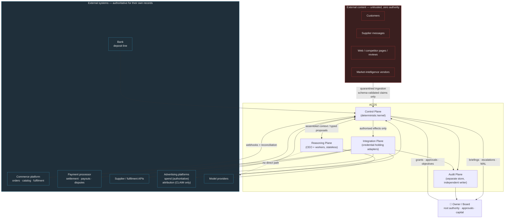
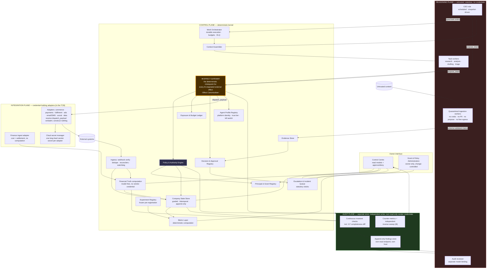
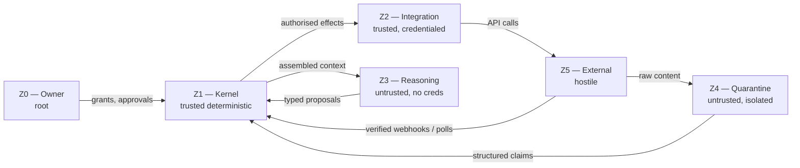

# 23 — System Context and Logical Architecture

**ACOS Operating Spine v1.3. Version 1.3. Issued 2026-09-03. Supersedes v1.1 (2026-09-02).**
Depends on: `22-architecture-principles.md`. Diagram sources under `diagrams/`.

## v1.3 change record

No change in v1.3. Version line bumped so the package carries one version; `phase2-v1.3-changelog.md §7` records which artifacts were materially edited and which were not.

## v1.1 change record

| Change | Remediation | Section |
|---|---|---|
| The Effect Gateway thesis is restated in `42 §9`'s narrower wording. v1.0's "the only code path through which any state change outside ACOS's own database can occur" was false on six counts. | R4, R20 | §1, §5 |
| The **Effect Canonicaliser** is named as a responsibility inside the gateway, and the model-facing capability becomes `propose_intent`. | R1 | §4, §5 |
| **B3 rewritten** to the red team's wording. **B8** gains the perimeter clause. **B9** extends from six artifact classes to sixteen. | R1, R4, R11 | §6 |
| The credential broker is **removed as an MVP component**; adapters hold per-adapter vendor secrets in a cloud secret manager and are declared TCB members. | R5, R19 | §3, §4, §11 |
| K6 splits into finance **ingest** (integration boundary, credentialed) and finance **computation** (control plane, no credential). | R4 | §3, §4 |
| The audit plane leaves the "own store only" posture and gains its own read-only vendor credentials. | R10 | §3, §4 |
| The trust-zone diagram is retained as a statement about data-flow direction and is explicitly **not** a Trusted Computing Base; the TCB is published separately. | R4 | §7 |
| Z4 gains a typed `red_class_signal` output consumed by **Ingress (Z1)**, not by Z3 — preserving the zone rule while giving escalation detection a text surface for non-text parts. | R12 | §7, §9.2 |
| The customer-message flow gains the deterministic tier floor and the non-text rule; T-U1 is deferred. | R12 | §9.2 |
| Sizing corrected: no credential broker, a processor ingest adapter added, one reasoning task type at MVP. | R19 | §11 |

---

## 1. Actors, and what each one is *not*

The Phase 2 brief lists candidate actors and warns against turning them into agents automatically. Applying EM5 — roughly half the surface has no interpretive content — most of them resolve to deterministic components or to external systems.

| Actor | Kind | Trust | What it is not |
|---|---|---|---|
| **Owner / Board** | Human | Root authority. The only principal that can create or widen a grant. | Not an operator. Not in the routine path. |
| **AI CEO** | Reasoning role, scheduled and bounded | Untrusted by construction (its context reaches summarised external material). Holds a *narrow* set of grants. | **Not** the system of record, not the security boundary, not the ledger, not the definition of its own authority, and not a persistent conversational entity. |
| **Reasoning workers** | Stateless bounded tasks against contracts | Untrusted. Read + propose only. | Not persistent characters. Not holders of credentials. Not addressable by each other. |
| **Kernel services** | Deterministic software | Trusted. This is where authority lives. | Not extensible by models. Not reachable from a reasoning runtime except through the kernel API. |
| **Integration adapters** | Deterministic software holding credentials | **Inside the Trusted Computing Base** (`49`). Each presents a vendor credential whose scope exceeds the action classes it serves. | Never contain a model. Never accept free-form input. Never construct a dispatch payload — they receive one (`§5`). |
| **Customers** | External human | Hostile by default in the security model (`07 §4.1`: in customer service every inbound message is attacker-controlled by definition). | Not a source of instructions. |
| **Suppliers** | External organisation | Hostile by default — BEC is the named threat (`07 §4.3`). | Never a payee-creation authority. |
| **Commerce platform** | External system | Semi-trusted for *records about itself*; untrusted for *content it relays*. | Not a source of truth for money (settlement is). |
| **Payment processor** | External system | Authoritative for settlement. | Not authoritative for order state. |
| **Fulfilment / supplier APIs** | External system | Authoritative for their own state; their claims about physical reality are CLAIM grade until corroborated. | Not proof of delivery. Carrier scan is. |
| **Advertising platforms** | External system | Authoritative for spend; **not** authoritative for attribution (EM12). | Not a source of ROAS truth. |
| **Analytics systems** | External system | Derived, second-order. | Not the metric layer. |
| **Support desk** | External SaaS | Holds conversation records and platform action bindings. | Not the authority layer. |
| **Market-intelligence providers** | External system | Purchased data with the ToS risk absorbed by the vendor (`06 §2.1`). | Not a substitute for corroboration. |
| **Audit function** | Deterministic checks + an independently-bound reasoning role | Trusted store, untrusted reasoner. Holds **its own read-only vendor credentials** (R10) so its inputs are not exclusively the output of the plane it audits. | Not suppressible by the CEO. Not writable by the audited system. Not dependent on a control-plane replica for evidence of external reality. |

**One actor is missing from the brief's list and belongs in it: the *platform-facing agent identity*.** EM11 makes it a first-class surface. Amazon and Shopify both regulate agents by identity and capability declaration, not only by behaviour, and the obligations differ (`17 §5.1`, `17 §5.4`). Its registry (K14) is deferred out of the MVP per `45 §3`.

### 1.1 The trust statement, restated (v1.1)

v1.0's "trusted / untrusted" labels described data-flow direction and were read as a Trusted Computing Base. `41 §5` supplies the honest version, adopted verbatim:

> **Untrusted, and assumed adversarial:** all external systems, all external content, and every process running a model.
>
> **Trusted because the architecture has no alternative:** the control-plane process and its database role, the two Postgres instances, the durable-execution library, every integration adapter, the audit-plane process, the CI/CD pipeline, the migration principal, the cloud database operator, and the observability vendors that receive process telemetry.
>
> **The residual under a compromised member of the second set is not bounded by MAL.** MAL bounds a compromised *model*. A compromised adapter is bounded by its vendor credential's scope **plus every authority whose preconditions its RECORD-grade writes can satisfy**. A compromised control plane is bounded by nothing inside ACOS.

The full analysis is `49-trusted-computing-base.md`, which is a maintained artifact rather than a diagram.

---

## 2. System context

**Two properties of this diagram are the architecture.**

1. **There is no edge from the Reasoning Plane to any external system.** The dotted line is drawn only to make its absence explicit. This is EM1 and EM2 in one picture.
2. **Untrusted content enters the Control Plane through a quarantine, not into the Reasoning Plane directly.** Reasoning workers read *claims*, not pages.

---

## 3. The four planes

The decomposition is by **trust and determinism**, not by business domain. Domain decomposition is what makes an architecture business-model-specific, which `21 §5` forbids.

| Plane | Determinism | Holds credentials | Model present | Availability requirement |
|---|---|---|---|---|
| **Control** | Fully deterministic | Only its own DB credential — CI-enforced (I25) | Never | Must function with all models offline |
| **Reasoning** | Probabilistic | Never | Always | Enhancement, not dependency |
| **Integration** | Fully deterministic | Yes — vendor credentials live here and nowhere else | Never | Must function with all models offline |
| **Audit** | Deterministic checks; one independently-bound reasoning role for review | Its own store, **plus read-only vendor credentials of its own** (R10) | Partially, read-only, separate binding | Independent of the other three |

**Two v1.1 corrections to this table.**

1. **K6 is split.** v1.0 placed the Financial Truth Service in both the control plane (`33 §2.1`) and the integration plane (`28 §3`, holding an org-scoped admin cost credential). Finance **ingest** is an adapter in the integration plane and holds the vendor credentials; finance **computation** is a control-plane module holding no vendor credential. The control plane's "only its own DB credential" row is true only because of this split, and CI checks it.
2. **The audit plane's independence was arithmetic, not evidential.** v1.0 gave it a replica of the database the control plane writes and credentials to its own store. Recomputing metrics from rows the audited component wrote is not independence. It now holds read-only credentials for commerce, processor, bank line, ESP and each advertising platform, and runs the inverse sweep itself (I8). Where a vendor offers no read-only scope — Google Ads — the audit credential is a separate login with viewer-level access, and that residual is stated rather than papered over.

**The availability line is a design requirement, not an aspiration.** `08 §9`: `api.anthropic.com` runs at 99.61% over 90 days ≈ 2.8 hours/month of degradation, with a documented 3h38m global 529 on 2026-08-24 and a 3-hour outage on 2026-08-28. Order intake, payment, fulfilment routing, reconciliation, statutory clocks and the approval queue must all continue through that. Anything a model must be online to do is, by definition, not in the operating spine.

---

## 4. Logical architecture

---

## 5. The Effect Gateway

Everything in the architecture is arranged around one component, so it is worth stating plainly what it is.

**Definition (v1.1).** The Effect Gateway is the deterministic chokepoint through which **every external state change originating in AI reasoning** passes. It accepts a `ProposedIntent`, **canonicalises it into a complete `AuthorizationRequest` and an exact `dispatch_payload` from authoritative state**, produces an `AuthorizationDecision`, and — if permitted — invokes exactly one integration adapter with the already-constructed payload and journals an `Effect` record.

### 5.1 The thesis, in the wording the architecture can defend

v1.0 claimed the gateway is *"the only code path in ACOS through which any state change outside ACOS's own database can occur."* That is false on six counts, all of them deterministic and none of them model-reachable: the webhook subscription watchdog, reconciler resolution on Stripe-family APIs, credential refresh, framework-managed webhook registration, K6's org-scoped cost credential, and the observability exporters (`42 §1`). The security argument only ever needed the narrower claim. Adopted wording:

> Every external state change that originates in AI reasoning passes through one deterministic chokepoint, the Effect Gateway, which constructs the request from authoritative state and authorises it against policy the model cannot reach. A small, enumerated set of deterministic kernel and integration components — reconcilers, the subscription watchdog, credential refresh, framework-managed registration, and observability exporters — can also reach external systems; each is inventoried, each is annotated at its call site, and none is reachable from a model-bearing runtime. **The perimeter is a maintained artifact with a CI check, not a property of a diagram.**

The distinction that matters: *"the only permitted path"* is a policy; *"the only capable path"* is an architecture. Only the first was established by v1.0. The CI check in `48-external-write-perimeter.md` (I24) is what converts one into the other, and two of the six paths — subscription management and reconciler resolution — become governed effect classes so the perimeter shrinks from six to four.

### 5.2 The Effect Canonicaliser

**v1.2: what the canonicaliser depends on, stated as a dependency (CAN-09).** The Effect Canonicaliser fetches authoritative state under the entity advisory lock and computes every dispatched amount from it. That makes **every read path it uses a member of the Trusted Computing Base**, which `49` now records: the commerce adapter's order and transaction reads, the processor's charge reads, the FX rate source, the allowlist, and the window registry. `I27` corroborates OBSERVATIONS used as *preconditions*; it does **not** corroborate the RECORD the canonicaliser reads to construct the effect. Under a compromised commerce adapter the destination from which "original instrument" resolves is adapter-derived, so `26 §11.4` publishes P4a's enforcement strength **per adapter** — structural on Stripe-family, policy-only on Shopify `refundCreate` — rather than claiming it uniformly. `35 §12.2` labels this contained, not closed, and the label is accurate.

**The component v1.0 was missing.** `26 §7` v1.0 validated a schema, checked a catalogue, fetched preconditions, evaluated policy and then reserved `context.exposure.monetary_amount` — a field the model supplied. `38 §7.2` named request-construction error as the most likely money-path bug in the system and the design contained nothing to prevent it.

The canonicaliser sits **inside K4, between schema validation and policy evaluation**. Per action class it holds a versioned constructor that fetches authoritative state, **enumerates** the permissible effects for `(action_class, resource)`, accepts the model's `selector` as an index into that enumeration, and then **computes** everything that bounds or describes the effect: exposure including per-class cost components, vendor parameters, counterparty, recoverability, currency conversion at a RECORD-grade FX rate with `staleness_policy=BLOCK`. It emits the `AuthorizationRequest` and the exact `dispatch_payload` together, bound by one hash.

**The shape that matters: the kernel enumerates, the model selects, the kernel computes.** Full specification in `26 §2` and `26 §2.1`.

**Why it is one component rather than a pattern.** Because EM9 requires a countable governed quantity and EM16 requires a non-suppressible record. A pattern applied in twelve places produces twelve places to get it wrong and no single place to count. A chokepoint produces one audit surface, one idempotency mechanism, one exposure-ledger integration, one place to kill.

**What passes through it.** Refunds, price changes, listing writes, inventory commitments, supplier orders, campaign mutations, budget changes, webhook subscription assertions, reconciler resolutions, every outbound message on every channel, every social post, every file published to a CDN, every platform API write that originates in reasoning or in a kernel state machine.

**What does not.** Reads. Internal state writes by kernel services. Financial ingest (that flows the other way, through Ingress). The four remaining perimeter paths, each annotated `PERIMETER_EXEMPT` with a reason and a ticket.

**Its failure mode.** Fail closed. If the policy engine is unavailable, the exposure ledger is unreachable, the canonicaliser cannot fetch authoritative state, or the state store cannot serve the preconditions, the gateway denies and the work item suspends durably. A gateway that fails open is not a gateway. **Where an action class cannot be deterministically canonicalised, that class is not eligible for autonomous execution** — the same disqualifier logic `25 §7` applies to idempotency.

**Deliberate consequence.** The gateway is a single point of failure for all outbound action. That is accepted: it is also the single point of control, and the alternative — several partly-trusted paths — is worse under the compromised-model assumption. Availability is bought by making it simple, in-process where possible, and dependent only on Postgres.

---

## 6. Boundaries, stated as invariants

Each is a testable property; `36` assigns a test to each.

| # | Boundary | Invariant |
|---|---|---|
| B1 | Reasoning ↛ External | No process in the Reasoning Plane can open a network connection to any host other than the model provider and the kernel API. Enforced by egress policy at the runtime, not by code review. |
| B2 | Reasoning ↛ Credentials | No credential capable of an external write is present in the environment, filesystem, or context of any process that runs a model. |
| B3 | Model ↛ Authority | **Model output may propose intent and select among kernel-enumerated options. It may never supply an authoritative precondition, an exposure figure, or any field of the dispatched request.** The engine reads the principal, the four permitted `ProposedIntent` fields, and state it fetches itself. (I21) |
| B4 | Model ↛ Financial truth | No value in a financial record has a model in its derivation graph. Enforced by writer identity on the financial tables, and by a CI check that no model client is present in the finance computation module. |
| B5 | Model ↛ Audit | No operating principal (including the CEO) holds write access to the audit store. `INSERT` is the control plane's only right, under a per-principal quota (I17c); hash and sequence are computed by the audit instance's own database functions under a role the writer cannot execute as (I17d). |
| B6 | Model ↛ Grade promotion | No model-attributed writer can create a record at `RECORD` or `OBSERVATION` grade, and a `DECISION_DELEGATED` record cannot gate a monetary or irrecoverable class (I28). |
| B7 | Untrusted ↛ Trusted, unschema'd | Data crossing from the quarantine to the evidence store is schema-validated and carries no free-text field that is later interpolated into a system prompt. |
| B8 | Effect ↛ External without journal | One transaction commits the authorisation, the effect row, the reservation, the state transition and a gap-free locally chained journal row; dispatch follows the commit, by recoverability class (`30 §5`). **Every vendor-HTTP call site outside this path carries an `authorisation_ref` or an annotated `PERIMETER_EXEMPT`, CI-enforced (I24).** No effect originating in reasoning can occur that is not recorded. |
| B9 | Self-modification prohibited | No principal may modify any **control artifact**. The enumeration is sixteen classes, not six: grants · Cedar policies · the action catalogue · model bindings · credential-scope declarations · audit records · **utterance templates · the approved policy corpus · the prohibited-commitment grammar · the escalation detectors and their patterns · promoter rules · `context_spec`s · metric computation specs · tolerance rules · locale rendering policy · the adverse-facts threshold set**. Each is owner-signed in a content-hash manifest (I19, `50-control-artifact-manifest.md`); a mismatch halts effects in the affected class. |
| B10 | Kernel availability independent of models | The Control and Integration planes have no runtime dependency on any model provider. |

**B8 deserves a note because it is the hardest.** A perfect two-phase commit between a Postgres transaction and a third-party HTTP API does not exist. The protocol is: commit the authorisation, the effect row (`status=AUTHORISED`), the reservation, the state transition and the journal row in one transaction; push the journal row to the audit store asynchronously with retry and quota; then dispatch. A crash between commit and outcome leaves an `OUTCOME_UNKNOWN` record, which the reconciler resolves — **as a gateway-dispatched effect reusing the original authorisation and idempotency key**, because on Stripe-family APIs the documented recovery for a timed-out create is a re-POST with the same key, and that is an external write (`42 §1`). The unrecoverable case — an adapter whose API offers no idempotency and no queryable record — is a **capability disqualifier**, not something to work around.

**v1.1: two idempotency claims have been weakened (R18, R20).** First, the durable-execution engine's never-re-execute guarantee covers *suspension and resume*; it **narrows but does not close** the crash-during-dispatch window, so duplicate prevention at the dispatch boundary rests on vendor idempotency or a vendor query. v1.0's `33 §1` and `35 §4` implied otherwise; this section always said it plainly and the other two have been corrected to match. Second, `refundCreate`'s `@idempotent` directive (Shopify API 2026-04) is the standard every money path should meet, but **its key scope and deduplication window are undocumented in this package**; if the window is shorter than the reconciler's resolution latency it does not cover the case it is relied on for. `36 §7` requires empirical verification in S3, and until that test runs the property is stated as unverified rather than asserted.

---

## 7. Trust zones

**Zone rules.**

- Z3 and Z4 never communicate. A research worker cannot ask an ingestion worker for anything; it reads the evidence store.
- Z4 processes are per-item and disposable. `07 §5` (LLM Map-Reduce / Dual-LLM): one untrusted item, one isolated context, no tools, structured output.
- Z2 processes do not install dependencies (`07 §10.16`) and do not share a filesystem with Z3 (`07 §12`). **v1.1: isolation is per adapter, not per plane** (R5, R6) — one adapter cannot read another's secret from its own environment or filesystem, and bank-line ingest runs in its own runtime with its own dependency tree, because `28 §4`'s settlement equality is independent only if the commerce, processor and bank adapters are not co-compromised.
- Z5 → Z1 is permitted only for HMAC-verified webhooks and adapter-initiated polls. **v1.1 precedence correction (R6):** an HMAC-verified webhook body is the only fact in the system with end-to-end cryptographic provenance from the vendor, so v1.0's blanket *"both are treated as hints until reconciled"* and `25 §8`'s *"the poll result wins on conflict"* inverted the trust order. The poll wins for **absence** — missed delivery, which `08 §8.3` documents as the normal case, since Shopify publishes no delivery guarantee, does not guarantee ordering, and auto-deletes a subscription after 8 consecutive failures over 4 hours. A poll that **contradicts** a verified webhook payload creates a `Contradiction` and gates nothing (I29).

**v1.1: one new typed channel out of Z4, and why it does not break the zone rule (R12).**

`44 §3.1` found the strongest single utterance defect in the package. The escalation detectors are lexical and pattern checks on inbound **text**, so a DSAR delivered as a PDF, a legal threat photographed as a solicitor's letter, a chargeback notice forwarded as an image, or a product-safety complaint in a voice note reaches **no detector at all** — a 100% false-negative rate on non-text-borne RED-class triggers, architectural rather than a corpus gap. The obvious fix was foreclosed by this section's own rule, because the only tier that may parse untrusted attachments is Z4 and Z4 may not talk to Z3.

Two changes, and the zone rule survives both:

1. **Any inbound message with a non-text part forces T-U2** — human review, no generation — unconditionally, until (2) exists and is tested.
2. **Z4 emits a typed `red_class_signal{class, confidence, span_ref}`**, produced by deterministic OCR/transcription plus the same pattern set, consumed by **Ingress in Z1**, never by Z3. Z4 still never communicates with Z3. The signal is a schema-validated structured claim like every other Z4 output, it carries no free text, and it is a *detector input* rather than a generation input.

Neither change makes the detector's non-text recall a pre-launch gate. `47 §10` records that an escalation detector which cannot be made to fire on a non-text-borne RED-class trigger would remove autonomous customer communication from the first business's scope — a finding about the business model rather than about the spine — and `37 §7` carries it as a falsification condition.

**And this section is not a Trusted Computing Base.** `41 §1` is right that a zone diagram states data-flow direction and never asks what trusting Z1 and Z2 costs. Four components that can violate B1–B10 appear nowhere in it: CI/CD, the migration/DDL principal, the cloud database operator, and the observability vendors. The TCB is `49-trusted-computing-base.md`, and it is a maintained artifact.

---

## 8. Where the lethal trifecta is decomposed

`07 §5` states the strongest structural finding in the security deliverable: an ecommerce company is a permanent lethal-trifecta environment (private data + untrusted content + outbound communication), and *"the trifecta cannot be avoided at the company level. It must be decomposed at the session level."*

The decomposition in this architecture:

| Execution context | Private data | Untrusted content | Outbound capability |
|---|---|---|---|
| Quarantined ingestion (Z4) | ✗ | ✓ | ✗ |
| Research / analysis worker (Z3) | ✗ (aggregates only) | ✗ (reads structured claims) | ✗ (propose only) |
| Support reasoning worker (Z3) | ✓ (scoped to one case) | ✓ (the customer message) | **✗ — propose only; the utterance gate sends** |
| CEO (Z3) | ✓ (aggregates) | ✗ | ✗ |
| Integration adapter (Z2) | ✓ | ✗ | ✓ |

**The support worker is the one row where two of three co-occur, and it is unavoidable** — answering a customer requires reading their message and knowing their order. The third leg is removed structurally: the worker cannot send. What it produces is a proposal that the Utterance Gate either assembles from a template, validates against grounding, or escalates. That is the entire reason the utterance path is a separate gate rather than an ordinary effect class.

---

## 9. Data flows worth naming

### 9.1 Inbound order (no model involved)

`Shopify webhook → HMAC verify → dedupe on X-Shopify-Webhook-Id → enqueue → 200 within 5s → durable handler → retain raw body → versioned parser (control plane) → State Store (RECORD grade) → fulfilment routing state machine → Effect Gateway → supplier adapter → Effect journal → verification poll → reconciler`

`08 §8.3` forces the shape: 1-second connection timeout, 5-second total, no ordering guarantee, no delivery guarantee, auto-unsubscribe after 8 failures. Therefore: no inline inference in the webhook path, a dedupe table, a reconciliation poller as the backstop, and a subscription watchdog. Three deterministic mechanisms, none of them AI.

**Two v1.1 changes to this flow.**

- **The adapter is a transport, not a fact author (R6).** The raw vendor response is retained verbatim and a **versioned deterministic parser in the control plane** derives the fact, so grade derives from `(parser_version, transport_identity)` rather than from the adapter alone (I26). v1.0's `content_hash` was computed by the adapter, which means a compromised adapter hashed its own fabrication. A compromised adapter must now produce a well-formed *vendor response*, not a well-formed ACOS fact.
- **The subscription watchdog is a governed effect class (R4).** Re-asserting a subscription is `webhookSubscriptionCreate/Update` — an Admin API mutation with an attacker-relevant `callbackUrl`. It becomes the action classes `webhook.subscription.assert` and `webhook.subscription.delete`, with `callbackUrl` derived from configuration and **never from a parameter**, and every assertion journaled.

### 9.2 Customer message (model involved, no send authority)

`Inbound message → non-text part? → force T-U2 → quarantine parse (+ red_class_signal to Ingress) → deterministic RED-class detectors on rendered, normalised text → State Store (CLAIM grade, case-scoped) → deterministic tier floor → triage worker (may only raise the tier) → deterministic router → [RED class? → Escalation, no generation] → Utterance Gate → T-U0 template slot-fill from RECORD state within max_age → outbox claim → Effect Gateway → send adapter → Effect journal → delivery-event reconciliation`

The router, not the model, decides the action. `10 §2.4`: *"Nothing, if the router is deterministic. Everything, if the model both classifies and acts."*

**Three v1.1 changes (R12, R13).**

1. **Tier assignment was model-controlled.** v1.0 said the tier is a property of the message class assigned in the catalogue — but message class came from the triage model's classification, and determinism of a function over model output is not determinism (`44 §2.5`). A compromised triage worker could downgrade a negotiation to `order_status`. A **deterministic tier floor** is now computed from message features and case state — attachment present, thread depth, prior escalation on the case, presence of any monetary or entitlement term, customer tenure, order state — and **the model's classification may only raise the tier, never lower it**.
2. **T-U1 is deferred out of the MVP** (`45 §3`). The MVP path is T-U0 or escalation. `26 §9.2` retains the narrowed T-U1 design and the twelve conditions it must satisfy before it is built.
3. **The send is claimed before it is attempted.** An ACOS-owned outbox row transitions to `CLAIMED` in a committed transaction before the HTTP call, carries a provider-visible correlation tag, and is never re-dispatched by any path (I36). An unknown outcome on an irrecoverable send is marked `PRESUMED_EXECUTED` and resolved from the provider's delivery event, never retried.

### 9.3 Money in (no model, ever)

`Stripe balance transactions + Shopify payouts + bank line → finance ingest adapters (Z2, credentialed) → retained raw responses → versioned parsers (Z1) → Financial Truth computation (Z1, no vendor credential) → per-payout equality check → MATCHED | UNMATCHED | MATCHED_WITH_TOLERANCE(rule) → Discrepancy object on failure → State Store (RECORD) → Metric Layer`

**And the audit plane runs the same equality check independently, from its own read-only processor and bank credentials** (R10). v1.0 proved financial truth by comparing the control plane's projection to itself; a three-way tie between two systems and one ledger is only a control if at least one of the three is not read by the component being audited.

### 9.4 Research → decision (independence in time)

`Discovery task (t0) → Evidence Store with provenance → [scheduled gap] → Evaluation task (t1), context excludes t0's reasoning trace → Scored claims → Decision Registry → corroboration gate → owner approval or bounded authority → Effect`

SR2. The evaluation task's context assembler is the enforcement point; it is code, not an instruction.

---

## 10. What is deliberately absent from the logical architecture

| Absent | Why |
|---|---|
| A product catalogue domain model | Business-model-specific. Lives in the commerce platform or in an adapter, not the kernel. |
| A marketing automation engine | Bought (`10 §6`). Klaviyo's 100/day flow-creation cap is a free guardrail (SR10). |
| A CRM | Not needed at proving-ground scale, and it would duplicate the commerce platform's customer records. |
| A message bus | At the scale in `09 §5.2` (100–300 orders/month, ~3,000 steps/month) Postgres-backed queues are sufficient. Reconsideration trigger in `34 ADR-004`. |
| A multi-tenant / portfolio layer | Constitution §31: do not build prematurely. The single concession is that every kernel entity carries a `company_id` from day one so a second company is a data-model no-op (`33 §10`). |
| A generic "agent framework" | `10 §8`: OpenAI retired the Assistants API (2026-08-26) and Agent Builder (2026-11-30); MCP has shipped two breaking redesigns in ~14 months; the Claude Agent SDK removed its V2 session API. Orchestration topology lives in ACOS's own code. |
| An LLM router / model gateway product | A `ModelBinding` table and a thin adapter are enough (`14`/`31 §7`). Building a routing platform is the abstraction-for-hypothetical-providers the brief warns about. |
| **A credential broker component** (v1.1 removal, R5) | v1.0 described it as issuing short-TTL, audience-bound, action-scoped tokens to adapters per invocation. No such vendor credential exists to issue on the selected platform: Shopify custom-app offline tokens do not expire and their scopes are set at the app. What a broker could issue is an *internal capability token*, which constrains nothing unless the component presenting the vendor credential enforces it — and that component is the adapter, which would be trusting itself. With two adapters and no money, the broker adds a TCB member and delivers nothing. Per-adapter secrets in a cloud secret manager instead. The broker returns as an **execution proxy** at the first money-moving credential or the third adapter, whichever comes first (ADR-024). |
| **Langfuse** (v1.1 removal, R4) | A secondary view by ADR-012's own framing, and an unenumerated third-party egress channel receiving prompt/completion pairs that for a support worker are case-scoped PII. Dropped until the observability egress inventory exists. |

---

## 11. Sizing sanity check

The architecture must be small enough to build and attack (`27`, quality gate 15). Component count in the MVP boundary:

- **Control plane:** 1 Postgres schema set, 1 deployable, ~11 logical services (most are a few hundred lines: the Metric Layer, the Financial Truth computation and the Effect Canonicaliser are the three substantial ones).
- **Integration plane:** 4 adapters at MVP — commerce (development store), communications (ESP sandbox), payment processor (Stripe test mode), finance ingest (cost + settlement + synthetic bank line). **No credential broker** (R5). Per-adapter secrets in the platform secret manager, per-adapter runtime isolation.
- **Reasoning plane:** **1 task type at MVP** — customer-message triage (R19). The research-with-citations worker and the model-backed CEO briefing are deferred; S5 uses a deterministic briefing generator, which is sufficient to prove property 8 because the mechanism being proved is the audit plane's deterministic diff, not the narrative.
- **Audit plane:** 1 store on a **different provider or at minimum a separate account** with separate payment method and operator credentials (R4, TEC-04), its own read endpoint on its own host, its own read-only vendor credentials, and the **17 audit-plane-owned invariants in the MVP set** (`phase2-v1.3-invariant-registry.md` `§1` owner column ∩ `§2.7`; 23 audit-plane-owned or co-owned across the full 70) — up from v1.0's six, because `45 §5` established that the problem was composition rather than count and that four of the most important invariants were not in the set of sixteen at all.

**Net v1.1 effect on size:** two components removed (credential broker, Langfuse), five deferred (K13, K14, world-time interval logic, the model-backed CEO, the research worker), and six added (Effect Canonicaliser, `StandingAuthorization`, the outbox, the perimeter CI check, the processor and bank-line ingest, the audit plane's vendor reads). `45 §9`: the additions are smaller than the deferrals in code volume and larger in what they prove.

`10 §5` independently arrived at a short list of what ACOS genuinely builds: the authority layer wired to real limits, the evidence store with discovery/evaluation separation, the discovery loop, the cross-source financial reconciler, the escalation queue with statutory clocks, and the counter-metric audit function. **Five of those six are kernel components in this architecture, and the sixth — the discovery loop — is explicitly not solved here.** The correspondence is a check that Phase 2 has not invented scope.
