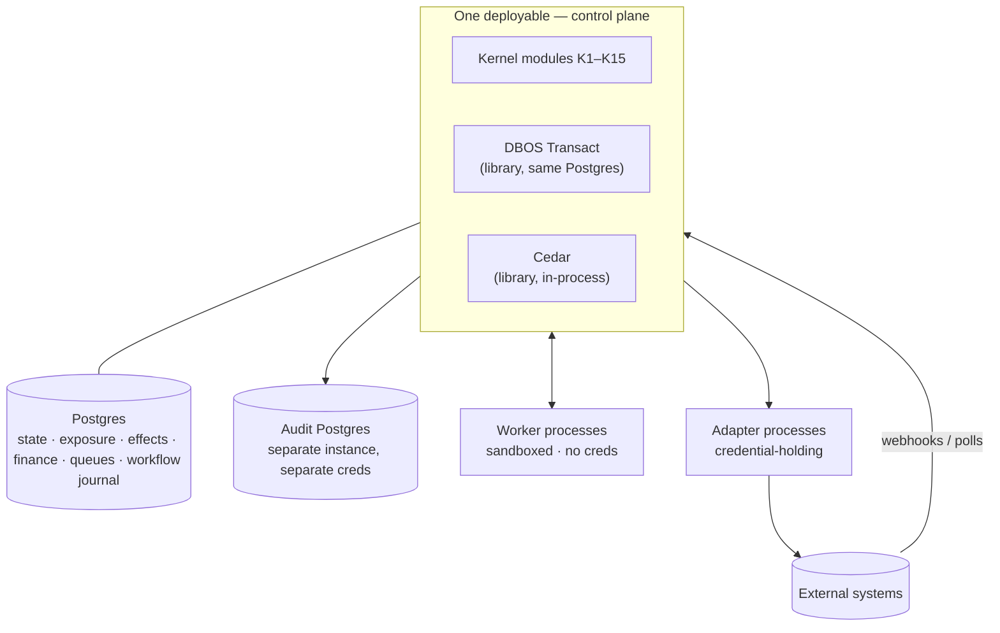
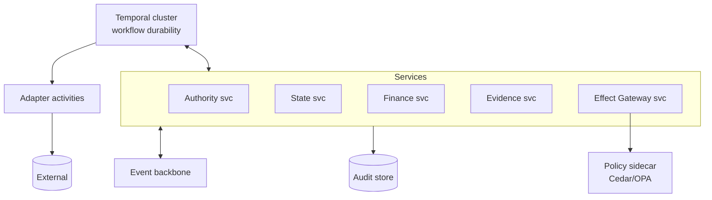
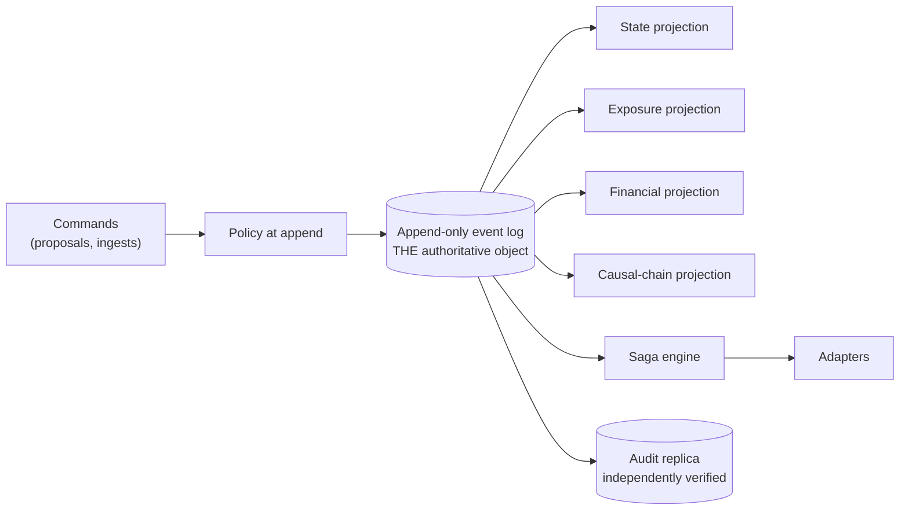

# 32 — Architecture Options

**ACOS Operating Spine v1.3. Version 1.3. Issued 2026-09-03. Supersedes v1.1 (2026-09-02).**
Covers Phase 2 brief Part 22. Depends on `22`–`31`.

## v1.3 change record

No change in v1.3. Version line bumped so the package carries one version; `phase2-v1.3-changelog.md §7` records which artifacts were materially edited and which were not.

## v1.1 change record

| Change | Remediation | Section |
|---|---|---|
| **The Option A → Option B boundary is restated.** ADR-002 v1.0 named Temporal as DBOS's fallback and called the migration *"a re-hosting rather than a rewrite"*. That was false: moving the checkpoint out of Postgres destroys the single-transaction property that is Option A's decisive advantage over Option B, so **taking that fallback is an explicit return to Option B and requires a distributed-reservation design plus a new ADR.** A DBOS *guarantee* failure instead falls back to an ACOS-owned Postgres step journal, which keeps the checkpoint in the same database. | R18 | §2, §3 |
| **The comparison is otherwise unchanged, and `47 §3` endorses its conclusion** more strongly than v1.0 argued it. No option was re-scored, no candidate was added or removed, and the four-substrate analysis stands as issued. | — | all |

**Why this matters for reading the rest of the document.** The Option A/B distinction below is not a preference about deployment topology. It is a distinction about **where the durable checkpoint lives relative to the exposure ledger**, and v1.0's own fallback plan crossed that line without noticing. A reader evaluating Option A should treat "stays in Postgres" as the load-bearing property, not "modular monolith".

---

## 1. What is held constant

All four options satisfy every evidence-mandated principle in `22 Part A`. **An option that violated one would not be an option; it would be a mistake.** Each therefore contains: a single effect chokepoint, a deterministic policy engine outside model reach, graded state with provenance, a model-free financial path, an independent audit store, bounded work units, and a separate utterance gate.

**What varies is the substrate**, and the four axes the brief names are covered:

| Axis | A | B | C | D |
|---|---|---|---|---|
| Database-centric ↔ dedicated durable-workflow-centric | Database-centric | Workflow-engine-centric | Log-centric | Framework-centric |
| Modular monolith ↔ service-oriented | Monolith | Services | Monolith + projections | Framework monolith + plugins |
| Orchestration-first ↔ event-first | Orchestration-first | Orchestration-first | **Event-first** | Orchestration-first |
| Agent SDK-centric ↔ framework-light | Framework-light | Framework-light | Framework-light | **Framework-heavy** |

---

## 2. Option A — Postgres-centric modular monolith with in-database durable execution

**Shape.** One Postgres. One deployable control plane, internally modular (kernel capabilities K1–K15 as modules with enforced interfaces). DBOS Transact provides durable execution *inside the same database*, so a workflow step checkpoint, an exposure reservation, an effect journal write and an authorisation decision commit in **one transaction**. Cedar is linked in-process as a library, with `cedar-policy-symcc` running in CI. Reasoning workers are out-of-process, sandboxed, credential-free, reachable only via the kernel API. Adapters are separate processes holding credentials. The audit store is a **separate Postgres instance** with its own credentials.

**Strengths.**
- **R1 for free.** The reservation-and-journal atomicity that `26 §7` step R depends on is a transaction, not a protocol. This is the single hardest correctness property in the architecture and A is the only option where it is trivial.
- Smallest operational surface: one database, one deployable, no cluster.
- Fastest path to something attackable. Quality gate 15 is satisfied by construction.
- Cedar in-process means policy evaluation costs microseconds, so evaluating on *every* effect — including cheap ones — is free, which keeps the chokepoint honest.
- Debugging the causal chain is a single query.

**Weaknesses.**
- One process is a single blast radius for a memory leak or a bad deploy.
- Scaling is vertical until it is not. Postgres connection pressure from workers is a real ceiling, though far above proving-ground volume.
- DBOS is the smallest and youngest of the durable-execution candidates (1.4k stars, v2.23.0 2026-06-01). MIT-licensed and Postgres-only, but a smaller ecosystem than Temporal.
- Language coupling: workers in a different language talk to the kernel over HTTP, which is fine, but the durable workflow itself is bound to the DBOS SDK's language.

**Cost.** Lowest build and lowest run. Neon or Supabase plus one host.

---

## 3. Option B — Service-oriented with an external durable workflow engine

**Shape.** Temporal cluster (self-hosted or Cloud from $100/mo) owns workflow durability. Kernel capabilities are separate services: Authority, State, Finance, Evidence, Effects, Audit. Cedar or OPA runs as a sidecar policy service. An event backbone connects services. Adapters are Temporal activities.

**Strengths.**
- Temporal is the most battle-tested durable engine here, with full event history, and pre-release **non-spoofable Principal Attribution** — *"server-derived, non-spoofable field tracking Workflow execution initiators"* — which is a close match for `26 §3`'s signed-principal requirement.
- Real service isolation. A worker-facing service can be resource-capped independently of the money path.
- Polyglot workers.
- Genuine horizontal scale, and the natural home if a second or third business is ever added with independent operations.

**Weaknesses — and one is decisive at this stage.**
- **R1 becomes a distributed problem.** Reservation, authorisation and effect journaling now span services, so atomicity requires a saga with compensations, or a reservation service that becomes a de-facto transaction coordinator. `29 §9`'s bound depends on reservations being uncheatable under concurrency; making that a distributed protocol is the most likely place to introduce a subtle overrun bug — in exactly the mechanism that bounds loss.
- A Temporal cluster is real operational weight for one developer and one store.
- More moving parts means more surfaces for the audit invariants to check, and more places for the causal chain to acquire gaps.
- `08 §10` notes Temporal Cloud retention (1 GB active, 40 GB retained at the entry tier) is still not an audit record — so B does not remove the need for ACOS's own audit store; it adds a system alongside it.

**Cost.** Higher build, higher run, materially higher cognitive load.

---

## 4. Option C — Event-log-first, ledger-centric

**Shape.** The authoritative object is a single append-only event log carrying facts, effects, authorisations and financial events. All state is a projection. Workflows are sagas over the log. Policy is evaluated at append time and the decision is itself an event. The audit store is a verified replica of the log.

**Strengths.**
- The causal chain (`30 §2`) is not something you build; it *is* the log. Reconstructing why anything happened, at any past moment, is native.
- Tamper-evidence is native: hash-chain the log and the audit property in EM16 comes almost free.
- Temporal queries — "what did the policy engine know at 14:32 on the 3rd?" — are natural rather than reconstructed. That is genuinely valuable for `35`-class post-incident analysis.
- Bitemporality (`24 §7`) is the log's default rather than a schema discipline.

**Weaknesses.**
- **Projection lag versus authorisation is a correctness hazard, not a performance one.** If the exposure projection lags the log, two concurrent proposals can both be authorised against stale headroom. Fixing that means synchronous projection for the exposure and precondition reads — at which point the log is a transactional database with extra steps, and R1 has been made harder for no gain.
- Schema evolution on an append-only log is a genuine and permanent tax.
- Highest conceptual load of the four, and quality gate 15 asks whether the MVP is small enough to build *and attack*. C is small to describe and large to get right.
- No candidate in the verified Phase 1 reuse inventory is an event-store product, so C imports a dependency the licence work did not cover.

**Cost.** Moderate run, high build, highest ongoing discipline.

**Worth saying plainly:** C has the best answer to the observability and audit requirements of any option, and the worst answer to the requirement that bounds loss. Given that `26 §10`'s MAL is the governing control, the trade goes the wrong way. The right response is to **borrow C's ideas inside A**: hash-chain the audit store, make the causal chain a materialised structure with foreign keys written at link time, and keep state append-only and bitemporal. `33` does exactly that.

---

## 5. Option D — Commerce-framework-anchored

**Shape.** Adopt Medusa (MIT) as the foundation. Use its commerce domain model — products, orders, fulfilments, returns, payments — and its durable workflow engine with per-step compensation. Build the ACOS kernel as Medusa modules and plugins. Cedar wraps Medusa's write paths.

**Strengths.**
- Genuinely honours `10 §6`'s *"never build what a mature dependency does."* Medusa is MIT, 34.3k stars, actively released, and ships a durable workflow engine **with per-step compensation inside a commerce domain model** — precisely the saga shape `25 §10` needs.
- A large amount of order, fulfilment and return state-machine work disappears.
- Its compensation model is the best available reference implementation of the pattern.

**Weaknesses — and the first is disqualifying.**
- **It presupposes physical commerce.** `21 §5` is explicit that **no business model is a defensible lead**, and the four ACTIVE ALTERNATIVES include high-value digital with a fenced asset and independent micro-SaaS. A subscription/replenishables business needs dunning and shipment scheduling; a $149 digital product needs licence delivery and entitlement; a micro-SaaS needs a licence server and metered billing. **Medusa's domain model is a good fit for one of four and a poor fit for two.** Quality gates 13 and 14 exist to catch this, and D fails both.
- It inverts the layering. In A/B/C the kernel is business-model-independent and commerce is an adapter. In D commerce is the foundation and governance is a plugin — which means the authority layer sits *above* a system that already has its own write paths, and every Medusa-native write path is a potential bypass of the Effect Gateway. That is a chokepoint with holes in it.
- The commerce platform is already bought (Shopify). Adopting Medusa means either running two commerce systems or replacing Shopify — and `21 §4.5` establishes Shopify as the substrate with the strongest agent posture: ToS that expressly contemplate agents, no app review for custom apps, non-expiring offline tokens, `refundCreate` `@idempotent`, and a first-party agent programme.

**Cost.** Moderate build, high coupling, high strategic risk.

**What survives from D:** the compensation pattern, and Medusa as the fallback self-hosted commerce substrate if Shopify becomes untenable. Both are carried into `33`.

---

## 6. Comparison

Scored against the brief's dimensions. **H = better.**

| Dimension | A — PG monolith | B — Temporal SOA | C — Event-log | D — Medusa |
|---|---|---|---|---|
| **Complexity** | **H** — one DB, one deployable | L — cluster + services | L — projections, schema evolution | M |
| **Reliability** | **H** — R1 is a transaction; R2 by engine guarantee | H — most battle-tested engine, but R1 distributed | M — projection lag is a correctness hazard | M — depends on framework internals |
| **Developer burden** | **H** | L | L | M — framework fluency required |
| **Observability** | M — causal chain is materialised by discipline | M | **H** — native | M |
| **Cost** | **H** — lowest | L — cluster + retention | M | M |
| **Vendor lock-in** | **H** — MIT throughout, Postgres | H — MIT, but a cluster to migrate | H — but no verified OSS candidate | L — deep framework coupling |
| **Scale** | M — vertical, far above need | **H** | H | M |
| **Testing** | **H** — one transactional boundary to fixture | M | L — projection tests multiply | M |
| **Autonomy safety** | **H** — atomic reservation; smallest bypass surface | M — distributed reservation is the weak point | M — same, plus lag | **L** — framework-native write paths bypass the chokepoint |
| **Suitability for the first proving ground** | **H** | L — over-built | L — over-built | M — only if physical |
| **Multi-business expansion** | M — `company_id` everywhere; would need work | **H** | H | L |
| **Business-model independence** | **H** | **H** | **H** | **L — fails quality gates 13 and 14** |

---

## 7. Where each option would win

Stated so the recommendation is a choice rather than a foregone conclusion.

**A wins** when the binding constraint is *getting a small, correct, attackable spine built by one developer*, and when transactional atomicity between authorisation and exposure is the property you least want to get wrong. Both are true now.

**B wins** when there are multiple businesses with independent operations, or genuinely long-lived cross-service workflows (a 90-day subscription dunning sequence with external callbacks is a real example), or a team large enough that service boundaries buy more than they cost. **None of these is true at Stage 2.** `34 ADR-002` records the trigger.

**C wins** when audit and temporal reconstruction are the dominant requirements and throughput is low enough that synchronous projection is free. That is closer to true than it sounds — but it is not worth accepting a weaker loss bound to get it, and the valuable parts are portable.

**D wins** if the first business is definitively physical commerce and Shopify is rejected. `21 §5` forecloses the first condition and `21 §4.5` argues against the second.

---

## 8. What none of the options fixes

Recorded so the recommendation is not read as a solution to more than it solves.

- **Competitor poisoning of the decision process.** Substrate-independent. `29 §8`.
- **Acquisition economics.** `21 §1`: the binding constraint is CPA, not architecture. No option changes it, and `SPINE`'s framing holds — *"automation makes the operator cheaper; it does not make the customer cheaper."*
- **Platform identity loss.** No spend cap or database schema touches a permanent Google Ads suspension.
- **The human residual.** `06 §4`: 9–30 h/month, scaling with product introductions and platform events rather than orders, so the labour curve flattens rather than approaching zero.
- **pass^k.** `SPINE` finding 3: capability rose, consistency did not; the 2026 pass^4/pass^1 ratio (0.6–0.7) is no better than Claude 3.5 Sonnet's 0.67 in 2024. Architecture bounds the consequences of inconsistency; it does not reduce it.
