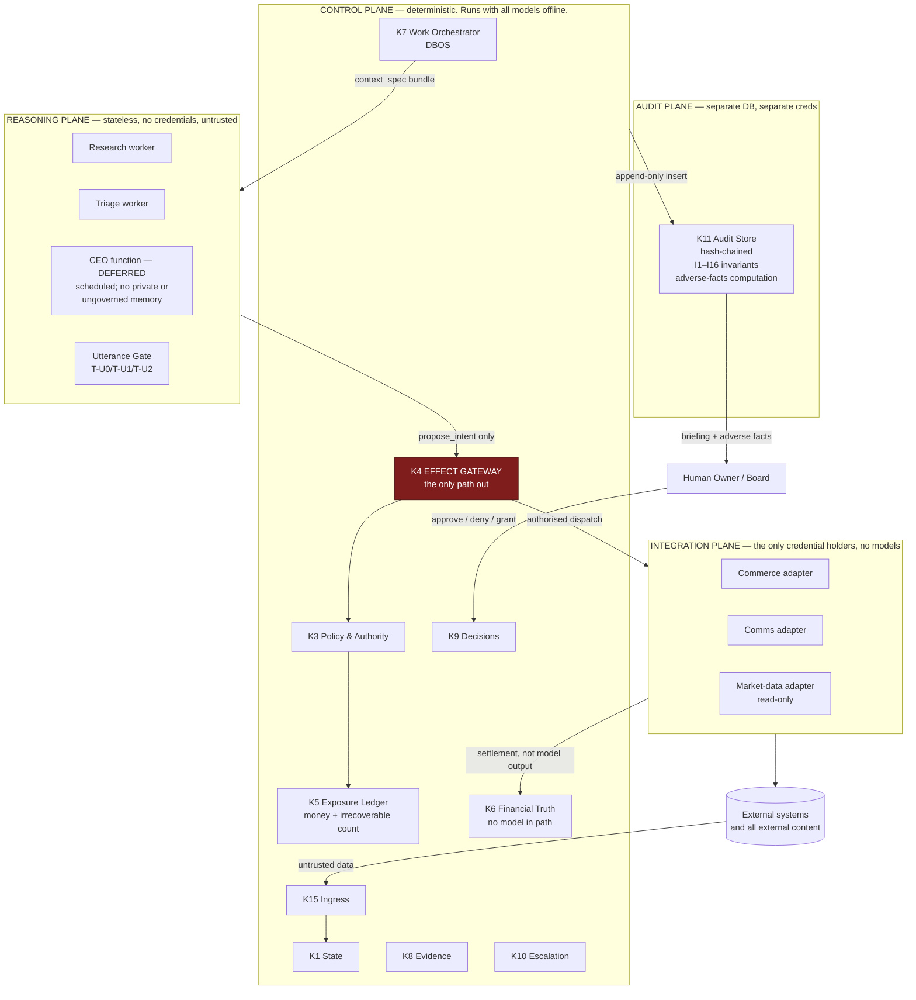
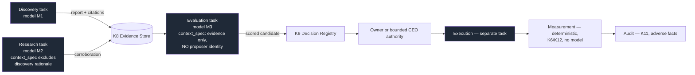

# 33 — Recommended Architecture: ACOS Operating Spine v1.1

**ACOS Operating Spine v1.3. Version 1.3. Issued 2026-09-03. Supersedes v1.1 (2026-09-02).**
Covers Phase 2 brief Parts 23, 24, 27. Depends on `22`–`32`. Constrained by `21 §7`, `21 §8` and `47`.

## v1.3 change record

The pending-approval bound corrected to `min(count_headroom, floor(monetary_headroom / per_action_max))` = 10 (TOS-01). Full disposition in `phase2-v1.3-remediation-ledger.md`.

## v1.1 change record

| Change | Remediation | Section |
|---|---|---|
| **§1's five-sentence summary no longer claims the gateway is the only code capable of an external write.** `42 §9`'s wording replaces it. | R4, R20 | §1 |
| The DBOS argument is narrowed: Option A does **not** depend on DBOS, so an Option A that abandons DBOS is still Option A. The never-re-execute guarantee no longer carries the double-refund claim. | R18, R20 | §1 |
| §2.1 gains the Effect Canonicaliser and the K6 split; the credential broker leaves §2.4. | R1, R4, R5 | §2 |
| §2.2's audit plane becomes a replicating verifier with its own read endpoint and its own read-only vendor credentials. | R3, R10 | §2.2 |
| §2.5's owner interface fetches the appendix from the audit plane, not through a control-plane surface. | R3 | §2.5 |
| §3.2's write-path sequence is rebuilt around `propose_intent`, canonicalisation, the journal row and the split dispatch rule. | R1, R3 | §3.2 |
| **§6's per-module-role claim is restated.** Per-module roles are accidental-coupling detection and SQL blast-radius limitation, **not** isolation against compromised in-process code — and the privileged `effect_path` role that spans four schemas is named, because §1's decisive transaction requires it. | R4, R20 | §6 |
| `refundCreate`'s `@idempotent` key scope and deduplication window are stated as **unverified** pending the S3 empirical test. | R20 | §6 |
| §7's infrastructure cost is tagged `[ESTIMATE]` and its omissions are named. | R20 | §7 |
| **§9's business-model neutrality claim is narrowed.** "No kernel capability changes in any column" is withdrawn. The digital column's recoverability is corrected. | R8, R17, R20 | §9 |
| §11 gains the TCB residual and the two open risks `47 §9` adds. | R4, R15 | §11 |


---

## 1. Recommendation

**Adopt Option A: a Postgres-centric modular monolith with in-database durable execution, an in-process provable policy engine, out-of-process credential-free reasoning workers, credential-holding adapter processes, and a physically separate audit store.**

Name: **ACOS Operating Spine v1.1**.

The decisive property is one sentence. **The exposure reservation, the authorisation decision, the effect journal row with its gap-free sequence and local chain hash, and the resulting state transition commit or fail together, as a single Postgres transaction.** `26 §10`'s authorised-loss quantities are the governing control of the whole system, and their validity rests entirely on reservations being uncheatable under concurrency. Option B makes that a distributed protocol; Option C makes it a race between a log append and a projection. Both put the most likely location of a subtle bug *inside the mechanism that bounds financial loss*. A makes it a `BEGIN`.

**v1.1: `47 §3` endorses this more strongly than v1.0 argued it, with two corrections.** First, **the argument does not depend on DBOS** (§1.1), so an Option A that abandons DBOS is still Option A. Second, ADR-002's Temporal fallback silently converted Option A into Option B — moving the checkpoint out of Postgres destroys the property this section calls decisive — so v1.0's *"re-hosting, not a rewrite"* was false and is corrected in ADR-002 and `31 §3.2`.

Three secondary reasons, in order of weight.

### 1.1 On the durable-execution engine, narrowed (v1.1, R18, R20)

v1.0 said R2 is *"satisfied by a documented engine guarantee rather than by discipline"* and implied the guarantee prevents the double refund. **It does not, and this document was one of the two that overstated it** (DBO-01).

- **What the guarantee delivers:** elimination of re-execution across **suspension and resume** — the documented LangGraph `interrupt()` behaviour in `08 §8.1`, where resuming a suspended graph re-runs the whole node. Real, and worth having.
- **What it does not deliver:** atomicity of a third-party HTTP effect. It **narrows but does not close** the crash-during-dispatch window, because an *incomplete* step is not a checkpointed step. Duplicate prevention at the dispatch boundary rests on vendor idempotency, a vendor query, or ACOS's own outbox claim (`25 §7`). `23 §6` B8 and `25 §7` always said this; this section and `35 §4` contradicted them.
- **What follows:** the dispatch outbox is ACOS-owned code regardless of engine, **so the engine is not load-bearing for the money path** — and an S1 spike compares DBOS against a hand-rolled Postgres step journal on the same kill-point matrix (`31 §3.3`), which is the option ADR-002 listed and never evaluated.
- **And approval durability no longer rests on the engine at all.** Approval waits are persisted kernel state and the workflow terminates (`25 §12`, R9), which removes both the resume ambiguity and the orphaned-suspension risk from OWNER approvals waiting across deploys.

**It is small enough to attack.** Quality gate 15 asks whether the MVP can be built *and adversarially tested* by one developer. `29`'s threat model is only worth anything if the red-team work in `36 §9` actually happens. Every hour spent operating a Temporal cluster is an hour not spent running the injection harness, and the harness is where `11 E6` and `11 E11` get their numbers.

**Nothing is foreclosed.** MIT/Apache-2.0 throughout (R12). Postgres, so migration targets are plentiful. `34 ADR-002` names the specific trigger that would move durable execution to Temporal, and because DBOS workflows are decorated functions over ordinary code, that migration is a re-hosting rather than a rewrite.

### 1.2 The security thesis, in the wording it can defend (v1.1, R4, R20)

v1.0's five-sentence summary opened: *"Every external state change passes through one deterministic chokepoint, the Effect Gateway."* Six deterministic paths reach external systems outside the gateway — the webhook subscription watchdog, reconciler resolution, credential refresh, framework-managed registration, the finance cost credential, and the observability exporters. **None is model-reachable, which is why this is a wording defect and not a fatal one**, but EM9's exact-countability claim depended on the strong version and 6 of 14 perimeter rows could write with no authorisation row.

Two of the six become governed effect classes in v1.1 (`webhook.subscription.*`, reconciler resolution). The remaining four carry annotated exemptions. Operative wording:

> Every external state change **that originates in AI reasoning** passes through one deterministic chokepoint, the Effect Gateway, which **constructs the request from authoritative state** and authorises it against policy the model cannot reach. A small, enumerated set of deterministic kernel and integration components — reconcilers, the subscription watchdog, credential refresh, framework-managed registration, and observability exporters — can also reach external systems; each is inventoried, each is annotated at its call site, and **none is reachable from a model-bearing runtime**. The perimeter is a maintained artifact with a CI check (`48`, I24), not a property of a diagram.

*"The only permitted path"* is a policy. *"The only capable path"* is an architecture. Only the first was established by v1.0, and the CI check is what converts one into the other.

### What is borrowed from the rejected options

Rejecting an option is not rejecting its ideas.

**From C (event-log-first):** the audit store is **hash-chained** — each row carries `H(prev_hash ‖ canonical_row)` — so EM16's tamper-evidence is obtained without making the log authoritative. State is **append-only and bitemporal** (SR4), so temporal queries work. The **causal chain is materialised**, not reconstructed: `30 §2`'s links are foreign keys written at the moment the link is created, so "why did this happen" is a graph traversal rather than a log scan and cannot be rendered unanswerable by a missing row.

**From D (Medusa):** the **per-step compensation pattern** in `25 §10`. Medusa's durable workflow engine with per-step compensation inside a commerce domain model is the best available reference implementation of the shape ACOS needs, and it is read as a reference. Medusa also remains the named fallback self-hosted commerce substrate (`31 §13`) if Shopify's posture changes.

**From B (Temporal):** the concept behind pre-release **Principal Attribution** — a server-derived, non-spoofable initiator field. ACOS implements the same idea itself: `26 §3`'s principal is stamped by the kernel from the authenticated caller identity and is not a parameter any caller can set.

### What is rejected, restated

**D is rejected on business-model independence, not on quality.** Its domain model presupposes physical commerce. `21 §5` establishes that no business model is a defensible lead and lists four ACTIVE ALTERNATIVES, two of which (high-value digital with a fenced asset, independent micro-SaaS) Medusa fits poorly. Quality gates 13 and 14 exist precisely to catch an architecture that has quietly chosen a business model, and D fails both. It also inverts the layering: in D, commerce is the foundation and governance is a plugin, which means every framework-native write path is a potential Effect Gateway bypass. A chokepoint with holes is not a chokepoint.

---

## 2. Component inventory

### 2.1 Control plane — one deployable, internally modular

Runs with **all model providers unreachable** (B10, R6). The modules are the fifteen kernel capabilities derived in `24 §2`, with enforced interfaces and no cross-module table access.

| Module | Kernel capability | Owns |
|---|---|---|
| `state` | K1 Company State Store | Graded facts, bitemporal, append-only |
| `principal` | K2 Principal & Grant Registry | Identities, grants, capability subsets, signatures |
| `authority` | K3 Policy & Authority Engine | Cedar evaluation, the 10-step sequence in `26 §7` |
| `effects` | K4 Effect Gateway, **Effect Canonicaliser** & Ledger | The deterministic chokepoint for AI-originated effects; **intent→canonicalisation→decision→journal→dispatch→outcome**. The canonicaliser is the component v1.0 assigned to nobody, and `38 §7.2` named its absence as the most likely money-path bug in the system |
| `exposure` | K5 Exposure & Budget Ledger | **Named windows**, money reservations, irrecoverable-action counters, and **`StandingAuthorization` forward exposure** — the dimension v1.0 could not represent, so one authorised advertising-budget change produced spend indefinitely, invisible to MAL |
| `finance` | K6 Financial Truth **computation** | Settlement equality, CM, cash, runway. **No model and no vendor credential in this path** (EM7, I25), both CI-checked. **v1.1: ingest is split out into the integration plane** (§2.4) — v1.0 placed this capability in the control plane here and in the integration plane in `28 §3`, holding an org-scoped admin credential, while `23 §3` said the control plane holds only its own DB credential. All three could not be true. |
| `work` | K7 Work Orchestrator | Work items, tasks, DBOS workflows, queues, `context_spec` enforcement |
| `evidence` | K8 Evidence Store | Reports, citations, retrieval snapshots, corroboration |
| `decisions` | K9 Decision & Approval Registry | Decision records, approval tokens, expiry |
| `escalation` | K10 Escalation & Incident Queue | Reasons, statutory clocks, decision-ready bundles |
| `metrics` | K12 Metric Layer | Definitions, denominators, freshness stamps |
| `experiments` | K13 Experiment Registry | Frozen pre-registrations, hashes, stopping rules |
| `profiles` | K14 Agent Profile Registry | Model bindings, autonomy ledger, eval results |
| `ingress` | K15 Ingress | Webhook receipt, polling, mailbox, scheduler; classification as untrusted |

K11 (Audit Store & Invariants) is **not** in this deployable. That is the point of it.

### 2.2 Audit plane — separate process, separate database, separate credentials, **its own reads**

Own Postgres instance, **on a different provider or at minimum a separate account with a separate payment method and separate operator credentials** (v1.1, TEC-04) — v1.0 placed both instances on managed Postgres with no separation requirement, so one cloud operator saw both sides of the separation EM16 depends on.

The control plane holds **`INSERT` only**, under a **per-principal quota** (I17c). Hash and sequence values are computed by the audit instance's **own database functions under a role the writer cannot execute as** (I17d) — v1.0 never said who computed them, and a chain the writer computes is not tamper-evidence.

**v1.1: this plane is a replicating verifier, not a write-ahead dependency** (R3). The primary journal lives in the control database with a gap-free company-scoped `journal_seq` and a locally computed chain; this plane receives rows, **re-chains them independently**, and proves it has every sequence value (I17). Dispatch proceeds by recoverability class while the mirror is unreachable (`30 §5.1`).

**v1.1: it holds its own read-only vendor credentials** (R10) — commerce, processor, bank line, ESP, each advertising platform — and runs the inverse sweep (I8), the settlement equality recomputation (I4), the dispatched-versus-reserved send reconciliation (I20) and platform-cap polling (I33) **itself**. v1.0 gave it a replica of the database the control plane writes and credentials to its own store, and claimed independent inputs; **recomputing from rows the audited component wrote is arithmetic independence, not evidential independence**, and it could not answer the one question an independent auditor exists to answer.

**v1.1: it serves its own read endpoint on its own host** (AUDA-08), so the owner's path to findings does not traverse the control plane.

Contains: the journal mirror with its independent chain, the decision mirror, the 23 audit-plane-owned or co-owned invariants from `phase2-v1.3-invariant-registry.md §1`, the four audit classes, the **adverse-facts computation** that `27 §5` auto-appends to every briefing, and the **approval-bundle adverse section** (I40).

### 2.3 Reasoning plane — worker processes

Stateless. **No credentials of any kind.** No outbound network except to the kernel API and, for research workers only, to an egress proxy with an allowlist and a per-task fetch budget (`29 §4`). Exactly one non-read capability: **`propose_intent(ProposedIntent)`** (SR1) — five fields, of which four reach the authorisation request and one is journaled and never parsed. Input is a `context_spec`-assembled bundle; the worker cannot choose what it sees. **v1.1: one task type at MVP** (customer-message triage); the research worker and the model-backed CEO are deferred.

### 2.4 Integration plane — adapter processes

The **only** credential holders, and **declared members of the Trusted Computing Base** (`49`). No model client library is installed in an adapter image — checked in CI, because it is the difference between "the adapter has no model" and "the adapter happens not to call one today".

**v1.1: four changes** (R1, R5, R6).

1. **Adapters construct nothing.** Each receives the kernel's `dispatch_payload` **verbatim** and does not reinterpret intent into vendor parameters. That is where the unit-price-versus-line-total class of error lives.
2. **Adapters are transports, not fact authors.** The raw vendor response is retained verbatim and a **versioned deterministic parser in the control plane** derives the fact (I26). v1.0's `content_hash` was computed by the adapter, so a compromised adapter hashed its own fabrication.
3. **No credential broker component.** Per-adapter vendor secrets in the platform secret manager, with **per-adapter** runtime, filesystem and dependency-tree isolation and a per-credential revocation switch that revokes. The broker returns as an **execution proxy** at the first money-moving credential or the third adapter (ADR-024).
4. **Every call site carries an `authorisation_ref` or an annotated `PERIMETER_EXEMPT(reason, ticket)`**, CI-enforced (I24, `48`).

**Adapter set at MVP:** commerce (Shopify Admin GraphQL, development store), communications (ESP sandbox), **payment processor (Stripe test mode, restricted keys)**, and **finance ingest** (provider cost APIs, development-store payout, synthetic bank line). The read-only market-data adapter moves out with the research worker. `37 §4`'s exclusion of a processor adapter is **reversed** — the settlement equality check is the terminal financial control and without a processor and a bank line, property 6 is proved against a single source.

### 2.5 Owner interface

Read-mostly. The nine views `V1`–`V9` from `30 §3`, plus exactly three write actions: approve, deny, and revise-then-approve. Owner authority actions (grant changes, `MAL_monetary` signing, **control-artifact manifest signing**, policy version activation, **audit-schema DDL**, **any workflow fork**) require a second factor and are recorded as decisions.

**v1.1: the client is a two-source reader** (R3, AUDA-08). It fetches the briefing and the operating views from the control plane and **the adverse-facts appendix and audit findings from the audit plane's own endpoint**, then diffs them client-side. v1.0 served V7 and the appendix through a control-plane surface, so a compromised control plane could filter what the owner saw — including the appendix designed to be unsuppressible. `§3.1`'s diagram drew `K11 → OWNER` directly, which is the correct shape and was not what v1.0's §2.5 specified.

---

## 3. Diagrams

### 3.1 Planes and the chokepoint



### 3.2 The write path, end to end

```mermaid
sequenceDiagram
    participant W as Worker (untrusted)
    participant EG as K4 Effect Gateway
    participant PE as K3 Policy Engine
    participant EX as K5 Exposure
    participant TX as Postgres txn
    participant AD as Adapter (creds)
    participant AU as K11 Audit

    W->>EG: propose_intent(action_class, resource_ref, selector, reason_code, rationale)
    EG->>EG: action_class in closed catalogue? (SR7) else DENY
    EG->>EG: CANONICALISE (step C′) — fetch state, enumerate options,<br/>resolve selector, compute exposure + parameters +<br/>counterparty + FX; emit AuthorizationRequest AND<br/>dispatch_payload, hashed together
    EG->>EG: derive idempotency key over CANONICALISED params
    EG->>PE: canonical AuthorizationRequest + evidence refs
    PE->>PE: fail-closed sequence incl. H′ contradiction,<br/>H″ delegated-grade (26 §7)
    PE->>PE: fetch own preconditions — never trust the intent
    Note over PE,TX: steps below are ONE transaction
    PE->>EX: reserve against EVERY referenced named window instance<br/>(money · irrecoverable); rate classes: zero-amount row<br/>+ standing exposure into I3 term 2
    EX-->>PE: reserved or INSUFFICIENT_HEADROOM
    PE->>TX: authorisation + effect row + reservation +<br/>state transition + journal row (journal_seq, local chain)
    TX-->>EG: committed — durable, locally chained, gap-free
    EG->>AU: push journal row (async, retried, quota-bounded)
    alt approval required
      EG->>EG: persist Approval as KERNEL STATE; workflow terminates<br/>reservation ALREADY held
      Note over EG: on approval: NEW workflow keyed on<br/>(approval_id, original idempotency_key), verify mode
    end
    EG->>EG: dispatch permitted for this recoverability class<br/>given mirror status? (30 §5.1)
    EG->>AD: dispatch_payload verbatim + idempotency_key
    AD-->>EG: outcome (or PRESUMED_EXECUTED if irrecoverable + unknown)
    EG->>TX: outcome + reservation settle/release
    EG->>AU: push outcome
```

The ordering matters and is an evidence-driven choice. **The reservation is taken before the approval wait, not after** (SR5). If reservations were taken on resume, a queue of pending approvals could each be individually within budget and collectively far outside it — which is the mechanical form of the Project Vend failure, where a CEO agent approved discounts *roughly 8:1 against its own stated policy* through accumulated individually-plausible decisions.

**v1.1: and this ordering does something v1.0 did not claim.** Because the reservation is held across the wait, **the pending-approval queue cannot collectively exceed the window ceiling** — bounded by `min(count_headroom, floor(monetary_headroom / per_action_max))` per class per window, which for `refund.create` is **10 items** against `MAL_monetary(month)` of **$300.00** and a $25 per-action cap, regardless of how many proposals a compromised model emits (`26 §12`, `44 §6.1`). *(v1.3, TOS-01: v1.1's "$600 / roughly 24 items" was wrong twice and was corrected in `26 §12` alone.)* That is a structural anti-flooding property and it is the second-strongest argument for SR5. It does **not** hold off the monetary path, which is why `26 §12` adds an owner-attention budget.

**Two v1.1 ordering changes worth naming.** The journal row commits **inside** the transaction and the audit push is asynchronous, so cross-database atomicity — which does not exist — is replaced by a gap-free local sequence the audit store can prove it has all of (`30 §5.1`). And **dispatch is conditional on recoverability class when the audit mirror is impaired**: reversible and statutory-clock-bearing effects proceed, discretionary compensable suspends, irrecoverable halts.

### 3.3 Independence in time



**There is no agent-to-agent channel anywhere in this architecture.** Stages communicate only by writing graded records that a later stage's `context_spec` may or may not admit. SR2's separation is enforced by the `context_spec` of the evaluation task, which is code-owned and not model-editable, and is checked by invariant `I9`.

---

## 4. How the recommendation satisfies the brief's required properties

| Required property | Mechanism | Where enforced |
|---|---|---|
| No LLM last before an irreversible effect | Effect Gateway; `propose_intent` is the only write capability, **and the kernel constructs the effect** | K4, SR1, B3, I21 |
| Authority in unreachable code | Cedar in-process, policies versioned, no model tool touches them; symcc proves P1–P7 in CI at a gate deferred past S1 | K3, `26 §11` |
| Recoverability independent of reversibility | **Three exposure quantities**: money, irrecoverable count split into discretionary and order-driven, and standing forward exposure. Irrecoverable actions are **count-gated and cost-disclosed** | K5, EM3, ADR-017, ADR-022 |
| Utterance authority separate | Three-tier construction gate; closed prohibited-commitment grammar; pre-generation escalation detectors | `26 §9` |
| Financial truth model-free | K6 reads settlement and platform APIs directly; no model client in the finance module | EM7, `28 §3` |
| Bounded, idempotent, reconcilable work | DBOS workflows, deterministic idempotency keys, three reconcilers | `25 §7`, `25 §8` |
| External content untrusted | K15 stamps every ingested item as untrusted with zero authority; egress allowlist | EM8, `29 §4` |
| Governed quantity is ungated actions | Effect ledger counts them directly; `action_class` closed catalogue makes the count exact | EM9, SR7 |
| Audit unsuppressible | Separate DB on a separate account, insert-only grant under quota, chain computed by the instance's own functions, **two-sided completeness diff**, hourly anchoring with `row_count`, **own read-only vendor credentials**, own read endpoint, adverse-facts auto-append | EM16, I17, I17b–d, I8, I41, I45 |
| Company memory is not conversation | **The CEO has no private or ungoverned memory**; persistent CEO-authored records are graded, provenanced, expiring and owner-ratified, and cannot gate a monetary class | EM14, `27 §2.4`, I28, I37 |
| Autonomy earned and demotable | Per `(task_type, action_class, model_binding, resource_class)`; binding change → probation | SR6 |
| Authorised loss computed and owner-signed | **Four quantities per named window** — `MAL_monetary` (signed), `MIE_cost` (ESTIMATE), `Standing`, `MAL_total` — displayed with the **six** things they do not bound | SR11, `26 §10`, I7 |

---

## 5. Data flow for the three canonical paths

**Order → fulfilment.** Shopify webhook → K15 (untrusted, dedup by `X-Shopify-Webhook-Id`) → K1 fact at RECORD grade → K7 work item. Because `08 §7` establishes Shopify webhooks have **no delivery guarantee, no ordering guarantee, a 5-second total timeout and auto-unsubscribe after 8 failures in 4 hours**, the webhook is a *hint*, never the source of truth: a reconciler polls the Admin API on a schedule and the poll result wins on conflict (`25 §8`). Fulfilment status from a supplier is a CLAIM until a carrier scan promotes it to RECORD (SR3).

**Customer message → response.** Mailbox ingress → untrusted → pre-generation escalation detectors run **before** any generation (legal threat, chargeback, DSAR, fraud, safety, product-safety, account-security, media/regulator, minor-related, unapproved jurisdiction) → if any fires, escalate and generate nothing → else classify utterance tier → T-U0 template slot-fill from RECORD state, or T-U1 grounded generation with deterministic citation and prohibited-commitment checking, or T-U2 to human. Any monetary remedy is a separate `propose_intent`, authorised separately from the utterance. **v1.1: T-U1 is deferred, so the middle branch is unbuilt at MVP** — the message either fills an approved T-U0 template within each slot's `max_age` or escalates to T-U2, and any non-text part forces T-U2 unconditionally (`26 §9`).

**Research → decision.** As §3.3. The measurement stage is deterministic and has no model, because `28 §8` and EM12 require that platform-attributed ROAS is a CLAIM: Gordon et al.'s 663 RCTs found platform attribution **overstates by 4.8×–12.8×**, so it is suppressed entirely as an optimisation signal during active incrementality measurement.

---

## 6. Physical and schema notes

Not a schema. The parts that are load-bearing for the invariants.

**Single logical Postgres for the control plane, one schema per kernel module**, with cross-module access only through module APIs.

**v1.1: the enforcement claim is restated (R4, R20, MON-01/MON-02).** v1.0 said boundaries are *"enforced by per-module database roles, so a module reaching into another module's tables fails at the database rather than in review."* That claim contradicted §1's decisive argument. §1's transaction spans `authorisations`, `effects`, `exposure_reservations` and `state_facts` — **four module schemas** — which requires a role spanning all four. So either the transaction is impossible or the per-module roles do not constrain the path that matters.

The defensible statement:

> Per-module database roles provide **accidental-coupling detection and SQL blast-radius limitation**. They are **not** isolation against compromised in-process code, because the control plane is one address space and a compromised process holds every role the process can assume.

**And the privileged path is named.** The `effect_path` role spans `authorisations`, `effects`, `exposure_reservations`, `state_facts` and `journal`, and it is **declared the privileged path** — it exists because §1's transaction requires it, it is the highest-value role in the company, and pretending otherwise is what made v1.0 self-contradictory. Module-boundary tests (`36 §13`) still have value: they catch drift, and drift into a ball of mud is ADR-003's real risk. They do not bound a compromise.

**Every table carries `company_id`**, non-null, from the first migration. §10.

**Append-only tables** (`state_facts`, `effects`, `authorisations`, `decisions`, `evidence`, `experiment_registrations`) have no `UPDATE` or `DELETE` grant for any application role. Correction is a new row with `supersedes`. `24 §8`'s "what may overwrite what" reduces to: nothing overwrites anything.

**Bitemporality** is two column pairs — `valid_from`/`valid_to` (when the fact was true of the world) and `recorded_at`/`superseded_at` (when ACOS believed it). The policy engine reads as-of `recorded_at` so a replayed authorisation decision sees exactly what the original saw. This is what makes `36`'s replay tests meaningful.

**The exposure ledger is the only table with a serialisable-isolation requirement.** Reservation is `INSERT ... SELECT` with a `SUM` guard inside the transaction, plus an exclusion constraint on the window. It is small, hot, and the single place where isolation level is a correctness matter rather than a performance one.

**v1.1: isolation is set and asserted at the connection, and the constraint is the backstop rather than the guard** (R9, MAL-08). v1.0 stated serialisable as intent, and a reservation written inside a framework `@transaction` at default isolation silently reintroduces write skew on the `SUM` guard — which `36 §14`'s 10× load test on a few hundred effects per month **cannot reproduce**. The concurrency harness uses **targeted interleaving with injected delays between `SELECT` and `INSERT`, plus a negative control at REPEATABLE READ that must fail**, proving the test can detect the bug at all (VAL-06).

**And reservations are never re-taken.** A unique constraint on `authorisation_id` (I31) makes double-reservation impossible; resume runs in verify mode (`25 §12`).

**`effects` primary key includes the idempotency key** with a unique constraint (I42), so a duplicate proposal cannot create a second row even if every layer above it fails. `25 §7`'s idempotency layers are: the ingress dedup key, this constraint, the **outbox claim** for irrecoverable sends (I36, v1.1), and the adapter's externally supplied key passed to the vendor.

**v1.1: the fourth layer's strength is unverified and is stated as such (R20).** Shopify's `refundCreate` has carried an `@idempotent` directive since API version 2026-04, and v1.0 asserted this *"makes the third layer real rather than aspirational."* **The directive's key scope and deduplication window are undocumented in this package.** If the window is shorter than the reconciler's resolution latency, it does not cover the case it is relied on for. `36 §7` correctly requires empirical verification; this document no longer asserts the property before that test runs, and the S3 kill-point test against the development store is what settles it.

**Control journal** columns on `effects` and its siblings: a **company-scoped gap-free monotonic `journal_seq`**, `prev_hash`, `row_hash` computed by a **control-DB trigger** (I17d), and `mirrored_at`, null until the audit store acknowledges.

**Audit store schema mirrors the journal plus its own independently recomputed `prev_hash`, `row_hash`, `chain_seq`.** Chain verification is continuous (**I41**, not I1 — v1.0 cited I1 here and in ADR-013 while `30 §6.1` defined I1 as authorisation coverage), and **completeness is I17**, a two-sided diff over `journal_seq`, because a chain proves order and non-alteration of rows present and nothing about rows omitted.

**Grade is a generated column, not an input.** Derived from `writer_principal_type` and `promoter_rule_id` by a database function. A model-authored row cannot be RECORD grade because no code path exists to make it one (SR3).

---

## 7. Deployment

Three process classes plus two databases. Control plane and adapters in one small VPC, **with per-adapter runtime and filesystem isolation** and bank-line ingest in its own runtime; workers in a separate sandbox with egress only through the proxy. Postgres managed; **audit Postgres a second managed instance on a different provider or at minimum a separate account with separate payment method and operator credentials** (TEC-04). Sentry for alerting, **behind a code-enforced field scrub allowlist and never receiving support-worker context** (`29 §4.1`). **No Langfuse** (`31 §10`). An external anchoring destination the database operator cannot rewrite. No cluster, no message bus, no service mesh.

**Infrastructure run cost at MVP: `[ESTIMATE]` (v1.1, R20).** v1.0 stated *"under $150/month"* untagged, and it omitted the second Postgres instance, Sentry at $26/month per `31 §10`, the worker sandbox and the egress proxy. Tagged, and with the omissions named, the figure is a range rather than a bound, and the v1.1 additions — a second database provider, an anchoring destination, a processor sandbox — move it upward. The comparison that matters is unchanged and does not depend on the precision: against `10`'s $122/month AI-side and $426–576/month buy-side figures, **the spine should not be the expensive part**, and it is not.

---

## 8. Scale envelope, honestly

**Comfortable:** low thousands of orders per month, tens of thousands of state facts per day, hundreds of gated effects per month, a handful of concurrent reasoning workers. This is well above anything Stage 2 or Stage 3 requires.

**First thing to break (v1.2, revised):** **per-company journal serialisation**, not connection pressure. `30 §5.2` allocates `journal_seq` from a `journal_counter(company_id)` row taken `FOR UPDATE` inside every effect transaction, because a PostgreSQL `SEQUENCE` leaves permanent gaps on rollback and a gap is the one signal `I17` reads as suppression. **Every gated effect for one company therefore serialises.** At hundreds of gated effects per month this is invisible; the ceiling is the transaction's own duration, and the money path already serialises on `window_balance` rows for the same reason. **The trigger to revisit is a second operating business** — which is a per-company counter, so it scales by partition — **or a company sustaining more than a few gated effects per second**, which no ecommerce business in this envelope produces.

**Second:** worker-to-kernel connection pressure on Postgres, addressed by a pooler long before it matters.

**Serialisation cost of `ACOS-JCS-1`** (v1.2, `30 §5.3`): per-column decimal scaling, NFC normalisation, RFC 8785 for JSON columns and 4-byte framing, computed by a trigger on every journal row **and again by the audit trigger**. It is CPU on the write path, in a PL function, at hundreds of rows per month. It is not a scale concern and is recorded here only so it is not later discovered as one.

**Third:** a single deploy is a single blast radius. Mitigated by the audit plane being separately deployed, so a bad control-plane deploy cannot corrupt the record of what it did.

**When to move:** `34 ADR-002`. The named trigger is a second operating business with independent workflows, or a durable workflow routinely exceeding 30 days with external callbacks — not a throughput number.

---

## 9. Business-model neutrality test, narrowed

Quality gates 13 and 14. The architecture is walked against four materially different models, three of which are `21 §5` ACTIVE ALTERNATIVES.

**v1.1: the claim is narrowed and the test's verdict changes (R8, R17, R20, BMN-01/02/04/05/07).** v1.0's test was *"passed only if no kernel capability changes"*, and every column reported "none". **That claim is withdrawn.** Two of the corrections in this remediation are themselves kernel changes:

- The **MIE split** into discretionary and order-driven (`26 §5`) is a kernel change, and it is *forced* by two of these four columns — POD's dominant recoverability class is IRRECOVERABLE for every fulfilled order, and for high-value digital, delivering the fenced asset is an irrecoverable disclosure. A correctly calibrated single MIE would have had to exceed order volume in both, at which point it gates nothing.
- The **counterparty/`customer_novelty` split** (`26 §2`, `26 §11.1`) is a kernel change, and it is forced by any model where the payer of a remedy is a first-time customer.

**The defensible claim:**

> **The core write-governance architecture is largely business-model independent** — one chokepoint, one write capability, kernel-constructed effects, grade from writer, reservation before approval, a separate audit plane. **Exposure classification, compliance surfaces, customer and counterparty semantics, and product-originated authority may require model-specific kernel extensions.**

That is weaker than v1.0's claim and it is true.

| | High-margin POD | Subscription / replenishables | High-value fenced digital ($149+) | Independent micro-SaaS |
|---|---|---|---|---|
| **Kernel changes** | **MIE split required** (order-driven fulfilment) | **`StandingAuthorization` required** (dunning, billing schedules) | **MIE split + recoverability reclassification** | **`StandingAuthorization` + metering governance + compliance path** |
| **New adapters** | print provider | billing/dunning | licence delivery | licence server, metered billing |
| **New action classes** | `fulfilment.order.create` | `subscription.pause`, `dunning.retry` | `entitlement.issue`, `entitlement.revoke` | `tenant.provision`, `plan.change` |
| **Dominant recoverability class** | IRRECOVERABLE (physical shipment), **order-driven** | COMPENSABLE, **and rate-based** | **IRRECOVERABLE** — v1.0 said COMPENSABLE while its own "hardest governance problem" cell said asset leakage is irrecoverable (BMN-02). Corrected. | COMPENSABLE, **and rate-based** |
| **Utterance tier load** | T-U0 heavy (shipping status) — **order-driven transactional sends, not `MIE_discretionary`** | T-U0 + deferred T-U1 (billing explanations) | Deferred T-U1 (licence/entitlement questions) | Deferred T-U1/T-U2 (technical support) |
| **Financial truth** | settlement equality unchanged | adds MRR/churn as **derived metrics**, not new truth sources | unchanged | **adds usage metering as a RECORD source — and that is the problem** (`28 §10` item 6) |
| **Compliance surface** | FTC shipment/refund clocks | involuntary churn; dunning disclosure | entitlement revocation disclosure | **GDPR Art. 17 inside the sold product's data plane** — and *"outside the effect model"* is not an available answer to an erasure request |
| **Hardest governance problem** | reship and address-edit discretionary counters versus order-driven fulfilment ratios | involuntary churn from dunning; `26 §9` prohibits promises about future billing; **duration governance is the `StandingAuthorization`, and v1.0 had none** | **fenced-asset disclosure is irrecoverable and revocation does not un-disclose it** | tenant data isolation and statutory obligations are properties of the product sold, **not** of ACOS's write path |

**Three honest notes, one of them new.**

**Micro-SaaS strains the model most**, and v1.1 sharpens why. v1.0 said tenant data isolation *"is outside the effect model"* and treated that as a scope boundary. It is not one for compliance: **a GDPR Art. 17 erasure request requires an authorised effect inside the sold product's data plane**, and a governance architecture that cannot reach there cannot discharge the obligation (BMN-04). Either that data plane comes inside the effect model, or micro-SaaS is out of scope for an ACOS-operated business. That is a finding, not a gap.

**Product-originated metering breaks B4 through the product** (BMN-05). If usage metering inside the sold software becomes a RECORD source, *"no value in a financial record has a model in its derivation graph"* extends into a component the effect model does not govern. `28 §10` item 6 gives three acceptable postures and requires one to be chosen before any micro-SaaS model is selected.

**Subscription introduces no new escalation reason that v1.0 missed** — involuntary churn cascade was correctly identified — **but it does introduce the dimension v1.0 could not represent at all.** A dunning schedule is a rate, and `StandingAuthorization` is the kernel change that governs it (BMN-06).

The POD column is deliberately *not* privileged despite Phase 1's original lead, per `21 §8`'s anti-assumption that wall art on Etsy is not the answer.

## 10. Multi-company, without building it

`31` of the constitution: avoid needless decisions that would make expansion impossible, and **do not build it now**.

Three things are done on day one because retrofitting them is expensive:

1. **`company_id` non-null on every table**, including audit. Adding a tenant discriminator to an append-only financial history later is a migration nobody wants.
2. **Grants, policies and MAL are scoped to a company**, so a second company's authority envelope is a new row rather than a new mechanism. Cedar policies already take resource attributes; company is one.
3. **Metric definitions and denominators are company-scoped** (`30 §4`), so cross-company aggregation is later addition rather than later disambiguation.

Three things are explicitly **not** built: portfolio-level capital allocation, cross-company shared workers, and any portfolio leadership role. `28`'s scope discipline applies — *do not design a multi-store autonomous empire before one business proves the core model*.

---

## 11. What this architecture does not fix

Restated at the end because the recommendation should not be read as covering more than it does.

- **Acquisition economics.** `21 §1`: CPA is the binding constraint on viability and no architecture touches it. `SPINE`: automation makes the operator cheaper; it does not make the customer cheaper.
- **Competitor poisoning of the decision process.** `29 §8`. No benchmark exists, no measured defence exists. The architecture contains the *loss* through MAL and the evidence-grade rules; it cannot reliably *detect* the poisoning.
- **Utterance validator false-negative rate.** Unmeasured anywhere in the literature (`07 §11.7`). This is why the gate is constructional rather than classificatory, but "we avoided depending on an unknown" is not the same as knowing it.
- **Correlated failure between operating models and the audit reviewer.** If both share a model family, an error mode common to the family is invisible. Mitigated by binding the audit reviewer to a different family and by making the invariant set deterministic, not by solving it. (**The set is the 70 identifiers in `phase2-v1.3-invariant-registry.md`, of which 57 are in the MVP subset (`§2.7`).** v1.0's "I1–I16" was a numbering four documents disagreed about.)
- **Long-trajectory degradation.** `SPINE` finding 3 and the pass^k data: 1,000 steps at 95% monthly reliability needs 99.9949% per step. Bounded work units cap the damage per unit; they do not raise per-step reliability.
- **Owner or insider credential compromise.** Out of scope, stated in `29 §14`. **v1.1: and the owner can be *degraded* without being compromised** — `44 §6` establishes approval fatigue as the failure mode this architecture is most likely to actually experience, and v1.0 measured it and connected it to no state change.

**v1.1: three additions, and the first outranks everything above it** (`47 §9`).

- **The Trusted Computing Base residual.** `49` enumerates fourteen members, four of which appeared nowhere in v1.0: CI/CD, the migration/DDL principal, the cloud database operator, and the observability vendors. **`MAL_total` bounds a compromised model. It bounds nothing about a compromised TCB member.** A compromised adapter is bounded by its vendor credential's full scope plus every authority whose preconditions its RECORD-grade writes can satisfy; a compromised control plane is bounded by nothing inside ACOS. **Vendor OAuth scopes are coarser than ACOS action classes on every platform examined, so adapters are irreducibly in the TCB and no design removes them.** The only mitigation is empirical: probe continuously (I15), read independently (I8), anchor hourly (I17b), and treat a succeeding probe as a critical incident.
- **The audit plane's inputs cannot be made fully independent.** Its own vendor reads are a large improvement over reading a replica of the audited database. It still cannot audit what never touched a vendor, and **its silence remains indistinguishable from correctness.** The residual shrinks; it does not close.
- **A coherent adversarial CEO scores well on the counter-metrics designed to catch it.** `27 §6`'s churn and calibration metrics detect *inconsistency*. An adversary that is consistent, calibrated and patient — moving objective thresholds slowly, each move individually defensible and individually ratified — is rewarded by them. `27 §6`'s drift metric helps. Nothing makes this solved.

**And one tension is recorded rather than resolved.** The audit plane's availability requirement and the statutory clocks are in genuine conflict (`22 §3.1`), and `30 §5.1`'s split halt is a **selected trade-off**, not a dissolution of the conflict.
