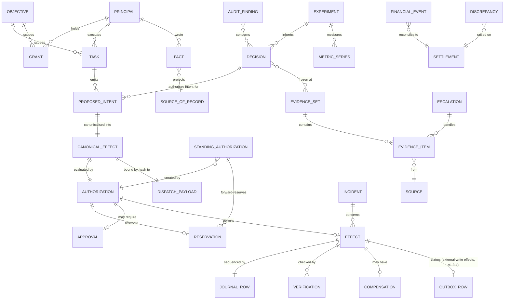

# 24 — Company State, Kernel Capabilities and the Evidence Model

**ACOS Operating Spine v1.3. Version 1.3. Issued 2026-09-03. Supersedes v1.1 (2026-09-02).**
Covers Phase 2 brief Parts 3, 4 and 11. Depends on `22`, `23`.

## v1.3 change record

K5's `window_balance` schema corrected to four terms, keyed by window instance, with the commitment guard, the generated `forward_monetary` column and the single-statement realised/standing update (TB-01, TB-02, TB-04). §3.1's transition table replaces `any → EXPIRED` with an explicit source set, adds `I62`, and declares window-instance scoping with `LIVE`-only re-reservation and the `I55` lapsed-exposure exemption (TB-06, TB-02). K9 holds `DegradedModeOverride` (TA-05). Full disposition in `phase2-v1.3-remediation-ledger.md`.

## v1.2 change record

| Change | Finding | Section |
|---|---|---|
| **K4 gains `enumerate_effects`** as a named READ capability with an `EnumeratedOptionSet` return type, and `selector` becomes a content-addressed `(enumeration_id, option_id)` pair rather than a positional index. The canonicaliser never substitutes an option. | SR-C2, SR-C3 | §3 K4 |
| **K4's I18 invariant is retired** and replaced by the `exposure` split — `vendor_amount` (nullable) and `total_exposure` — under I18a–I18d. `dispatch_payload` and `AuthorizationRequest` both carry `constructor_version`. | SR-C1, SR-C4 | §3 K4 |
| **K5's `StandingAuthorization` gains a five-state machine**, a `StandingRevocationAuthority`, an exposure-remainder forward-exposure formula, `boundary_kind` on every window, and `PRESUMED_SETTLED`. Forward exposure is retained in **every non-`REVOKED` status**. | SR-S1–S4, SR-L4 | §3 K5, **new §3.1** |
| **K5's window objects gain typed ceilings.** `max_monetary : Money \| UNBOUNDED`, not nullable; `window_balance` rows with a DB `CHECK` under `FOR UPDATE` replace v1.1's unimplementable exclusion constraint. | SR-L1, SR-L2 | §3 K5 |
| **K9 gains the Approval state machine** — seven states, a declared transition table, and a unique partial index on `RESUMING`. Reservation TTL derives from the tier SLA; OWNER-tier reservations are exempt from reaping. `RemedyObligation` is a new entity. | SR-R1 | §3 K9 |
| **K10's clock objects gain `clock.source_record_ref`**, a RECORD-grade citation, so a statutory clock cannot be created or extended on a model-influenceable fact. | SR-A2 | §3 K10 |
| **K11 gains journal attestation and the three-state mirror machine.** I17 is restated as *transport* completeness; the unqualified claim moves to I8. The uncorroborated state is **stricter** than normal, not looser. | SR-A1, SR-A2 | §3 K11, `30 §5.4`, `30 §5.6` |
| **K11's journal sequence gains an explicit allocator and lock order**, and re-push is idempotent under `UNIQUE(company_id, journal_seq)`. | SR-A4, SR-A5 | §3 K11, `30 §5.2` |
| `value_direction` replaces `settlement_direction` throughout and takes six values; `§8`'s address-of-record rule is cited by P4. | SR-R2, SR-R3 | §8, `26 §11` |

## v1.1 change record

| Change | Remediation | Section |
|---|---|---|
| **K4 gains the Effect Canonicaliser** as a named responsibility, and the model-facing capability becomes `propose_intent`. The adapter receives a constructed `dispatch_payload` and builds nothing. | R1 | §3 K4 |
| **K5 gains the `StandingAuthorization` entity** for rate-based actions whose economic consequence continues after the authorising action. Kernel capability count stays at 15; this is an entity, not a capability. | R2 | §2, §3 K5 |
| **K6 splits** into finance ingest (integration boundary, credentialed) and finance computation (control plane, no vendor credential). | R4 | §3 K6 |
| **K11's failure behaviour is replaced.** Buffer-and-continue was one of two mutually exclusive behaviours the package specified for the same condition. The audit store becomes a replicating verifier and halt applies by recoverability class. | R3 | §3 K11 |
| **DECISION grade splits** into `DECISION_OWNER` and `DECISION_DELEGATED`. A delegated (model-originated) decision may gate only the narrow class its delegating grant names, and never a monetary or irrecoverable class. | R7 | §5 |
| Provenance gains endpoint, method, request hash, response status, response hash, timing, `authorisation_ref` and `parser_version`; `content_hash` is no longer computed by the adapter. | R6 | §6 |
| World-time interval logic is deferred out of the MVP; `observed_at`, `recorded_at`, supersession and `max_age` are not. | R19 | §7 |
| Supersession gains the webhook-versus-poll precedence correction and the `IMMUTABLE_AFTER_ORDER` field class that closes precondition laundering. | R6, R7 | §8 |
| §10 gains a sixth entry: adapter compromise escalating into another adapter's authority through RECORD-grade writes. | R6 | §10 |
| Contradiction blocking moves from the Decision Registry alone into the policy engine as step H′. | R7 | §15 |
| K13 and K14 are deferred out of the MVP. The capabilities are unchanged; nothing is built. | R19 | §2 |


---

# Part I — Deriving the kernel

## 1. Method

The brief supplies a candidate list of kernel capabilities and instructs: *"Do not simply adopt this list. Derive the minimum set from evidence."*

The derivation test applied to each candidate is:

> **Remove it. Name the Phase 1 evidence that then produces a failure with no other mitigation available.**

A capability that survives removal — because another component covers it, or because no evidence demands it — is not kernel. It may still be built; it is not part of the minimum spine.

## 2. Result

| Candidate | Verdict | Evidence that forces it, or why it fails the test |
|---|---|---|
| **Company state** | **KERNEL** | EM14. Remove it and conversation history becomes the record; Vending-Bench 2's ~69k-token auto-trimming context is what that produces. |
| **Identities / principals** | **KERNEL** | EM2, EM11, EM16. Without a principal registry there is nothing for policy to evaluate against, no attribution in the audit record, and no place to hold platform-facing agent identity. Cedar's stated insight applies directly: *"The principal remains the agent, not a user entity."* |
| **Authority / policy** | **KERNEL** | EM2. The precondition every Phase 1 classification assumes (`20 §5 I2`). |
| **Actions (effects)** | **KERNEL** | EM1, EM6, EM9. The effect record is simultaneously the idempotency mechanism, the attribution record, the ungated-action counter, and the reconciliation anchor. It is the single most load-bearing entity in the architecture. |
| **Financial truth** | **KERNEL** | EM7. Must exist with all models offline. |
| **Audit trail** | **KERNEL** | EM16. Separate store; the audited system cannot write to it. |
| **Approvals** | **KERNEL** | EM15, `07 §5`: *"A human approval gate is only a real control when it is a state transition in a deterministic system"* — not a dialog box in an agent client. |
| **Incidents / exceptions** | **KERNEL** | EM6, EM15. Dead-lettered work and statutory clocks both need a typed, owned, SLA-bearing object. `08 §11`: managed-engine trace retention (24h–90d) cannot hold it. |
| **Evidence** | **KERNEL** | EM8, `07 §4.4`. Provenance and corroboration are the only identified defence against decision-process poisoning, and they require an evidence store distinct from state. |
| **Tasks / work** | **KERNEL** | EM6. Bounded units need a durable representation with budgets and termination. |
| **Events** | **KERNEL, but thin** | EM6, `08 §8.3`. What is required is ingress verification, deduplication and reconciliation — not an event-sourcing platform. The kernel entity is `InboundEvent{source, external_id, hash, received_at, processed_at}`. |
| **Decisions** | **KERNEL** | Constitution §24, EM16, `30 §5`. Without a decision object there is no chain from evidence to effect, and the owner cannot answer *why*. |
| **Objectives** | **KERNEL, minimal** | Survives narrowly. Needed because grants and spend trajectories are scoped to objectives, and because the CEO's priority-setting output must attach to something durable. Reduced to `Objective{id, statement, metric_ref, window, budget_envelope, status}`. |
| **Policies** | **Not separate from Authority** | Folded in. A policy *is* the authority artifact. Keeping them separate invites a second, weaker enforcement path. |
| **Experiments** | **KERNEL** | Constitution §18, SR8. Pre-registration must be frozen at registration or the goalpost problem is unaddressed. |
| **Metrics** | **KERNEL** | EM7, EM16. Metrics must be computed by something the agent cannot write to, and counter-metrics are the audit mechanism. |
| **Budgets / exposure** | **KERNEL — and it is not the financial ledger** | SR5, EM3, EM13. Committed-but-unsettled exposure is what authorisation must reserve against; realised cash is what the ledger records. Conflating them permits aggregate overrun equal to the settlement lag. **v1.1: this capability gains the `StandingAuthorization` entity** (R2). v1.0 could represent an *amount* and not a *rate*, so one authorised advertising-budget change produced external spend every day until something stopped it, invisible to MAL and false-positived by the inverse sweep on every renewal. |
| **Agent profiles** | **KERNEL** | EM11. Platform-facing identity, capability declaration, trust tier, per-platform kill switch. |
| Products, orders, customers, suppliers, campaigns, content | **NOT KERNEL** | These are *domain* entities. They live in the commerce platform (`10 §2.2`: storefront is BUY) and are projected into the state store as graded facts. Putting them in the kernel is how an architecture becomes business-model-specific — the failure quality gate 1 tests for. A subscription business, a digital-product business and a micro-SaaS have different domain entities and the same kernel. |
| Product candidates, niches, competitors | **NOT KERNEL** | These are evidence and hypotheses, already covered by the Evidence Store and the Decision Registry. |
| Support cases | **NOT KERNEL** | Lives in the bought helpdesk (`10 §6`). Projected in as case-scoped facts. |
| Agent actions | **NOT KERNEL — it is the Effect record** | Merged. A separate "agent action" entity would create a second, weaker audit path. |

**Kernel capability count: 15.** Domain modelling is explicitly outside it.

**v1.1 note on the count (R2, R19).** `46 R2` offered `StandingAuthorization` as either a sixteenth kernel entity or an extension of K5. It is recorded as an **entity owned by K5**, because forward exposure reservation is exactly what K5 does and a separate capability would create a second place where exposure is tracked. The count stays at 15.

**Two capabilities are deferred out of the MVP** per `45 §3`, with the derivations above unchanged:

- **K13 Experiment Registry** proves none of `37 §1`'s nine properties. Its purpose is Stage 2's statistical honesty. Trigger: before Stage 2.
- **K14 Agent Profile Registry** requires a live platform identity. The MVP has a development store, no marketplace, no advertising account and no public storefront — nothing to declare and nobody to declare it to. Trigger: the first real platform identity.

Deferral is not reclassification. Both remain kernel; neither is built at MVP; `37 §4` lists them as decisions.

## 3. Kernel capability specifications

Each is specified against the brief's required fields. Data model detail is in Part II.

---

### K1 — Company State Store

| | |
|---|---|
| **Responsibility** | Hold every fact ACOS believes about itself and its world, with provenance, grade and temporal validity. |
| **Authoritative data** | It is the authority for *what ACOS believes*. It is **not** the authority for external reality — for that it holds a graded projection with a named upstream system of record. |
| **Inputs** | Ingress adapters (RECORD grade), Financial Truth Service (RECORD/OBSERVATION), Metric Layer (OBSERVATION), quarantined ingestion (CLAIM), reasoning workers (INTERPRETATION/HYPOTHESIS only), Decision Registry (DECISION). |
| **Outputs** | Context assembly reads; policy precondition reads; metric inputs; control-centre reads. |
| **Invariants** | Append-only. Every record carries `grade`, `provenance`, `observed_at`, `valid_from`, `valid_to`, `writer_principal`, `source_system_of_record`. Grade is derived from writer identity and promotion rule, never asserted (SR3). No update-in-place; correction is a new version with a supersession link. |
| **What AI may do** | Read (through assembled context, not directly). Write records at `INTERPRETATION`, `HYPOTHESIS`, `ESTIMATE`, `RECOMMENDATION` grade only, and `DECISION_DELEGATED` where a grant delegates the decision. |
| **What AI may not do** | Write `RECORD`, `OBSERVATION` or `DECISION_OWNER` grade. Delete. Modify `valid_to` on another record. Promote a grade. Write a `DECISION_DELEGATED` fact that gates a monetary or irrecoverable class (I28). |
| **Failure behaviour** | Read failure → work item suspends; policy fails closed. Write failure → work item retries; effect authorisation is blocked because preconditions cannot be evaluated. |

---

### K2 — Principal & Grant Registry

| | |
|---|---|
| **Responsibility** | Define every actor that can propose or perform, and every authority statement that permits anything. |
| **Authoritative data** | Principals, grants, delegation chains, categorical prohibitions, the MAL computation. |
| **Inputs** | Owner administration only. |
| **Outputs** | Policy evaluation inputs; MAL and grant inventory to the control centre; principal attribution to the audit store. |
| **Invariants** | Grants are created and widened **only** by the owner, through a change-controlled path (B9). Every grant has an expiry. Delegation produces a signed chain whose capability set is a strict subset of the delegator's. Depth ≤ 3. Categorical prohibitions cannot be overridden by any grant. |
| **What AI may do** | Read its own effective grants (so it can avoid proposing what will be denied). Propose a grant change as a `RECOMMENDATION` for owner review. |
| **What AI may not do** | Create, widen, extend, or self-assign. Read another principal's private grant conditions. |
| **Failure behaviour** | Unavailable → policy fails closed → all effects denied. This is correct: an ACOS that cannot determine authority must not act. |

---

### K3 — Policy & Authority Engine

| | |
|---|---|
| **Responsibility** | Return `PERMIT / DENY / REQUIRE_APPROVAL(tier)` for a typed effect proposal, deterministically and reproducibly. |
| **Authoritative data** | The policy set (versioned artifact) and the decision record it emits. |
| **Inputs** | Signed principal, structured proposal, state fetched by the engine itself. |
| **Outputs** | `AuthorizationDecision{verdict, policy_version, evaluated_facts, matched_rules, reservation_id}`. |
| **Invariants** | Never reads model-authored text. Never accepts a model's assertion of a fact. Deterministic: same inputs, same policy version → same verdict, always. Deny rules evaluated first and cannot be overridden. Emits a decision record for every evaluation including denials. |
| **What AI may do** | Nothing. It is not a caller and not a subject of the engine's API beyond being the principal on a proposal. |
| **What AI may not do** | Invoke it directly, read its rules in a form it could reason about bypassing, modify it, or observe near-miss information that would aid probing (denial reasons returned to a model are coarse-grained by design). |
| **Failure behaviour** | Fail closed. |

---

### K4 — Effect Gateway & Effect Ledger

| | |
|---|---|
| **Responsibility** | The deterministic chokepoint for every external effect originating in AI reasoning (`23 §5`), the **canonical constructor** of every authorisation request and dispatch payload, and the journal of everything that crossed it. |
| **Authoritative data** | Every external effect ACOS has attempted, with idempotency key, principal, authorisation reference, adapter, request/response hashes, verification status, compensator reference, `gate_class`, `recoverability`. |
| **Inputs** | `ProposedIntent` from a reasoning worker (four permitted fields plus a journaled rationale), or a **`KERNEL_SERVICE` request** from a kernel state machine bearing a `StandingRevocationAuthority` (`26 §7.1`). |
| **Outputs** | A canonically constructed `AuthorizationRequest` **and** the exact `dispatch_payload`, bound by one hash and both stamped `constructor_version`; adapter invocation with that payload verbatim; `Effect` journal record with a gap-free `journal_seq` and local chain hash; audit mirror push; exposure ledger reservation; verification task. **`EnumeratedOptionSet` in response to `enumerate_effects`.** |
| **Invariants** | No external effect without a prior committed journal row (B8). **`exposure.vendor_amount == dispatch_payload`'s vendor-visible amount where one exists (I18a); `exposure.total_exposure == reservation.amount` exactly (I18b); `vendor_amount ≤ total_exposure` (I18c); `settled_total` within the class tolerance of `total_exposure` at settlement (I18d).** *(v1.2: `I18` is retired — it was a three-way equality between two quantities that are not equal whenever a cost component exists, which is every refund carrying a retained fee. `26 §2.1.1`.)* **No `AuthorizationRequest` field is populated from `ProposedIntent` beyond `action_class`, `resource_ref`, `selector`, `reason_code` (I21).** Idempotency key is a deterministic function of `(task_id, action_class, resource_id, semantic_parameter_digest)` computed by the kernel over the **canonicalised** parameters — never a random UUID, and **never including `journal_seq`**, which is allocated after the key is computed (`30 §5.2`, SR-A4). Every effect has a terminal status: `VERIFIED`, `FAILED`, `COMPENSATED`, `PRESUMED_EXECUTED` (irrecoverable, unknown outcome, never re-dispatched), or `UNRESOLVED_DISCREPANCY`. Effects never silently disappear. |
| **What AI may do** | Call `propose_intent`. Call **`enumerate_effects`** within `tool_scope`, rate-limited. Read the status of effects it proposed. |
| **What AI may not do** | Supply an exposure figure, a vendor parameter, a monetary value, a counterparty, a `value_direction`, a recoverability class, or any field of the dispatched request. Choose the idempotency key. Choose the `constructor_version`. Bypass the gateway. Mark an effect verified. Register or invoke a compensator. Set `gate_class`. Enumerate outside the resource set its `context_spec` admits. |
| **Failure behaviour** | Fail closed on policy, exposure or canonicaliser-state unavailability. On adapter failure, bounded retry with jitter against the same idempotency key, then dead-letter to an Incident. On ambiguous outcome, status by recoverability class: money holds and the reconciler resolves; **irrecoverable assumes executed, marks `PRESUMED_EXECUTED`, consumes the irrecoverable unit and never re-dispatches** (`35 §4`, R13). Reconciler resolution is itself a gateway-dispatched effect reusing the original authorisation and idempotency key. |

**The Effect Canonicaliser (v1.1, R1).** The responsibility v1.0 assigned to nobody. It sits between schema validation and policy evaluation, and per action class it holds a **versioned constructor** that:

1. fetches the authoritative state itself, under the existing entity advisory lock (`25 §14`);
2. **enumerates** the permissible effects for `(action_class, resource)` — for a refund, the refundable line items and the remaining maximum per item; for a budget change, the permitted absolute values given the current budget and the increase rule; for an address edit, the permitted address sources;
3. accepts the model's `selector` as a **content-addressed `(enumeration_id, option_id)` pair** against the **live** re-enumeration and rejects anything else — **never substituting a different option**, and denying `SELECTOR_STALE`, `SELECTOR_ENUMERATION_STALE` or `SELECTOR_MALFORMED` as appropriate (I53);
4. **computes** exposure from the selected option, including per-class cost components: retained processing fee for refunds, freight and COGS for reships, and registered compensator cost for COMPENSABLE classes — and, for rate-changing actions, the **forward integral to the window-instance boundary** as the separate `exposure.forward_integral` field, which is **not** a component of `total_exposure` and enters `I3` term 2 rather than the ordinary reservation (`26 §2.1.3`, TB-03);
5. converts to the single ledger currency using a RECORD-grade FX rate with `staleness_policy=BLOCK`, journaling both original and converted amounts;
6. computes counterparty identity and novelty, **`value_direction`** (six values, `26 §11.1`), and recoverability, from the catalogue and from state — never from the intent;
7. emits the `AuthorizationRequest` and the exact `dispatch_payload` together, hashed together, **both stamped with the `constructor_version` that produced them**, and hands both on.

The adapter receives `dispatch_payload` verbatim and **constructs nothing**. Where an action class cannot be deterministically canonicalised, it is not eligible for autonomous execution — the same disqualifier logic `25 §7` applies to idempotency. The semantic error catalogue this closes is in `26 §2.2`.

**`enumerate_effects` (v1.2, SR-C2).** v1.0's `propose_intent` accepted a `selector` into an enumeration **the model had no way to obtain**, so either the model guessed and every non-trivial action failed, or an undocumented read existed in the money path. It is documented now:

```
enumerate_effects(action_class, resource_ref)
  -> EnumeratedOptionSet {
       enumeration_id,            // content-addressed over the option set
       action_class, resource_ref,
       computed_at, max_age,      // per class
       constructor_version,
       options[ { option_id,      // content-addressed over the option's semantic fields
                  description } ] // projected through the task's context_spec (I52)
     }
```

A **READ capability** inside `tool_scope`, journaled with `journal_row_kind = READ`, rate-limited per principal per window, and **filtered by the task's `context_spec`** so the enumeration is not a broader read than the task already holds. Enumeration reserves nothing and authorises nothing.

**Content-addressed option ids (v1.2, SR-C3).** A positional index is unstable under concurrent state change: a refund enumeration taken at *t* and resolved at *t+δ*, with a partial refund landing in between, silently re-indexes and **the kernel refunds a different line than the model reasoned about, at full policy compliance.** `option_id` is a digest over the option's declared semantic fields — the `semantic_option_digest` specification per class is in `26 §2.2` — so a changed option has a changed id and the selector no longer resolves. It denies. It does not approximate.

**Constructor versioning (v1.2, SR-C4).** `ConstructorVersionRecord { semantic_major, non_semantic_minor, changed_fields[], semantic_change }` accompanies every decision and every payload. Constructors are a **control artifact, class 19**; the canonicalisation specification is **class 20** (`50 §2`). A replay under a differing `semantic_major` is refused rather than recomputed (I61), and an approval resume under a differing `semantic_major` denies `CONSTRUCTOR_SEMANTIC_CHANGE` (`26 §12.1`).

---

### K5 — Exposure & Budget Ledger

| | |
|---|---|
| **Responsibility** | Track committed exposure against every **named** authority window, in the money currency and the irrecoverable-count currency, including **forward exposure from standing authorisations**. |
| **Authoritative data** | Named windows (each declaring `boundary_kind`, `max_monetary`, `max_count`, `max_irrecoverable_units`), reservations, commitments, releases, **`window_balance` rows**, `StandingAuthorization` records with their status and forward exposure, `StandingRevocationAuthority` records, `PRESUMED_SETTLED` exposures, MAL utilisation. |
| **Inputs** | Effect Gateway reservations; window-boundary re-reservation jobs; settlement events from the finance computation that convert commitment to realised cost; reservation expiries. |
| **Outputs** | Available headroom per window; utilisation metrics; **six displayed quantities** — `MAL_monetary`, `MIE_cost`, `Standing`, `OrderDriven_cost`, `MAL_total`, realisable cash exposure (`26 §10.1`); runway inputs. |
| **Invariants** | Reservation is atomic with the authorisation decision (SR5). **For every named window *instance*, `Σ open reservations + Σ standing forward exposure + Σ presumed-settled exposure + realised spend ≤ window ceiling` (I3, v1.2 gains the third term — SR-L4; v1.3 corrects the printed enforcement to carry all four terms and scopes the balance row to the window instance — TB-01, TB-02).** An effect reserves `exposure.total_exposure` against **every** window its matching grants reference and fails if any lacks headroom. **No second reservation for an authorisation that already holds one (I31).** **A verify-mode resume never increases a held reservation (I51)** — a distinct property from I31, DB-enforced by the `reservation_no_increase` trigger. Reservation TTL derives from the approval tier's SLA; **OWNER-tier reservations are exempt from reaping** and their exposure is attributed to `I32`. Money and irrecoverable-count are separate ledgers with separate ceilings (EM3), and **no order-driven fulfilment consumes `MIE_discretionary` (I30)** — but order-driven irrecoverable cost is **displayed** (I57). |
| **What AI may do** | Read its own headroom. |
| **What AI may not do** | Reserve, release, adjust a ceiling, create or extend a `StandingAuthorization`, or read another principal's headroom. |
| **Failure behaviour** | Unavailable → Effect Gateway denies. A window boundary that cannot be re-reserved **pauses** the affected standing authorisation through its `revocation_effect_class` rather than allowing it to continue — and the pause is authorised by the `StandingRevocationAuthority`, not by the grant, which may already have expired (`26 §7.1`). |

**Named windows (v1.1, R8).** v1.0's grants declared private window limits while reservations were taken against windows, and nothing bound one to the other — so two grants permitting the same action class either doubled the headroom or conflicted with no precedence rule (`43 §5.2`). Windows are now **company-scoped named objects**; grants *reference* them; and every grant references a MONTH window so `MAL_total(month)` is defined. v1.0's `37 §5` failed this: a grant carrying only a DAY window made `min(g.window_limit(MONTH).max_monetary, …)` undefined, which is why the stated $600 monthly ceiling did not reconcile with a $40/day advertising grant.

**Typed ceilings (v1.2, SR-L1).** Every window declares:

```
Window {
  window_id, company_id, name,
  boundary_kind,                    // DISCRETE | ROLLING     (v1.2, SR-S1)
  period,                           // DAY | MONTH
  max_monetary       : Money | UNBOUNDED,     // NOT NULLABLE
  max_count          : Integer | UNBOUNDED,
  max_irrecoverable_units : Integer | UNBOUNDED,
  max_count_by_class : { action_class -> Integer }   // v1.2, SR-L2: MIE counts are heterogeneous
}
```

`min(UNBOUNDED, x) = x`. `0.00` admits no monetary exposure. **`null` is a schema violation rejected at catalogue validation**, because v1.1's `MAL_monetary` took a `min` against an operand no window declared and an independent implementation could not evaluate it (`26 §10.1`, LIM-01).

**`boundary_kind` is declared, not implied (v1.2, SR-S1).** *"Remaining periods to window end"* is meaningful only for a window with an end. **All nine production windows in `51 §2` are `DISCRETE`.** `35 §7`'s *"rolling 24h"* phrasing described no declared window and is corrected. A ROLLING method is defined in `51 §2.1` and marked **`NOT_ADMISSIBLE_AT_MVP`**: a continuously-ageing balance cannot be represented as one `CHECK`-constrained `window_balance` row, and adding it would relax the concurrency proof for no MVP benefit.

**`window_balance`, because the v1.1 enforcement mechanism was not implementable (v1.2, SR-L2, LIM-05); corrected to four terms and made instance-scoped and atomic in v1.3 (TB-01, TB-02, TB-04).** v1.1 said `I3` was enforced by *"an exclusion constraint"*. PostgreSQL exclusion constraints test pairwise operator relations between rows; **`I3` is a sum over a row set against a scalar, which no exclusion constraint expresses.** v1.2 replaced it with a `window_balance` row and **printed a three-term `CHECK` over a row with no standing column**, so the term Mechanism B exists to enforce was enforced by nothing in the artifact declaring the enforcement (TB-01). **This is the single authoritative schema specification for `window_balance` and for the standing exposure it aggregates. No other artifact declares either.**

```
-- One row per (company, window, window instance). TB-02: the instance is part of the key.
window_balance(
  company_id, window_id, window_instance_key,                       -- PRIMARY KEY
  reserved_monetary,      standing_monetary,      presumed_monetary,      realised_monetary,
  reserved_count,         standing_count,         presumed_count,         realised_count,
  reserved_irrecoverable,                         presumed_irrecoverable, realised_irrecoverable,
  max_monetary, max_count, max_irrecoverable_units,                 -- from the window registry, 51 §2
  CHECK (reserved_monetary >= 0 AND standing_monetary >= 0
     AND presumed_monetary >= 0 AND realised_monetary >= 0)         -- and likewise per ledger
)

-- One row per (standing authorisation, window, window instance). TB-02, TB-04.
standing_window_exposure(
  standing_authorization_id, window_id, window_instance_key,        -- PRIMARY KEY
  company_id,
  standing_cap_monetary   NUMERIC NOT NULL,                         -- authoritative primitive
  realised_monetary       NUMERIC NOT NULL DEFAULT 0,               -- authoritative primitive
  forward_monetary        GENERATED ALWAYS AS
                            (GREATEST(0, standing_cap_monetary - realised_monetary)) STORED,
  instance_in_scope       BOOLEAN NOT NULL                          -- §3.1's in-scope rule
)
```

**The commitment guard is the enforcement of `I3`, and it carries all four terms** (TB-01, TB-04). A bare `CHECK` cannot express it, because the four-term sum must gate a *commitment* while never refusing an *observation* — see the financial-truth rule below. It is a `BEFORE UPDATE` trigger on `window_balance`, per ledger:

```
IF (NEW.reserved_monetary  > OLD.reserved_monetary
 OR NEW.standing_monetary  > OLD.standing_monetary
 OR NEW.presumed_monetary  > OLD.presumed_monetary)
   AND (NEW.reserved_monetary + NEW.standing_monetary
      + NEW.presumed_monetary + NEW.realised_monetary) > NEW.max_monetary
THEN RAISE 'I3_WINDOW_EXHAUSTED';
```

Every reservation takes `SELECT … FOR UPDATE` on the affected `window_balance` rows **in ascending `window_id`**, then the journal counter — the lock order declared in `30 §5.2`. The guard is the invariant; the row lock is the serialisation; the ordering is the deadlock proof. `36 §2.5`'s concurrency test targets this. **The guard's operand set is exactly `I3`'s four terms, per ledger, and `analysis/v1.3-consistency-audit.md` condition V4 compares the printed expression against the registry mechanically.**

**Financial truth is always writable (v1.3, TB-04, and TB-08 clauses (b) and (c) applied as its consequence).** A realised figure the vendor actually delivered must be recordable even when it exceeds a ceiling ACOS authorised. So:

- An update that **increases only `realised`** passes the guard unconditionally, even where the resulting four-term sum exceeds `max_monetary`.
- Exceeding raises **`WINDOW_CEILING_BREACHED`**, and where the excess is attributable to a standing authorisation's vendor overdelivery, **`STANDING_OVERDELIVERY`** — a distinct incident type, deliberately **not** `I3`'s security path. A vendor billing artefact is not evidence that the control model was breached.
- The four terms still bound what ACOS may newly commit: a realised increase shrinks the headroom available to the *next* commitment, because the guard reads `NEW.realised_monetary`. **No term was dropped from the bound; what changed is which write the bound refuses.**

**Realised and standing move in one statement (v1.3, TB-04).** `forward = standing_cap − realised` couples two ledger values, and v1.2 left their atomicity undeclared: realised-first transiently breached the `CHECK` and blocked the financial-truth path; standing-first transiently created headroom a concurrent authorisation could consume without touching any lock associated with the standing authorisation. The repair removes the choice:

1. `forward_monetary` is a **generated column** over `(standing_cap_monetary, realised_monetary)`. It is not independently writable, by anyone, including the control plane. Only one primitive changes.
2. The spend reconciler's update is **one statement** against `standing_window_exposure`, and a trigger in the same statement recomputes `window_balance.standing_monetary` as `Σ forward_monetary WHERE instance_in_scope` and increments `window_balance.realised_monetary` by the same delta. Both terms move together or neither does.
3. **The reconciler takes the same lock order as the authorising transaction** — `window_balance` rows `FOR UPDATE` ascending `window_id`, then `standing_window_exposure`, then the journal counter. There is one lock order in the system and both writers of the money row obey it.

No interleaving exposes headroom, because the aggregate is recomputed under a lock a concurrent authorisation must also hold. `36 §14`'s targeted-interleaving set carries both orderings with the mandatory `REPEATABLE READ` negative control.

**Why `forward` is generated per authorisation and summed, rather than generated on the aggregate.** `max(0, ·)` does not distribute over sums: `max(0, Σcap − Σrealised)` is smaller than `Σ max(0, cap_i − realised_i)` whenever one authorisation has overrun, so an aggregate generated column would silently under-reserve. Generating at the level where the identity is valid and aggregating by trigger keeps the conservative form.

**`StandingAuthorization` (v1.1, R2).**

```
StandingAuthorization {
  id, company_id, action_class, resource_ref,
  authorising_decision_ref, authorising_effect_ref,
  adapter,                             // v1.2: parameter provenance is per adapter (51 §3.2)
  rate { amount, currency, period },
  forward_exposure(s, w_instance, t),  // v1.2: COMPUTED, exposure-remainder form (26 §10.1)
                                       // v1.3 (TB-02): scoped to a window INSTANCE, materialised
                                       //   as standing_window_exposure rows; zero for every
                                       //   instance outside the in-scope interval below
  realised_spend_by_window_instance,   // v1.2: the remainder's other operand; v1.3: per instance
  created_at,                          // v1.3 (TB-02): start of the in-scope interval
  expires_at,                          // MANDATORY, mirrors grant expiry
  revocation_effect_class,             // the governed class that stops it
  revocation_authority_id,             // v1.2: the StandingRevocationAuthority (I55)
  reconciler_match_rule,               // v1.2: scoped to THIS standing_authorization_id
  status,                              // LIVE | PAUSE_PENDING | PAUSED | EXPIRED | REVOKED
  cessation_verified_at                // v1.2: REVOKED requires this (I54)
}
```

**v1.2 changes four things about this entity**, each because a v1.1 statement about it was unsound. **v1.3 adds a fifth — window-instance scoping — because the v1.2 formula had no instance referent and recomputed the full `standing_cap` in every subsequent instance of a recurring window, permanently exhausting `W_MONTH_ADSPEND` for any authorisation that can never reach `REVOKED` (TB-02).**

1. **`forward_exposure` is computed, not stored as a fixed reservation.** `standing_cap(s,w) = rate × periods_basis(w, adapter)`; `forward_exposure = max(0, standing_cap − realised_spend)`. v1.1's `rate × remaining_periods` used the *rate* period against a *calendar* window and carried no slack, so a single day of documented Google Ads overdelivery paused a healthy campaign on **day 2 of a 30-day consent** (STD-04) and understated `MAL_total(month)` in seven months of twelve (STD-06). `26 §10.1` and `51 §4.3` carry the derivation.
2. **Five states, not four**, with `PAUSE_PENDING` between the dispatch of the pause and its verification. v1.1's four states had no representation for *"we have asked the platform to stop and do not yet know that it has."*
3. **Forward exposure is retained in every non-`REVOKED` status** — including `PAUSED` and `EXPIRED`. None of them establishes that the platform stopped spending. The commercial cost of this is stated in `26 §10.5` rather than discovered.
4. **`reconciler_match_rule` is scoped to one `standing_authorization_id`.** v1.1's rule matched by `(vendor, resource_ref, rate)`, so a second authorisation on the same campaign **absorbed the first's post-pause charges** and `I22` never fired — the exact defect R2 was created to close, reached through the pause path (`54 §4.2`). **v1.3 (TB-05): `standing_authorization_id` is not carried by any declared vendor read, so v1.2's scoping was a self-assertion. The field is now declared as an ACOS derivation with a named authoritative timestamp and a directional ambiguity rule in `51 §3.2`, and the match rule no longer names conjuncts over fields the adapter's source does not contain.**
5. **Forward exposure is scoped to a window instance, and the boundary re-reservation job re-reserves only for `LIVE`** (v1.3, TB-02). `§3.1` declares the rule.

**A rate is not an amount, and the architecture must govern both.** Applies to advertising budgets, subscriptions, dunning schedules, saved payment mandates, metered plans and recurring supplier or service commitments.

| Concern | Mechanism |
|---|---|
| Forward exposure | `max(0, standing_cap(s,w) − realised_spend(s,w,t))` against every referenced window. Contributes `Standing(w)` to `MAL_total(w)`. |
| Window-boundary re-reservation | A scheduled job re-reserves at each **DISCRETE** boundary. Re-reservation of the remainder form succeeds after documented overdelivery, which is the point (`51 §4.3`). |
| Failure to obtain new headroom | The authorisation **pauses** via `revocation_effect_class` — itself a governed effect, journaled, and authorised by the `StandingRevocationAuthority` so it remains dispatchable after the grant expires (`26 §7.1`, STD-03). It does not continue. |
| Mandatory expiry | An advertising budget, like a grant, is periodically re-consented. I23. |
| Revocation | The named class, dispatched through the gateway. |
| Renewal matching | `reconciler_match_rule` matches renewals in the financial and effect reconcilers, so `25 §8.3`'s inverse sweep needs **no exclusion rule** — v1.0 would have flagged every renewal as an unjournaled external mutation, producing either an incident flood or a permanent hole in the sweep. |
| Provider-initiated charges | Same rule, **scoped to one authorisation id**. A recurring charge matching no live standing authorisation is an incident (I22). |
| **Cessation verification** (v1.2; operand corrected v1.3) | `REVOKED` requires a verification read from the audit plane's own credential showing **zero incremental platform spend across the interval the adapter's declared cessation specification defines** (I54). The single scalar `cessation_lag` is **retired** as the `I54` operand; the per-adapter **cessation specification** replaces it, its required fields are declared under **TB-07** and it is `UNDECLARED` for every adapter (`51 §3.2`). Conservative default, unchanged: **no `REVOKED` transition is available at MVP**, and exposure is held to the close of the last in-scope window instance (`§3.1`). |
| Inverse reconciliation | Run by the audit plane from its own vendor reads (I8), not by the control plane. |

---

### K6 — Financial Truth Service

| | |
|---|---|
| **Responsibility** | Produce the company's financial position deterministically from external settlement data. **Split in v1.1 (R4): ingest and computation are separate components in separate trust zones.** |
| **Structure** | **Finance ingest** — adapters in the integration boundary (Z2). They hold the vendor credentials, retain raw responses verbatim, and compute nothing. **Finance computation** — a control-plane module (Z1) holding **no vendor credential**, which parses retained responses through versioned parsers and derives every figure. |
| **Authoritative data** | Financial events, settlements, reconciliation runs, discrepancies, contribution-margin records, cash position, runway projection. |
| **Inputs** | Retained raw responses from: payment processor balance transactions, commerce payouts, bank settlement lines, supplier cost APIs, advertising spend, model-provider cost APIs. |
| **Outputs** | RECORD/OBSERVATION-grade facts to K1; metrics; discrepancy objects; runway. |
| **Invariants** | No model in the derivation graph of any value (B4), CI-checked. **No vendor credential in the computation module (I25), CI-checked.** Reconciliation status ∈ `{MATCHED, UNMATCHED, MATCHED_WITH_TOLERANCE(named_rule)}` and nothing else (I4). **No cash, runway or ceiling figure derives from an unsettled source (I46).** Operates fully with all models offline. |
| **What AI may do** | Read outputs. Narrate and interpret them. |
| **What AI may not do** | Write anything. Resolve a discrepancy. Choose a tolerance rule. |
| **Failure behaviour** | Missing upstream data → the affected period is marked `INCOMPLETE`, not estimated. Reconciliation mismatch → `Discrepancy` object, escalation, and **no auto-resolution** (`28 §6`). |

**Why the split matters (`43 §8`).** v1.0 placed this capability in two trust zones simultaneously: `28 §3` put it in the Integration Plane holding an **org-scoped admin** credential — on both named model providers that scope includes API-key and workspace management, which touches the categorically prohibited `credential.*` class — while `33 §2.1` listed `finance` as a control-plane module and `23 §3` said the control plane holds only its own database credential. All three statements could not be true. The org-admin cost credential's scope must be enumerated and replaced with a purpose-scoped key if the provider offers one; where it cannot be narrowed, the residual is recorded in `48-external-write-perimeter.md` rather than asserted away, and I15's empirical probe applies to it.

**And the audit plane recomputes the settlement equality independently** from its own read-only processor and bank credentials (R10). Financial truth proved by comparing one system to itself is not proved.

---

### K7 — Work Orchestrator

| | |
|---|---|
| **Responsibility** | Schedule, execute, budget, retry, suspend, resume, time out and dead-letter every unit of work. |
| **Authoritative data** | Task records, execution journals, budgets consumed, termination reasons. |
| **Inputs** | Triggers: verified inbound events, schedules, escalation resolutions, owner directives, CEO task orders. |
| **Outputs** | Worker invocations; suspension on approval; incidents on dead-letter. |
| **Invariants** | Every task has a declared budget (tokens, dollars, wall-clock, tool calls, sub-task depth) enforced deterministically at the queue, not by the model. Completed steps are checkpointed and never re-executed. No task runs unbounded. **v1.3.4 (CSB-01): a task carries `task.case_ref` — the statutory or customer case it runs under, or NULL. It is kernel state, set from the authoritative trigger that created the task (an ingress case, an escalation, a `RemedyObligation`'s preserved lineage), and it is the authoritative source every effect of that task inherits its `case_ref` from (`30 §9.2`).** |
| **What AI may do** | Emit typed task orders from a closed catalogue (CEO); emit sub-task requests of declared types within depth and budget (workers). |
| **What AI may not do** | Set its own budget, extend a budget, cancel an audit or verification task, or address another worker directly. **v1.3.4: set, supply, change or influence `task.case_ref`, or supply a case reference on any proposal, claim or dispatch path. It is the key `30 §5.1` row 3 reads a statutory clock by, so a model-steerable case reference is the row-3 lever `30 §9.1` exists to close (`30 §9.2`).** |
| **Failure behaviour** | Budget exhaustion → terminate, record `TERMINATED_BUDGET`, emit partial output flagged incomplete. Repeated failure → Incident. |

---

### K8 — Evidence Store

| | |
|---|---|
| **Responsibility** | Hold externally-sourced claims with provenance, tier, corroboration state and freshness, and gate their use in decisions. |
| **Authoritative data** | Evidence items, sources, corroboration links, contradictions, access failures. |
| **Inputs** | Quarantined ingestion workers only. |
| **Outputs** | Scored, corroborated claim sets to evaluation tasks and the Decision Registry. |
| **Invariants** | Every item carries `source_url`, `fetch_time`, `content_hash`, `retrieving_principal`, `source_tier`, `source_first_seen`, `access_status`. Independence for corroboration is computed on registrable domain **and** owner entity, not on URL distinctness. Inaccessible evidence is recorded as an item with `access_status=FAILED`, never omitted. |
| **What AI may do** | Read. Emit interpretations that cite items by id. |
| **What AI may not do** | Create an item without a fetch record. Assert corroboration. Modify a tier. Delete. |
| **Failure behaviour** | Insufficient corroboration → decisions requiring it are blocked and escalate. |

---

### K9 — Decision & Approval Registry

| | |
|---|---|
| **Responsibility** | Record every consequential decision, its evidence, its alternatives, its authorisation, and its outcome; and hold pending approvals as durable state transitions. |
| **Authoritative data** | Decision records, approval objects, dissent records, **`DegradedModeOverride` records** (v1.3, TA-05). |
| **Inputs** | CEO and worker proposals; owner approvals/denials; effect outcomes; measured results. |
| **Outputs** | The causal chain the owner queries; approval-queue contents; audit inputs. |
| **Invariants** | A decision that authorised exposure must reference the evidence set that supported it, frozen by hash at decision time. An approval is a state transition with a recorded approver, timestamp, the exact proposal hash approved, **the `dispatch_payload_hash` and the `constructor_version`** — approving a proposal that then changes is impossible. **Every approval transition is in the declared set of §3.1's table, and at most one approval per `approval_id` is in `RESUMING` (I60, DB-enforced by a unique partial index).** **Every verify-mode denial that leaves an unmet customer or statutory obligation emits a linked `RemedyObligation` and auto-enqueues a fresh proposal at the same tier (I58).** Dissent is recorded, not resolved by averaging. **v1.1 (R9): a pending approval is persisted kernel state here, not a suspended workflow.** The proposing workflow terminates; resumption starts a *new* workflow keyed on the approval id and the original idempotency key, and policy re-runs in **verify mode** against the reservation already held. This removes both the resume ambiguity in `26 §12` and the orphaned-suspension risk from OWNER approvals that wait indefinitely across deploys (DBO-03). |
| **What AI may do** | Propose decisions; record dissent; read history. |
| **What AI may not do** | Approve. Alter a frozen evidence set. Close an approval. **Request, grant, second-approve, extend, or read the caps of a `DegradedModeOverride`** (v1.3, TA-05) — the override is an owner act end to end and no model-reachable path touches it. |
| **Failure behaviour** | Approval timeout → escalation urgency increases; the underlying work item remains suspended, never auto-approved. **v1.2: TIER_1/TIER_2 reservations carry `tier.sla + 6h` TTL; OWNER-tier reservations are exempt from reaping, so R′'s assertion always has a subject** — v1.1 guaranteed the reservation was reaped before the approval it was held for (RES-01). The full state machine, transition table and `RemedyObligation` definition are in `26 §12.1`–`§12.3`. **v1.3: `DegradedModeOverride` is kernel state held here** — its schema, scope rule, expiry semantics, second-approver rule and owner display are specified once in `30 §5.7.2`, its limits are instantiated in `51 §3.6`, and its per-instance and aggregate bounds are enforced by `I63`. An override auto-expires to the restrictive state, never to `NORMAL`, and changes no ceiling. |

---

### K10 — Escalation & Incident Queue

| | |
|---|---|
| **Responsibility** | Every exception, statutory clock and human-required event as typed, owned, SLA-bearing objects. |
| **Authoritative data** | Escalations, incidents, clocks, resolutions. |
| **Inputs** | Deterministic triggers (RED classes, policy denials of a certain kind, discrepancies, dead letters, clock thresholds), plus discretionary escalation from workers. |
| **Outputs** | The owner's inbox; audit inputs; work-item resumption on resolution. |
| **Invariants** | Mandatory escalation triggers are deterministic and cannot be suppressed by a model. Statutory clocks (GDPR 72h / 1 month, CCPA 45d, FTC 30d and 7 working days) are timers on state, evaluated by code. **Every clock carries `clock.source_record_ref` citing the RECORD-grade fact that started it (I56); a clock cannot be created, extended or restarted on an OBSERVATION- or CLAIM-grade fact.** Every escalation carries the evidence bundle needed to decide without further interrogation. |
| **What AI may do** | Raise a discretionary escalation. Assemble the evidence bundle. Draft a recommended resolution. |
| **What AI may not do** | Suppress, close, downgrade urgency, or reset a clock. **Create a clock, or influence the fact a clock cites.** **v1.3.4 (CSB-01): influence which clock an effect is evaluated against — the effect→case binding is kernel-owned and immutable, and the evidentiary clock among several qualifying live clocks is selected deterministically by the kernel, never chosen by a caller (`30 §9.2`).** |
| **Failure behaviour** | Queue unavailable → mandatory-escalation work items refuse to proceed. |

**Why clocks needed a RECORD-grade citation (v1.2, SR-A2, AUD-06).** `30 §5`'s dispatch precedence privileges *"COMPENSABLE inside a live statutory clock"* over the audit mirror, so **the clock is a lever on the mirror-degraded path.** If a clock could start on anything a model influences, a model could manufacture the exemption it needs. `I56` closes it at the source: the clock cites the RECORD — the processor's refund request, the GDPR erasure request as received — and the citation is checkable. Combined with `§3.1`'s inverted mirror machine, the clock lever is closed on both ends.

---

### K11 — Audit Store & Invariant Checks

| | |
|---|---|
| **Responsibility** | An append-only record of authorisations, effects, decisions, policy versions and findings, plus continuously-evaluated invariants and counter-metrics. |
| **Authoritative data** | The audit record itself; findings; acknowledgements. |
| **Inputs** | The control plane's **primary journal rows**, pushed asynchronously and verified for gap-freedom; **`JournalAttestation` rows every 5 minutes** (SR-A1); **its own read-only vendor credentials** (commerce, processor, bank line, ESP, each advertising platform); independently computed metrics. |
| **Outputs** | Findings to the owner **through its own read endpoint on its own host**; unacknowledged findings auto-appended to the briefing; the adverse-facts appendix and its hash. |
| **Invariants** | Separate store on a **different provider or at minimum a separate account** with separate payment method and operator credentials. No operating principal holds write access beyond `INSERT`, under a per-principal quota (I17c, B5). Hash and sequence computed by the audit instance's own database functions under a role the writer cannot execute as (I17d). **I17 is *transport* completeness: every journal row the control plane produced and attested is present in the mirror, and no row is present that the control plane did not produce** (v1.2, SR-A1 — v1.1's unqualified *"every authorisation and effect appears in both"* was not checkable by a store that only ever sees what it is sent, and the unqualified claim now lives on **I8**, which is evaluated from the audit plane's own vendor reads). **Attestation completeness: for every `JournalAttestation` received, every `journal_seq ≤ max_journal_seq` is present and the recomputed `head_hash` matches (I17e).** **Two-sided mirror-state agreement: the control plane's declared mirror state and the audit plane's own observation agree, and divergence in either direction is an incident (I17f).** **Hourly anchoring of `{head_hash, chain_seq, row_count}` to a medium the operator cannot rewrite, with a copy to the owner (I17b).** Findings cannot be edited or closed by the CEO. **No external effect exists in any vendor system that ACOS did not journal, evaluated from the audit plane's own reads (I8).** |
| **What AI may do** | The audit reviewer (separate model binding) may read and may write findings. |
| **What AI may not do** | Any operating principal: write beyond `INSERT`, edit, delete, or close. The audit reviewer: edit or delete an existing finding, or hold any `propose_intent` capability. |
| **Failure behaviour** | **v1.2: see `30 §5.6`, which replaces the two-state description below with a three-state machine in which the uncorroborated state is STRICTER than normal operation.** The v1.1 text below remains accurate for the corroborated case. **v1.1: replaced. See `30 §5`.** The primary journal is in the **control** database, gap-free by a company-scoped `journal_seq` and hash-chained locally by a control-DB trigger; this store is a **replicating verifier**, not a write-ahead dependency. While the mirror is unreachable, dispatch is permitted by recoverability class — REVERSIBLE proceeds; COMPENSABLE inside a live statutory clock proceeds; COMPENSABLE discretionary suspends; **IRRECOVERABLE halts**; anything above the per-action approval floor halts. Mirror lag past threshold raises `AUDIT_MIRROR_DEGRADED` at CRITICAL urgency; prolonged unreachability halts all classes, with an owner override recorded as a decision. **Degradation to blanket `REQUIRE_APPROVAL` is removed**, because it was a model-reachable approval-flood lever: filling the audit store converted the whole system into an approval queue (AUDA-05, APP-08). Audit-store saturation is an incident, not a mode change. |

**What v1.0 specified, and why it was replaced (R3).** This capability said buffer-and-continue; `30 §5` said the same; `36 §6` said halt and explicitly rejected buffering; `38 §9.11` asked a question presupposing halt; and the internal quality gate certified the property by citing `36 §6` alone. Two mutually exclusive behaviours for one condition, in documents of equal standing, with no supersession note — a developer would have implemented one arbitrarily. Beyond the contradiction, **halt did not deliver what it claimed**: halting effects does not halt authorisations, reservations, expiries, state facts, escalations or clock evaluation, so after an outage the control database contained rows the audit database never saw, and that divergence is indistinguishable from suppression. And under strict halt, an audit-database outage blocks refunds while the FTC 7-working-day clock runs — EM16 forcing an EM15 breach (`22 §3.1`).

The replacement separates **durability** from **externalisation**. A locally committed, locally chained, gap-free journal row satisfies EM16's purpose that no effect escapes the record. What the mirror adds is *unsuppressibility*, which matters most where the action cannot be undone — which is why the halt boundary sits at IRRECOVERABLE. This is a **chosen trade-off, not a resolution**, and it is recorded as one.

**And what v1.1 got wrong about it (v1.2, SR-A1, SR-A2, AUD-01, AUD-03).** Two defects, both structural:

- **Silence and suppression were indistinguishable.** The mirror is a push target that verifies gap-freedom in what it receives. A control plane that stops pushing at `journal_seq = N` produces a mirror whose newest row is `N` and whose chain is perfectly gap-free — **identical to a genuinely idle company.** The anchor bounds it at one hour. `JournalAttestation` — `{company_id, max_journal_seq, row_count, head_hash, attested_at}`, itself a journal row, cadence **5 minutes**, k=3 missed attestations before `ATTESTATION_STALL` — bounds it at 15 minutes and makes the two states distinguishable.
- **Degraded mode was self-declared.** The control plane decided it was degraded, and degradation relaxed the dispatch rule for clock-bearing COMPENSABLE effects. A compromised control plane declares degradation and dispatches refunds unmirrored. `30 §5.6`'s **inversion** is the fix: the uncorroborated state **suspends** clock-bearing COMPENSABLE rather than dispatching it, so unilateral declaration is self-harming. The relaxation exists only in `CORROBORATED_DEGRADED`, which requires the audit plane's own signal.

---

### K12 — Metric Layer

| | |
|---|---|
| **Responsibility** | Compute every number ACOS reports, deterministically, from RECORD-grade inputs. |
| **Invariants** | Every metric has a named computation spec, a version, and an input lineage. Metrics are never model-produced. Counter-metrics for agent KPIs are computed by the audit plane from independent inputs. |
| **What AI may do** | Read; narrate; propose new metrics as `RECOMMENDATION`. |
| **What AI may not do** | Compute, adjust, or backfill. |
| **Failure behaviour** | Missing inputs → metric is `INCOMPLETE`, never interpolated. |

---

### K13 — Experiment Registry

| | |
|---|---|
| **Responsibility** | Experiments as first-class objects with frozen pre-registration. |
| **Invariants** | Criteria hashed and anchored in the audit store at registration (SR8). Verdict computed by K12 against the frozen criteria. Amendments create versions with diffs; results reported against original **and** amended. |
| **What AI may do** | Propose experiments; interpret results. |
| **What AI may not do** | Register, amend, compute the verdict, or stop an experiment early outside its declared stopping rule. |
| **Failure behaviour** | An experiment whose metrics cannot be computed is `INVALID`, not "inconclusive-but-directionally-positive". |

---

### K14 — Agent Profile Registry

| | |
|---|---|
| **Responsibility** | Platform-facing agent identity, capability declaration, trust tier, disclosure obligations, per-platform kill switch (EM11). |
| **Authoritative data** | Published agent profiles; declared capabilities; per-platform automation status; jurisdictional disclosure requirements. |
| **Invariants** | The published capability declaration is generated from the action catalogue, so it cannot drift from what ACOS can actually do. "Cease access if requested" is implemented as a switch that revokes the platform's adapter credentials, not as a policy note. |
| **What AI may do** | Read. |
| **What AI may not do** | Modify a profile, change a trust tier claim, or alter disclosure text. |
| **Failure behaviour** | Profile fetch failure by a platform is a platform-side matter; ACOS monitors for it and raises an incident on trust-tier downgrade. |

---

### K15 — Ingress

| | |
|---|---|
| **Responsibility** | Verified, deduplicated intake of external events, plus the reconciliation and watchdog machinery that makes webhooks safe to depend on. |
| **Invariants** | HMAC verified before parsing. Deduped on the platform's own event id. Acknowledged within the platform's timeout (5s for Shopify) with no inference in the path. Reconciliation pollers are the source of truth; webhooks are hints. A subscription watchdog re-asserts subscriptions on a schedule. |
| **What AI may do** | Nothing. |
| **What AI may not do** | Exist here. |
| **Failure behaviour** | Handler outage → subscription auto-deletion after 8 consecutive failures over 4 hours (`08 §8.3`) → watchdog re-asserts → reconciler backfills the gap. |

---

## 3.1 The `StandingAuthorization` state machine (v1.2, SR-S2)

v1.1 named four statuses and specified no transitions, so **three questions the money path asks every day had no answer**: what releases forward exposure and when; what happens when the pause effect itself fails or times out; and whether an expired authorisation whose platform is still spending is `EXPIRED` or an incident. `54 §4` constructed a loss from each. This is the answer.

```
                      ┌──────────────── pause dispatch fails / times out ──────┐
                      ▼                                                        │
LIVE ──pause dispatched──▶ PAUSE_PENDING ──verified stopped──▶ PAUSED ─────────┘
  │                             │                                │
  │                             │                                │
  └──expires_at reached─────────┴────────────────────────────────┴──▶ EXPIRED
                                                                        │
        cessation verified across the adapter's cessation specification │
                    (I54; TB-07 — UNDECLARED, so unavailable at MVP)    │
                                                                        ▼
                                                                    REVOKED
```

| # | From | To | Trigger | Forward exposure (current instance) | New-instance re-reservation |
|---|---|---|---|---|---|
| T1 | `LIVE` | `PAUSE_PENDING` | Pause effect dispatched through the gateway under the `StandingRevocationAuthority` | **Retained** | No |
| T2 | `PAUSE_PENDING` | `PAUSED` | Verification read **from the audit plane's own vendor credential** confirms the platform reports the campaign stopped | **Retained** | No |
| T3 | `PAUSE_PENDING` | `PAUSE_PENDING` | Pause effect fails or times out → bounded retry against the same idempotency key, then `STANDING_PAUSE_FAILED` incident at CRITICAL | **Retained** | No |
| T4 | `LIVE` | `EXPIRED` | `expires_at` reached | **Retained** | No |
| T5 | `PAUSE_PENDING` | `EXPIRED` | `expires_at` reached | **Retained** | No |
| T6 | `PAUSED` | `EXPIRED` | `expires_at` reached | **Retained** | No |
| T7 | `PAUSED` | `REVOKED` | `I54` cessation verification: zero incremental platform spend across the adapter's declared cessation specification | **Released** | No |
| T8 | `EXPIRED` | `REVOKED` | As T7 | **Released** | No |
| — | `REVOKED` | — | **Terminal. Zero outbound transitions.** | — | — |
| — | `LIVE` | `LIVE` | Window boundary crossed | — | **Yes** — the only status that acquires a new instance |

**v1.3 corrects two defects in this table (TB-06).** v1.2's fourth row read `any | EXPIRED`, and `any` literally includes `REVOKED`: a revoked authorisation would re-enter `EXPIRED` at `expires_at`, **re-acquiring forward exposure it had already released**, while `I55` fired `STANDING_UNREVOCABLE` at CRITICAL because its revocation authority had been destroyed. Every pre-expiry revocation produced a guaranteed CRITICAL and an exposure resurrection. The `any` is replaced by the explicit source set `{LIVE, PAUSE_PENDING, PAUSED}` (T4–T6). And **no invariant asserted that transitions lie in the declared set at all** — the `Approval` machine received `I60` for exactly this in the same release; the machine that gates money release received nothing. **`I62` is that invariant**, DB-enforced by a `BEFORE UPDATE` trigger over `(OLD.status, NEW.status)` against the table above, with `REVOKED` having zero outbound rows. `status` is therefore a **stored** column, not a generated one; `I23`'s expiry property is enforced by the scheduled sweep that performs T4–T6 as ordinary transitions subject to `I62`, plus `I23`'s own continuous check.

### Window-instance scoping of forward exposure (v1.3, TB-02)

v1.2's `I54` said forward exposure *"is held until the last referenced window closes"* and defined *"the last referenced window"* nowhere. For a recurring named window with an unbounded series of instances the phrase has no referent, and the formula `forward_exposure(s, w, t) = max(0, standing_cap(s,w) − realised_spend(s,w,t))` recomputed the **full** `standing_cap` in every subsequent instance, because `realised_spend` in a fresh instance is zero. Since no adapter's cessation specification is declared and no `REVOKED` transition exists, a single paused authorisation exhausted `W_MONTH_ADSPEND` permanently and **advertising could never restart**. Two implementations diverged by *permanent exhaustion versus normal operation*. This is the rule.

**Definitions.**

- A **window instance** is the concrete calendar period of a `DISCRETE` window containing a given instant, keyed by `window_instance_key` — for example `W_MONTH_ADSPEND:2026-01`, evaluated in the company timezone on the database clock.
- The authorisation's **in-scope interval** is `[s.created_at, s.expires_at + cessation_grace)`.

**The rule, stated so an independent implementation has nothing to infer:**

> `forward_exposure(s, w, i) = 0` for every instance `i` of `w` whose period does not intersect `s`'s in-scope interval, and for every instance for which no `standing_window_exposure` row exists.
>
> A `standing_window_exposure` row exists for `(s, w, i)` if and only if the row was created — at authorisation time for the then-current instance, or by the boundary re-reservation job for a later one — and `i` intersects the in-scope interval. `instance_in_scope` goes false when the interval ends, and `window_balance.standing_monetary` drops the term in the same statement.

**The boundary re-reservation job re-reserves only for `status = LIVE`.** At a window boundary it creates a `standing_window_exposure` row in the new instance for every `LIVE` authorisation whose in-scope interval reaches it, and for no other status. So:

| Status at the boundary | Predecessor instance | New instance |
|---|---|---|
| `LIVE` | Closes with the instance | **Row created.** Exposure continues |
| `PAUSE_PENDING` | **Retained to instance close** | **No row.** Headroom returns |
| `PAUSED` | **Retained to instance close** | **No row.** Headroom returns |
| `EXPIRED` | **Retained to instance close** | **No row.** Headroom returns |
| `REVOKED` | Released at T7/T8 | No row |

**This preserves the property Mechanism B exists for and removes the one it did not intend.** *Within* a window instance, pausing returns no headroom — `PAUSE_PENDING`, `PAUSED` and `EXPIRED` all retain, and a successor cannot acquire the headroom the predecessor holds. That is `54 §4.2`'s closure and it is untouched. What lapses is only the *future* instance a dead authorisation never should have acquired.

**The `PAUSE_PENDING` residual, stated rather than engineered away.** `PAUSE_PENDING` means ACOS asked the platform to stop and does not know that it has, so it is the one status with positive reason to believe spend may continue across a boundary. Not re-reserving it means at most one window instance in which real spend is unreserved. Three things bound that: `STANDING_PAUSE_FAILED` is already open at CRITICAL; any observed new-instance spend attributable to the predecessor raises `STANDING_SPEND_WHILE_PAUSED` under `I22` and is attributed to the predecessor by `51 §3.2`'s directional rule, never absorbed by a successor; and the spend lands in `realised_monetary` for the new instance, where it consumes headroom against `max_monetary` through the commitment guard — so a successor cannot both absorb the predecessor's delivery and obtain full headroom. **The alternative — re-reserving `PAUSE_PENDING` indefinitely — reintroduces permanent exhaustion for any pause that never verifies, which is the defect being repaired.** The third red team's recommendation of `LIVE`-only is adopted.

**`I55`'s permanent-CRITICAL consequence is closed with it** (`61 §B2` step 7). `I55` requires a live `StandingRevocationAuthority` for every non-`REVOKED` authorisation, and that authority expires at `grant.expires_at + cessation_grace` — after which every unrevocable authorisation produced `STANDING_UNREVOCABLE` at CRITICAL forever, as the specified steady state for every standing authorisation ACOS ever creates. **v1.3 exempts from `I55` any authorisation that is `EXPIRED` and holds zero in-scope instances** — that is, `now() ≥ expires_at + cessation_grace`. There is nothing left to revoke, so requiring an authority to revoke it is noise. An authorisation that is `EXPIRED` and still holds an in-scope instance is **not** exempt, and the CRITICAL is correct there.

**Three properties, each load-bearing:

1. **Forward exposure is released in exactly one state, and reaching it requires evidence.** Not a status change, not a timer, not a successful API response — a **read showing no incremental spend**. `54 §4.2`'s path is closed: the pause times out, the platform keeps serving, spend reporting lags by hours, and because the authorisation never leaves `PAUSE_PENDING`, its exposure is still held and a second authorisation on the same campaign cannot quietly acquire the headroom.
2. **The cessation specification is `UNDECLARED` and its fields `UNMEASURED` for Google Ads and Meta**, so the conservative default binds: **no `REVOKED` transition is available at MVP.** Exposure is held to the close of **the last in-scope instance of every referenced window**, per the scoping rule above — a phrase with a referent, which v1.2's *"the last referenced window"* did not have. The commercial consequence — pausing does not return headroom within the window, pause-and-reauthorise inside one window is not possible, and a paused campaign cannot be resumed at all — is stated in `26 §10.5`, not buried here.
3. **`EXPIRED` is not an absorbing safe state.** An expired authorisation whose platform is still spending produces charges matching a non-`LIVE` authorisation. Under the `reconciler_match_rule`, scoped to one `standing_authorization_id`, those charges match **this** authorisation, remain within its retained exposure, and raise `STANDING_SPEND_AFTER_EXPIRY` — rather than being absorbed by a successor's rule, which is how `I22` was defeated in v1.1. **v1.3 (TB-05): the scoping is real only because `standing_authorization_id` is now a declared derivation keyed on the vendor's *delivery* date with a directional tie-break that never favours a successor. `51 §3.2` carries it.**

### The `StandingRevocationAuthority` (v1.2, SR-S3, STD-03)

`24 §3` K5 makes the pause a governed effect. `26 §7` step I requires a matching grant. **The grant expires at the same instant the standing authorisation does**, so at exactly the moment the architecture most needs to stop a live campaign, the authority to do so has lapsed and the pause denies `NO_GRANT`. A deadlock in the money path.

```
StandingRevocationAuthority {
  id, company_id,
  standing_authorization_id,        // exactly one
  action_class_selector,            // singleton: the revocation_effect_class
  resource_selector,                // equality on one resource_ref
  per_action_max { monetary: 0.00, count: UNBOUNDED },
  expires_at,                       // = grant.expires_at + cessation_grace   (72h, CONFIGURED)
  created_by: KERNEL                // never model-proposable
}
```

**Created by the kernel atomically with the `StandingAuthorization` (I55)**, so one cannot exist without the other. It authorises step I for exactly one class against exactly one resource at exactly zero monetary exposure, and `26 §7.1` enumerates which policy steps a `KERNEL_SERVICE` request skips (I, K, L, N) and which it never skips (everything else, including canonicalisation, categorical prohibitions, reservation, signature and audit write). `36 §2.7` asserts it cannot authorise another class, another resource, or any monetary amount.

**`cessation_grace` is 72 hours, `CONFIGURED`** — long enough to cover a weekend outage of the pause path, short enough that a lapsed authority is not a standing capability. It is a control artifact and appears in `50 §2`.

---

# Part II — The company state model

## 4. Shape

Logical, not a schema. Physical design is `33 §6`.



## 5. Grades and the promotion rule

The brief requires separation between authoritative facts, observations, evidence, model interpretations, hypotheses, recommendations, decisions, approved plans, executed actions and outcomes. The mechanism is a single `grade` attribute whose value is **derived from writer identity and a named promotion rule**, never asserted by the writer (SR3).

| Grade | Who may write it | Meaning | May it be a policy precondition? |
|---|---|---|---|
| **RECORD** | Ingress adapters; Financial Truth Service; Effect Gateway | A fact from a system of record we control or an authoritative counterparty API response. | **Yes** — the only grade that may. |
| **OBSERVATION** | Metric Layer; deterministic derivations over RECORDs | Computed, with a named spec and lineage. | Yes, where the spec is registered. |
| **CLAIM** | Quarantined ingestion; adapters relaying third-party assertions | Someone outside ACOS asserted this. Untrusted origin. | **No.** |
| **INTERPRETATION** | Reasoning workers | A model's reading of RECORDs, OBSERVATIONs and CLAIMs. Carries citations. | No. |
| **HYPOTHESIS** | Reasoning workers; owner | A testable proposition. | No. |
| **ESTIMATE** | Reasoning workers; deterministic models with stated assumptions | A number with a stated derivation and uncertainty. | No, except where a registered deterministic estimator is explicitly named in the policy. |
| **RECOMMENDATION** | Reasoning workers; CEO | A proposed course of action. | No. |
| **DECISION_OWNER** | Decision Registry, on **owner** approval | A course of action the owner chose. | **Yes.** |
| **DECISION_DELEGATED** | Decision Registry, within delegated authority — i.e. **model-originated** | A course of action a delegated principal chose inside a grant. | **Only for the narrow action class the delegating grant names, and never for a monetary or irrecoverable class** (I28). |

**The DECISION split (v1.1, R7).** v1.0 had one `DECISION` grade, writable *"on owner approval or within delegated authority"*, and gating everything. That is a hole in the lattice rather than a design failure, and it is the one place where grade-from-writer — which resisted every content-level attack in `40` — leaked. The path it opened (MOA-10): a CEO-authored recommendation is accepted within delegated authority, becomes a `DECISION`, and thereby reaches gating grade **without a promoter and without a corroborating RECORD**. `DECISION_DELEGATED` closes it. A model-originated decision remains a legitimate, durable, provenanced company record; it simply cannot be the evidence that unlocks money or an irrecoverable action.

**The promotion rule, stated as the invariant:**

> A record's grade may be raised only by a **deterministic promoter** — a named, versioned rule that consumes a lower-grade record plus a corroborating RECORD and emits a new record at the higher grade, with both parents linked. No model-attributed writer can invoke a promoter. **Promoter rules are control artifacts** under B9 and appear in the owner-signed manifest (I19).

**v1.1: grade for vendor-derived facts derives from the parser, not the adapter (R6).** `24 §6`'s `content_hash` was *"hash of the raw upstream payload, retained"* — computed by the adapter. A compromised adapter hashed its own fabrication, so provenance was self-attested throughout, and because grade derives from writer identity an adapter could write RECORD at will. Adapters become **transports**: the raw vendor response is retained verbatim and a **versioned deterministic parser in the control plane** derives the fact. Grade derives from `(parser_version, transport_identity)`, and every RECORD-grade fact must resolve to a retained raw response with a matching response hash (I26). A compromised adapter must now produce a well-formed *vendor response*, not a well-formed ACOS fact.

**Worked example, the one the brief names.**

`Supplier API responds "status: shipped"` → written by the supplier adapter as **CLAIM**, counterparty = supplier, because the supplier is asserting something about physical reality it may be wrong or lying about.
`Carrier tracking scan received` → written by the carrier adapter as **RECORD** about the carrier's own system.
Promoter `shipment_confirmed_v1`: *if a CLAIM of `shipped` exists for order X and a RECORD of a carrier scan exists for a tracking number bound to order X within N days, emit RECORD `order.X.shipped`.*
Absent the scan, the order is not shipped. It is *claimed shipped*, and a policy conditioned on `order.shipped` will not authorise the customer-facing "your order is on its way" utterance, nor the fulfilment-SLA-dependent Shopify Protect path.

This is the mechanical form of the brief's requirement that an AI belief not become a business fact — generalised so it also blocks a *supplier's* belief and a *platform's* belief.

## 6. Provenance

Every record carries a provenance block. It is not optional and it is not nullable.

```
provenance {
  writer_principal_id        // which component or agent wrote it
  writer_kind                // TRANSPORT | PARSER | KERNEL_SERVICE | MODEL | OWNER | PROMOTER
  source_system_of_record    // e.g. "shopify.orders" | "stripe.balance_transactions" | null
  source_external_id         // the upstream primary key, where one exists
  source_fetch_at            // when we obtained it

  // v1.1 (R6): the transport's own account of the call, retained outside its write path
  transport_identity         // which adapter made the call
  endpoint, http_method      // where and how
  request_hash               // hash of the request ACOS sent
  response_status            // vendor status code
  response_hash              // hash of the retained raw response body
  raw_response_ref           // the retained bytes; a fact with no matching response is a finding (I26)
  timing { sent_at, received_at }
  authorisation_ref          // the authorisation the call was made under, or the PERIMETER_EXEMPT ticket
  vendor_attestation         // HMAC verification result where the vendor signs (webhooks) — else null

  parser_version             // the deterministic parser that derived this fact from raw_response_ref
  promoter_rule              // set only when grade was raised
  parent_record_ids[]        // lineage
  model_binding              // set only when writer_kind = MODEL: model id + version + prompt version
  evidence_item_ids[]        // citations, for INTERPRETATION and above
}
```

**`content_hash` is gone as a single field**, because one adapter-computed hash could not distinguish "this is what the vendor said" from "this is what the adapter says the vendor said." It is replaced by `request_hash` + `response_hash` + `raw_response_ref`, with the raw bytes retained by the control plane rather than by the adapter. **A fact with no matching request is a finding** (I26).

**`vendor_attestation` names the one place in this stack with end-to-end cryptographic provenance:** the HMAC on Shopify webhooks, verified in K15 inside the control plane. That makes an HMAC-verified webhook body a higher provenance tier than a poll, which is why `§8`'s precedence rule changed.

`model_binding` is what makes SR6 enforceable: when a binding changes, every INTERPRETATION written under the old binding is identifiable, and the autonomy ledger can be reset for that binding without discarding the state store.

## 7. Temporality and staleness

Bitemporal, minimally:

- `observed_at` — when the world was in this condition, per the source.
- `recorded_at` — when ACOS learned it.
- `valid_from` / `valid_to` — the interval over which ACOS treats it as current. `valid_to` is set by a supersession, never by an edit.

**v1.1 scope note (R19).** **World-time interval logic is deferred out of the MVP** per `45 §3`. Property 7 in `37 §1` needs append-only writes, `observed_at`, `recorded_at`, supersession links and per-type `max_age`; replay-for-audit (`36 §5`) reads as-of `recorded_at`. World-time intervals serve retroactive correction, which the MVP does not exercise. The columns exist from the first migration — retrofitting temporal columns onto append-only history is expensive — and the interval query logic lands at the first retroactive-correction requirement.

**Every fact *type* declares:**

| Field | Purpose |
|---|---|
| `max_age` | Beyond this, reads return the record flagged `STALE`. |
| `refresh_source` | The adapter or reconciler that can refresh it. |
| `staleness_policy` | `BLOCK` (policy denies effects depending on it), `WARN`, or `IGNORE`. |

**Why this is a kernel concern and not a nicety.** `08 §6` records the gap directly: LoCoMo and LongMemEval measure whether a fact can be *retrieved*, not whether it is still *true*; every memory system surveyed is additive by default with no truth maintenance; and for a business where supplier prices, stock levels and policies change weekly *"this is precisely the failure mode that matters and precisely the one nobody measures."* An unmeasurable risk is converted into a deterministic check by requiring an age bound at declaration time.

Examples of `staleness_policy = BLOCK`: supplier base cost (a pricing decision on a stale cost is a margin error), inventory availability (an oversell creates an FTC 30-day exposure), incremental CAC measurement (EM12: ad-spend authority requires a fresh one), platform policy version (a policy change invalidates an autonomy grant).

## 8. What may overwrite what

Nothing overwrites anything. The rules govern **supersession**:

| Situation | Rule |
|---|---|
| New RECORD for the same subject from the same system of record | Supersedes; the old record's `valid_to` closes. |
| New RECORD contradicting an existing RECORD from a *different* system of record | **Neither supersedes.** A `Contradiction` object is created and both remain valid, and **neither can gate an authorisation while the contradiction is open (I29)**. This is the settlement-mismatch case and the FIFO of `28 §6`: prefer unresolved discrepancy over invented reconciliation. |
| **Poll result contradicting an HMAC-verified webhook body** (v1.1, R6) | **Neither supersedes; a `Contradiction` is created and gates nothing.** v1.0's `25 §8` rule that *"the poll result wins on conflict"* preferred the unauthenticated source over the cryptographically attested one. The poll wins for **absence** — a missed delivery, which is `08 §8.3`'s documented reality — and never for contradiction. |
| **A field in the `IMMUTABLE_AFTER_ORDER` class** (v1.1, R7) | Shipping address, recipient identity and every payout-adjacent field are immutable after order creation **unless changed by an owner-approved effect**. Recipient resolution for any send uses the address as at order creation. |
| CLAIM contradicting a RECORD | The RECORD stands. The CLAIM is retained with a `CONTRADICTS` link and is a signal — a supplier repeatedly claiming shipment before a scan is a supplier-quality metric. |
| INTERPRETATION contradicting anything | Retained, linked, and surfaced. Never supersedes. A model disagreeing with the ledger is information about the model. |
| Correction by the owner | A new RECORD at owner provenance, superseding, with a mandatory reason. |

**Precondition laundering, and why `IMMUTABLE_AFTER_ORDER` exists (v1.1, R7, from MOA-09).** "The engine fetches its own preconditions" is a strong property and it has a gap: the engine fetches *current* state, and an earlier authorised effect can *change* that state. The worked path is a support request — *"someone changed my address"* — followed by a reship to the new address:

1. `order.address.edit` is authorised inside its limits. The order's shipping address is now attacker-controlled RECORD-grade state.
2. `fulfilment.reship` fetches its own precondition — the order's address — and finds the new one. Every check passes. Goods move to the attacker.

The engine was never lied to. It was *arranged*. Three rules close it, and the third is the general one:

- Address, recipient and payout-adjacent fields are `IMMUTABLE_AFTER_ORDER` unless changed by an **owner-approved** effect.
- Recipient resolution for a send or a shipment uses the address **as at order creation**, not as current.
- **Any effect whose result becomes another effect's precondition is marked at the action-class level and requires the higher approval tier.** This is a property of the catalogue, declared once per class, and it generalises beyond addresses to every case where one action increases the authority available to another.

## 9. Systems of record — the authoritative table

Which external system is authoritative for what, and what ACOS holds.

| Subject | External system of record | ACOS holds | Notes |
|---|---|---|---|
| Order existence, line items, totals | Commerce platform | RECORD projection | Reconciled on a poller, not on webhooks (`08 §8.3`). |
| Payment capture, refund, fee, payout | Payment processor | RECORD projection | `reporting_category`, not `type` (`10 §2.2`). |
| Cash | Bank settlement line | RECORD | The terminal check. Everything ties here or the books are wrong. |
| Supplier cost | Supplier cost API | RECORD (adapter response) | Note it is a *quote* at fetch time; `max_age` short. |
| Physical shipment | Carrier scan | RECORD | Supplier assertion is CLAIM until scanned. |
| Ad spend | Ad platform billing | RECORD | Delayed posting is normal; see `28 §6.4`. |
| Ad attribution / ROAS | — | **CLAIM only** | EM12. No external system is authoritative for incrementality. |
| Incremental CAC | ACOS's own holdout/geo experiment | OBSERVATION | Computed by K12 from ACOS's order table. |
| Inventory | Supplier API + commerce platform | RECORD, reconciled | Divergence is an Incident, not a merge. |
| Customer identity & PII | Commerce platform | Minimal projection, case-scoped | Never bulk-loaded into a reasoning context. |
| Support conversation | Helpdesk | RECORD projection | The utterance record is ACOS's Effect journal, not the desk's. |
| Model cost | Provider cost API | RECORD, **daily granularity only** | `09 §11.5`: per-order AI cost is a *modelled allocation* and must be labelled one. **v1.1: the credential that reads this is org-scoped admin on both named providers, which includes API-key and workspace management — touching the categorically prohibited `credential.*` class.** Its scope is enumerated in `48-external-write-perimeter.md`, replaced with a purpose-scoped key where the provider offers one, and probed continuously under I15 where it cannot be narrowed. It is held by a finance **ingest** adapter, never by the computation module. |
| Company authority | **ACOS** | RECORD | ACOS is the system of record for its own governance. Nothing external is. |
| Company decisions & effects | **ACOS** | RECORD | Same. |

## 10. Where a false belief can still enter

Stated because an architecture that claims none is not credible.

1. **A counterparty API lies or is wrong.** A payment processor's balance transaction is RECORD grade; if the processor is wrong, ACOS is wrong. Mitigation is reconciliation against a second source (the bank line), which is why the terminal check is the deposit, not the processor.
2. **An adapter has a mapping bug.** RECORD grade with a wrong value is the most dangerous single failure in the model, because policy trusts it. Mitigation: adapter contract tests against recorded fixtures (`36 §7`), and the invariant checks in K11 that cross-check derived quantities.
3. **A promoter rule is wrong.** `shipment_confirmed_v1` matching the wrong tracking number promotes a false fact. Mitigation: promoters are versioned, few, and individually property-tested.
4. **Corroboration is defeated by a coordinated source set.** The competitor-poisoning case (`07 §4.4`). Registrable-domain and owner-entity independence checks raise the cost; they do not close it. **This remains the largest unquantified risk and the architecture does not claim to solve it** (`29 §7`).
5. **A stale fact inside `max_age`.** Freshness bounds are a heuristic. A supplier price that changed an hour after fetch is inside every reasonable bound.
6. **A compromised adapter escalates into another adapter's authority** (v1.1, R6, from REC-01). Because grade derives from writer identity, an adapter writes RECORD at will, and RECORD is the only grade that gates. Worked path: a compromised **commerce** adapter writes plausible RECORD-grade orders → K12 computes an `IncrementalityMeasurement` (OBSERVATION) from ACOS's own order table (`28 §8`) → the `SpendAuthorityCondition` gating `campaign.budget.adjust` is satisfied by a fabricated incremental CAC → the **advertising** adapter now dispatches spend increases it could not otherwise have obtained, without its own credential being touched. The same mechanism reaches contribution margin, cash, runway, `runway_months_floor`, and any Cedar condition of the form `resource.status == "approved"`.

   So the correct statement of an adapter's blast radius is **its vendor credential's full scope plus the union of every authority whose preconditions its RECORD-grade writes can satisfy**, which is larger than `36 §10` v1.0 stated. Three mitigations, and none of them closes it: the parser split (I26) forces a compromised adapter to produce a well-formed vendor response rather than a well-formed fact; I27 forbids any OBSERVATION used as a policy precondition from deriving solely from a single adapter's writes, so `SpendAuthorityCondition` requires corroboration against **processor settlement** rather than the commerce projection; and per-adapter runtime and dependency isolation raises the cost of co-compromise. The residual is real, and adapters are named TCB members for this reason (`49`).

---

# Part III — Evidence architecture

## 11. Objects

```
Source {
  id, registrable_domain, owner_entity (where determinable),
  tier (1-9, per Constitution §7), first_seen_at,
  robots_status, access_method, vendor_interest_flag
}

EvidenceItem {
  id, source_id, url, fetch_at, content_hash, raw_blob_ref,
  access_status: OK | ROBOTS_BLOCKED | AUTH_WALL | 403 | TIMEOUT | JS_REQUIRED,
  retrieving_principal, extraction_method
}

Claim {
  id, evidence_item_id, subject, predicate, value,
  extracted_by (principal + model binding), extraction_confidence,
  quote_span, grade = CLAIM
}

CorroborationLink { claim_a, claim_b, independence_verdict, computed_by_rule }
ContradictionLink { claim_a, claim_b, detected_by_rule }
EvidenceSet { id, claim_ids[], frozen_hash, frozen_at }
```

## 12. Source tiering

Constitution §7's order is implemented as a numeric tier stored on the source, assigned deterministically where possible:

| Tier | Class | Assignment |
|---|---|---|
| 1 | Official platform documentation | Domain allowlist |
| 2 | Official API documentation | Domain allowlist + path |
| 3 | Official policy / terms | Domain allowlist + path |
| 4 | Official repositories | Domain allowlist |
| 5 | Technical papers | DOI / arXiv presence |
| 6 | Primary demonstrations / benchmarks | Curated list |
| 7 | Independent technical analysis | Manual, reviewed |
| 8 | Community experience | Default for forums |
| 9 | Vendor marketing | Domain has a commercial interest in the subject → `vendor_interest_flag` |

**`vendor_interest_flag` is the specific defence against the failure `11 E8` targets** — a research agent laundering vendor marketing into evidence. `05 §3` (via `11 E8`) states the information environment for this sector is *"dominated by parties selling tools to entrants"*. The flag is set by a deterministic check: does the source's owner entity sell a product in the category the claim concerns? Where determinable it is automatic; where not, the source is tier 8 by default, not tier 7.

## 13. Corroboration and the decision gate

**Independence is computed, not asserted.** Two claims corroborate only if their sources differ on **registrable domain** *and* on **owner entity where determinable** *and* neither cites the other as its source. Two articles quoting the same press release are one source.

**The decision gate is deterministic and scales with exposure:**

| Decision exposure band | Required corroboration | Max source tier | Freshness |
|---|---|---|---|
| No exposure (internal artifact) | none | any | any |
| Below per-action floor | 1 item | ≤ 8 | within type `max_age` |
| Above floor, below approval threshold | ≥ 2 independent | ≤ 6 | ≤ 90 days |
| Approval-requiring | ≥ 2 independent **and** ≥ 1 at tier ≤ 3 | ≤ 4 for the load-bearing claim | ≤ 30 days |
| Irrecoverable class | as above, plus owner approval regardless | — | — |

The numbers are `[ESTIMATE]` and owner-configurable. The *structure* — that corroboration requirements are a function of exposure and are enforced by code at the Decision Registry, not by a model's judgement — is the finding.

## 14. Inaccessible evidence is evidence

`11 E8`'s pre-registered failure includes **false closure**: a confident answer to an unanswerable question, scored against five questions *chosen because the answer is known to be unavailable*. Phase 1's own notes are full of 403s and robots blocks, and an agent under output pressure has an obvious and undetectable substitute available.

Architectural response: `access_status` is a required field, `FAILED` items are stored, and the Decision Registry computes an **evidence coverage** figure — the proportion of the decision's required claim slots that are filled by items with `access_status=OK`. Coverage below a threshold blocks autonomous decision and escalates with the gap named. A worker that cannot obtain evidence produces a *documented gap*, which is a valid and countable output.

## 15. Contradiction

Contradictions are surfaced, not resolved. `ContradictionLink` is created by deterministic rules (same subject+predicate, incompatible values, overlapping validity). A decision whose evidence set contains an unresolved contradiction on a load-bearing claim cannot be auto-authorised. Constitution §6: *"When evidence conflicts, surface the conflict."*

**v1.1: the policy engine blocks too (R7, MOA-08).** v1.0 blocked contradicted evidence at the Decision Registry only, which left the effect path open: a fact in an open contradiction could still be fetched as a policy precondition and satisfy a check. `26 §7` gains **step H′** — any precondition participating in an open `ContradictionLink` denies with `PRECONDITION_CONTRADICTED` (I29). The worked case is a refund proceeding on the commerce projection while a conflicting processor record is open, which is exactly the configuration `28 §6.1` says must produce an unresolved discrepancy rather than a decision.

## 16. Defence against indirect injection in the evidence path

The requirement (Phase 2 brief Part 11): *"External webpages must not be able to instruct ACOS merely by containing text."*

Five mechanisms, in order of load-bearing:

1. **Structural.** The context that reads the page (Z4) has no credentials, no PII, no `propose_intent`, and no free egress. Injection that succeeds gains nothing to do (`07 §4.2`: browsing *"can be made inconsequential"*).
2. **Schema.** Z4 emits typed claims, not prose. There is no free-text field from a fetched page that is later interpolated into a downstream system prompt (B7). Where a quote span is retained, it is stored and displayed, not re-injected.
3. **Per-item isolation.** One item, one disposable context (LLM Map-Reduce, `07 §5`). A poisoned page cannot influence the extraction of a different page.
4. **Grade.** Everything from Z4 is CLAIM. CLAIM cannot be a policy precondition. The path from "a page said X" to "ACOS spent money because of X" runs through corroboration and, above the floor, human approval.
5. **Telemetry.** An injection classifier runs on fetched content and populates an incident log. `07 §5`: BrowseSafe recall 0.841 (~16% false negatives), PromptGuard-2 recall 0.213. **It is never a gate.** Its value is raising attacker cost and detecting campaigns.

**What this does not defend against**, stated plainly: a page that contains *plausible false data* rather than instructions. That is `07 §4.4`, it has no benchmark and no measured defence, it presents as a bad business decision rather than a security event, and mechanisms 1–5 do nothing about it. Corroboration and `source_first_seen` down-weighting are the best available and their efficacy is unmeasured. See `29 §7` and `36 §9`.
