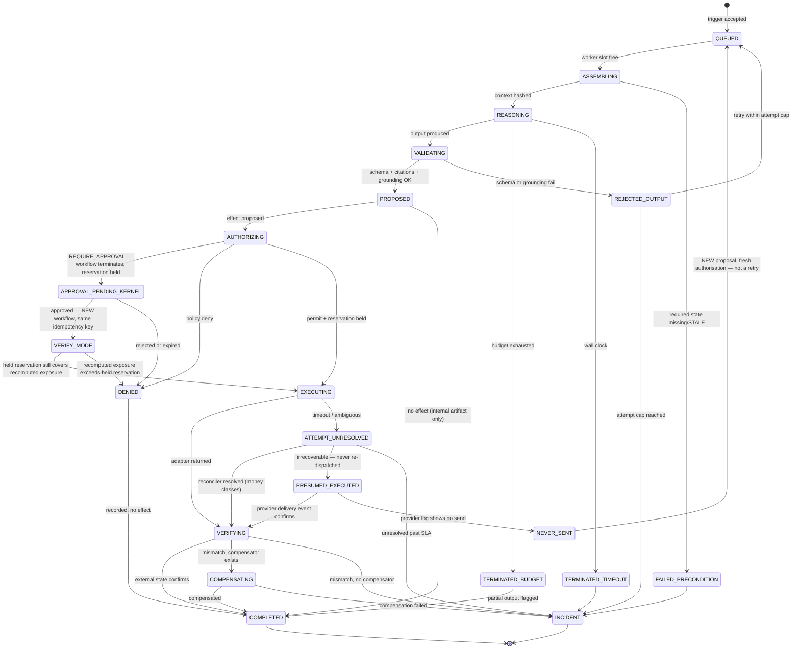
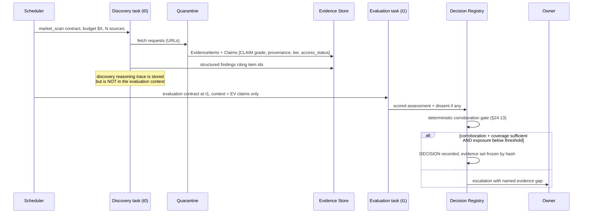

# 25 — Workflow and Event Architecture

**ACOS Operating Spine v1.3. Version 1.3. Issued 2026-09-03. Supersedes v1.1 (2026-09-02).**
Covers Phase 2 brief Part 5. Depends on `22`, `23`, `24`.

## v1.3 change record

No change in v1.3. Version line bumped so the package carries one version; `phase2-v1.3-changelog.md §7` records which artifacts were materially edited and which were not.

## v1.1 change record

| Change | Remediation | Section |
|---|---|---|
| The lifecycle gains `PRESUMED_EXECUTED` and the outbox claim; `ATTEMPT_UNRESOLVED` splits by recoverability class. | R13 | §5 |
| The **subscription watchdog becomes a governed effect class** with `callbackUrl` derived from configuration and never from a parameter. | R4 | §6 |
| **Reconciler resolution becomes a gateway-dispatched effect** reusing the original authorisation and idempotency key, because a re-POST on Stripe-family APIs is an external write. | R4 | §8.3 |
| The **inverse sweep moves to the audit plane**; the control-plane effect reconciler keeps its operational role and loses its audit role. | R10 | §8.3 |
| Webhook-versus-poll precedence corrected: the poll wins for absence, never for contradiction. | R6 | §8.1 |
| The unknown-outcome policy becomes **recoverability-keyed**, and an ACOS-owned outbox with an at-most-once claim is added. | R13 | §7, §10 |
| **Approval waits are kernel state, not workflow suspensions.** Resume starts a new workflow and runs policy in verify mode. | R9 | §12 |
| The durable-execution guarantee is restated: it eliminates re-execution across suspension and resume, and narrows but does not close the crash-during-dispatch window. | R18 | §7, §12 |
| ESP selection becomes an EM6 criterion: a provider with no idempotency header, no delivery-event webhook and no queryable message log cannot serve an irrecoverable class. | R13 | §7 |


---

## 1. The constraint this document exists to satisfy

`08 §1`, arithmetic, restated because every choice below is downstream of it:

| N steps | per-step reliability required for 95% end-to-end |
|---|---|
| 100 | 99.9487% |
| 1,000 | **99.9949%** |
| 3,000 | 99.9983% |

A 2,500-order store running ~3,000 agent-initiated steps per month at an optimistic 99.9% per step has a **4.9%** chance of a clean month. And the table assumes independence, which `08 §1` establishes is optimistic: Vending-Bench's doom loop began with a single false belief about inventory arrival and cascaded from the corrupted state.

**No model improvement closes this.** Halving a frontier model's error rate moves 99.9% to 99.95% — one order of magnitude of horizon in a problem that needs three. The gap closes only by making failures detectable, bounded, idempotent and recoverable.

Two further constraints shape the design:

- **AgentDyn reports defence performance falling sharply beyond ~10 trajectory steps** (`07 §11.2`), on a benchmark averaging 7.1 steps. ACOS workflows routinely exceed that. So every published security ASR figure is an *optimistic bound* for long trajectories, and **bounded work units are a security property, not only a reliability one.**
- **METR's p50→p80 horizon gap is ~10× for every 2026 frontier model** (`10 §1`), and METR states explicitly that *"a 50% time horizon of X hours does not mean we can delegate tasks under X hours to AIs."* Plan work units at roughly an hour of human-equivalent effort against the p80 column, not the headline.

---

## 2. Choosing the execution mechanism per shape of work

The brief asks where each approach belongs. Answering "everywhere" is how architectures become unbuildable.

| Mechanism | Where it belongs in ACOS | Where it must not be used |
|---|---|---|
| **Event-driven** | External state changes: webhooks, settlement postings, carrier scans, platform notices. | Anything requiring guaranteed delivery on its own — Shopify publishes no delivery guarantee (`08 §8.3`). |
| **Durable workflow** | Every multi-step process that touches money, goods or messages: order fulfilment, refund, return, campaign change, supplier order, escalation resolution. | Single-step reads. Cheap internal computation. |
| **Task queue** | Reasoning work with budgets; batchable ingestion; verification polls. | Anything needing ordered exactly-once semantics — that is the workflow engine's job. |
| **State machine** | Order state, fulfilment state, case state, escalation state, experiment state, effect state. Finite, enumerable, legal-transition-checked. | Anything whose states are not enumerable. If you cannot enumerate them, you have not understood the process. |
| **Agent loop** | Inside a single bounded work unit, with a hard step cap, a token budget and a wall-clock budget. | As the top-level control structure of anything. `10 §2.1`: *"A 'CEO agent that wakes up and looks around' is the wrong shape."* |
| **Scheduled processes** | Reconcilers, watchdogs, cadence work (briefings, metric rollups, budget passes), reservation reaping, clock evaluation, autonomy-ledger recomputation. | Reacting to external events. Polling for what a webhook already tells you, *except* as the reconciliation backstop, which is mandatory. |
| **Reactive triggers** | Threshold crossings computed by the Metric Layer: discrepancy detected, budget utilisation crossed, exception rate breached, clock at 60% of SLA. | Triggers evaluated by a model. All triggers in the mandatory set are deterministic. |

**The layering, stated once:** events and schedules *start* work; the workflow engine *runs* it durably; state machines *constrain* it; queues *pace* it; agent loops occupy *one bounded step inside it*.

---

## 3. The work item

```
WorkItem {
  id, company_id, task_type, trigger_ref, objective_id,
  principal_id,                       // who this runs as; determines grants
  contract_version,                   // the task contract, §4
  input_context_ref,                  // deterministically assembled, hashed
  budget { tokens, usd, wall_clock_s, tool_calls, subtask_depth, effect_count },
  consumed { ... },
  status,                             // §5
  attempt, idempotency_scope,
  termination_reason,                 // COMPLETED | BUDGET | TIMEOUT | POLICY | ERROR | ABANDONED
  output_ref, output_schema_version,
  parent_work_item_id, depth
}
```

**Budgets are enforced at the queue and the orchestrator, in code, before and during execution — never by asking the model to be brief.** `09 §11.4`: across 24,008 METR runs, mean tokens per run exceeds median by **10–70×** for every agent measured, so the cost distribution is dominated by runaway tails and a mean-based budget is systematically wrong in the expensive direction. Anthropic documents multi-agent systems *"spawning 50 subagents for simple queries"* and *"scouring the web endlessly for nonexistent sources."*

**And the budget ceiling matters more than the bill.** `08 §9`: on reaching the Anthropic tier spend cap the API returns **429 with `enforced_spend_limit_reached` and no `retry-after`**, and access *"pauses until 00:00 UTC on the first day of the next month."* A runaway does not cost $500; it takes the AI layer offline until the calendar rolls over. ACOS's own ceiling sits well below the provider's, enforced at the queue, so a runaway degrades rather than hard-stopping.

---

## 4. The task contract

A work item's behaviour is fully determined by its contract. Contracts are versioned artifacts, not prompts.

```
TaskContract {
  task_type, version,
  purpose,
  context_spec,          // exactly which state/evidence the assembler must fetch
  evidence_scope,        // which evidence classes are readable; grades permitted
  tool_scope,            // closed set, from the READ catalogue; PROPOSE if granted
                         // v1.2 (SR-C2): enumerate_effects is a READ member of this set,
                         // rate-limited per principal per window, and its returned option
                         // descriptions are projected through context_spec (I52)
  allowed_action_classes,// what this task may propose, if anything
  output_schema,         // JSON Schema; validated before anything downstream sees it
  citation_requirement,  // which output fields must carry evidence_item_ids
  confidence_requirement,// whether the output must carry calibrated confidence
  model_binding_ref,     // pinned model id + version
  budgets { ... },
  termination_conditions,
  eval_suite_ref,        // the suite this contract must pass before promotion
  autonomy_key           // (task_type, action_class, model_binding) for the autonomy ledger
}
```

**Two properties make workers replaceable** (Phase 2 brief Part 9: *agents as replaceable workers against stable contracts*):

1. Nothing about a worker persists outside kernel state. A worker is a pure function from assembled context to schema-valid output.
2. The contract, not the worker, is the interface. Swapping the implementation, the prompt or the model changes `model_binding_ref` and `contract.version` — and per SR6 that resets the autonomy ledger entry for that key.

---

## 5. Work-item lifecycle



**Four states in this diagram are the ones people leave out, and each maps to a named Phase 1 failure.**

- **`ASSEMBLING → FAILED_PRECONDITION`.** Required state is missing or `STALE` with `staleness_policy=BLOCK`. This is the Vending-Bench doom-loop interceptor: the work item refuses to reason about inventory it cannot currently verify, rather than proceeding on a belief.
- **`ATTEMPT_UNRESOLVED`.** The adapter timed out after the request may have been received. **Blind retry here is how you double-refund.** For money classes the reconciler queries the external system by idempotency key — or re-POSTs under the original authorisation where the vendor's documented recovery requires it — and resolves the state; only then does the item move. **v1.1: for irrecoverable classes there is nothing to query synchronously, so the state resolves to `PRESUMED_EXECUTED` and the effect is never re-dispatched** (§10).
- **`APPROVAL_PENDING_KERNEL` and `VERIFY_MODE`** (v1.1, R9). v1.0 suspended the workflow across the approval wait, which created two problems: the resume path had no already-reserved branch, so a naive implementation double-reserved or released-and-re-reserved and lost the slot to a concurrent proposal; and an OWNER approval with no expiry could outlive a deploy that changed the workflow, leaving an unrecoverable suspension holding headroom indefinitely (DBO-03). The pending approval is now **kernel state** and the workflow terminates. Approval starts a **new** workflow keyed on the approval id and the original idempotency key, and policy re-runs in **verify mode**: every step re-evaluates, and step R *asserts* the held reservation still covers the recomputed exposure rather than reserving again. A recomputed exposure that exceeds it **denies** — **v1.2: attributed to `I51`, not `I31`.** `I31` states that no second reservation row is created for an authorisation that already holds one; *"a verify-mode resume never increases a held reservation"* is a different property, and v1.1 cited `I31` for it in four places (RES-04). `I51` is DB-enforced by the `reservation_no_increase` trigger. **v1.2 also adds `RESERVATION_ABSENT`** for the case v1.1's wording did not cover — the reservation gone rather than insufficient, which was the *guaranteed* case at OWNER tier because the reaper outlived nothing (`26 §12.1`) — and a **`RemedyObligation`** on every verify-mode denial that leaves an unmet customer or statutory obligation (I58, `26 §12.3`).
- **`VERIFYING`.** A 200 from an API is not evidence that the world changed. Verification is an independent read-back — and for money, it is the settlement reconciliation, not the API response.
- **`TERMINATED_BUDGET → COMPLETED (partial, flagged)`.** A partial output that is *labelled* partial is usable; an unbounded run is not.

---

## 6. Event ingestion

`08 §8.3` fixes the shape completely, and it is worth quoting the constraints because they are unusually specific:

- *"Webhook delivery isn't always guaranteed, and your app can miss or mishandle events for other reasons, such as handler failures or downtime."*
- *"If Shopify receives no response or an error, it retries 8 times over the next 4 hours. After 8 consecutive failures, the subscription is automatically deleted if it was configured using the Admin API."*
- One-second connection timeout, **five-second total request timeout**; any non-200 including 3XX is an error.
- *"Shopify doesn't guarantee ordering within a topic, or across different topics for the same resource"* — a `products/update` may arrive before `products/create`.

Four mandatory mechanisms follow, none of them AI:

| # | Mechanism | Detail |
|---|---|---|
| 1 | **Verify-then-enqueue-then-ack** | HMAC verify → dedupe insert → enqueue → return 200, all within 5s. **No model inference in the webhook path, ever.** |
| 2 | **Dedupe table** | Keyed on the platform's own event id (`X-Shopify-Webhook-Id`), with the payload hash retained. Duplicates are expected, not exceptional. |
| 3 | **Reconciliation poller** | The actual source of truth. Webhooks are hints that make the reconciler cheaper. Cadence per entity class; orders faster than catalogue. |
| 4 | **Subscription watchdog — a governed effect class** | Re-asserts every subscription on a schedule. A four-hour handler outage silently unsubscribes the company from its own order events; the watchdog is what makes that survivable. **v1.1 (R4, SPO-01):** re-assertion is `webhookSubscriptionCreate/Update`, an Admin API **mutation** carrying an attacker-relevant `callbackUrl`, and v1.0 issued it from Ingress with a credential, on a timer, with no proposal, no authorisation, no journal row and no perimeter annotation. Redirecting subscriptions exfiltrates order PII continuously. It becomes the action classes `webhook.subscription.assert` and `webhook.subscription.delete`, dispatched through the gateway, with **`callbackUrl` derived from configuration and never from a parameter**, and every assertion journaled. |

**Out-of-order handling.** Events carry the platform's own sequence or update timestamp where available; the handler applies last-writer-wins on `observed_at`, and an event older than the current record's `observed_at` is recorded but does not supersede (`24 §8`). Where no ordering token exists, the reconciler's snapshot wins.

---

## 7. Idempotency

Three independent layers, because a single layer fails at a single boundary.

| Layer | Key | Prevents |
|---|---|---|
| **Ingress** | Platform event id | Processing the same webhook twice. |
| **Work item** | `(trigger_ref, task_type)` | Two work items for one trigger. |
| **Effect** | `H(task_id ‖ action_class ‖ resource_id ‖ semantic_param_digest)` | Two external effects for one intent. |

**The effect key is deterministic, not random.** This is the whole point. A crash between journaling and adapter invocation, followed by a restart, must regenerate the *same* key so the adapter's own idempotency (or the reconciler's lookup) recognises it. A UUID minted at attempt time provides no protection against exactly the failure that matters.

**`semantic_param_digest` excludes non-semantic fields** — timestamps, request ids, retry counters — so a functionally identical retry produces an identical key, while a genuinely different refund amount produces a different one.

**Where the adapter's API offers no idempotency**, the effect class is downgraded: it cannot be autonomous, it requires approval, and if it is also irrecoverable it is excluded entirely. `refundCreate`'s `@idempotent` directive (Shopify API 2026-04) is the standard; an API that cannot meet it is a capability disqualifier, not a problem to engineer around.

**v1.1: this rule was violated by the package's own plan (R13, DUP-01).** `26 §5` classifies `email.send` as IRRECOVERABLE, most ESPs offer no idempotency header, and where a message log exists it is eventually consistent — so the rule as written **excludes autonomous email sending**, while `33 §9` planned a "T-U0 heavy" operating profile and `37 S4` built autonomous T-U0 sends. The internal quality gate identified the ESP at-least-once exposure as its one real residual and did not notice the residual was prohibited by this section.

Two changes resolve it without relaxing the rule.

**First, a fourth idempotency layer that ACOS owns: the outbox.** Rather than requiring the vendor to supply a query primitive, ACOS builds one.

| Layer | Key | Prevents |
|---|---|---|
| **Outbox claim** (v1.1) | Effect idempotency key, unique | A second dispatch of the same intended message by any path (I36) |

One outbox row per intended message, unique on the effect idempotency key, carrying a **provider-visible correlation tag** (custom header, metadata or tag). The row transitions to `CLAIMED` in a committed transaction **before** the HTTP call, and a `CLAIMED` row is never re-dispatched by any path — including recovery, including a fork, including a manual replay.

**The state machine, declared (v1.3.4, OBX-01, S1I-C2).** v1.1 named `CLAIMED` and named no prior state, while requiring a *transition* to it. The declaration is:

> **Exactly two states: `ENQUEUED` and `CLAIMED`. Exactly one transition: `ENQUEUED → CLAIMED`. No transition out of `CLAIMED`, and no second transition into it.**
>
> **`CLAIMED` HAS NO TIMEOUT, NO LEASE, NO EXPIRY AND NO RECLAIM.** There is no `READY`-after-timeout, no visibility timeout, no stale-lease reaper, no attempt counter that resets a claim, and no elapsed time of any length that returns a `CLAIMED` row to `ENQUEUED`. **This is the property that distinguishes an ACOS claim from an ordinary queue lease**, and every published outbox and job-runner library defaults the other way. `I36`'s *"never re-dispatched by any path — including recovery, including a fork, including a manual replay"* is that sentence read as a state machine.
>
> A row whose claim is followed by an uncertain outcome is the subject of `§5`'s recoverability-keyed unknown-outcome policy and `§8`'s reconciliation. **It is never the subject of a retry that re-claims.**

**The scope, declared (v1.3.4, OBX-02, S1I-C5).** v1.1 described the outbox as the fourth *idempotency layer* — beside the ingress key, the effect key and the vendor's own key, none of which is class-scoped — while `24 §4`'s ERD, `33 §6`, `35 §4` and ADR-026's title each scoped it to *"irrecoverable sends"*. The scope is:

> **The ACOS dispatch outbox applies to every effect that will cross an external-write boundary** (`48`), whatever its recoverability class. REVERSIBLE, COMPENSABLE and IRRECOVERABLE effects all take an outbox row when their execution goes through an adapter or vendor transport.
>
> **The scope predicate is `effect requires external dispatch`.** It is **not** `effect.recoverability == IRRECOVERABLE`, and it is **not** every catalogue action unconditionally: an internal-only kernel effect that crosses no external-write boundary takes no outbox row.
>
> **The predicate is derived from the closed action catalogue's execution metadata** — the class's declared adapter and method — so it is a property of the catalogue that a model cannot choose and a caller cannot pass. ADR-026 remains titled for the irrecoverable case because that is the case that *forced* the mechanism; it is not a bound on it.

**The claim transaction is `30 §5.7.2` item 3's "dispatching transaction" (v1.3.4, OBX-03, S1I-C3).** `30 §5.7.2` item 3 increments `effects_dispatched` and `monetary_dispatched` *"in the dispatching transaction"* and no artifact said which transaction that is. It is **the claim transaction**, and its architectural position is:

> current claim-time authority evaluation → **exclusive durable claim** → COMMIT → transport
>
> **The claim is the last committed local transaction before an effect can leave**, and it is irreversible: no path returns a `CLAIMED` row to `ENQUEUED`, so after it commits the effect *will* be handed to transport. If the override counters were incremented later, N rows could each be claimed against a cap of one and `I63(a)`'s cap would bound nothing.
>
> **This does not place the HTTP request inside the database transaction.** The transaction commits and *then* transport runs; `§7`'s own sentence — the row transitions to `CLAIMED` *"in a committed transaction **before** the HTTP call"* — is what puts the call outside it.


**Second, ESP selection becomes an EM6 criterion.** A provider offering neither an idempotency header nor a delivery-event webhook nor a queryable message log **cannot serve an IRRECOVERABLE class**. That is this section's own disqualifier applied where it belongs, and it is a vendor-selection constraint rather than an engineering problem.

**And one claim about the durable-execution engine is weakened (R18).** The engine's never-re-execute guarantee covers *suspension and resume* — the documented LangGraph `interrupt()` case it was selected for. It **narrows but does not close** the crash-during-dispatch window, because an *incomplete* step is not a checkpointed step. Duplicate prevention at the dispatch boundary rests on vendor idempotency, a vendor query, or the outbox claim. `33 §1` and `35 §4` v1.0 implied more; both are corrected.

---

## 8. Reconciliation

Three reconcilers, running independently, on separate schedules, with separate failure modes. All deterministic.

### 8.1 Entity reconciler — *does the platform agree about state?*

Walks orders, fulfilments, inventory and catalogue; compares the projection against the platform; produces `Contradiction` objects. Catches missed webhooks, out-of-order application and adapter mapping bugs.

**v1.1 precedence correction (R6, REC-03).** v1.0's `§8` rule that *"the poll result wins on conflict"* preferred an unauthenticated source over a cryptographically attested one, because an HMAC-verified webhook body is the only fact in this stack with end-to-end provenance from the vendor (`24 §6`). Corrected rule:

- **The poll wins for absence.** A missed delivery is `08 §8.3`'s documented reality and the poll is the backstop for it.
- **A poll that contradicts a verified webhook payload creates a `Contradiction` and gates nothing** (I29). Neither supersedes.

### 8.2 Financial reconciler — *does the money tie?*

`Σ(financial events in payout batch) == bank deposit amount`, exact. Status ∈ `{MATCHED, UNMATCHED, MATCHED_WITH_TOLERANCE(named_rule)}` and nothing else. `10 §5` and `SPINE`'s second pro-project finding both name this as the single best automated integrity control available, and it requires no AI.

### 8.3 Effect reconciler — *does the external world agree with our journal?*

The one that is usually missing. For each effect in a non-terminal state past its SLA, query the external system by idempotency key or resource id and resolve to `VERIFIED`, `FAILED`, `PRESUMED_EXECUTED` (irrecoverable classes) or `UNRESOLVED_DISCREPANCY`.

**v1.1: resolution is a governed effect, not a side channel (R4, SPO-02).** On Stripe-family APIs the documented recovery for a timed-out create is to **re-send the request with the same `Idempotency-Key`**, because a timed-out create leaves no id to `GET`. So this reconciler performs an external **write**, and v1.0 did it outside the authorisation path, on a schedule, against a reservation that might already have expired. Resolution is now a gateway-dispatched effect that reuses the **original authorisation and idempotency key**, is journaled as a resolution attempt, and is **refused if the reservation was released**.

**v1.1: the inverse sweep moves to the audit plane (R10, AUDA-10).** v1.0 implemented *"does the external system contain effects ACOS did not journal?"* here, in the control plane, while `30 §6.1` listed it as audit invariant I8. Under control-plane compromise a control-plane sweep is worthless, and under mere adapter compromise it reports what the adapter says. The sweep runs in the **audit plane**, from that plane's own read-only vendor credentials, and files findings the control plane cannot see, edit or delete (I8). An unjournaled external mutation is either a bug, a second uncontrolled actor, or a compromise, and all three are incidents.

This reconciler keeps its **operational** role — resolving `OUTCOME_UNKNOWN` so work items can advance — and loses its **audit** role. The two were conflated and they have different trust requirements.

**And renewals are no longer false positives.** A recurring charge from an advertising budget, a subscription or a saved mandate matches a live `StandingAuthorization` under its `reconciler_match_rule` (I22). v1.0's sweep would have flagged every renewal, producing either an incident flood or an exclusion rule that is a permanent hole in the sweep.

---

## 9. Retries, backoff and the model layer

`08 §9`: official SDKs retry transient failures *"twice by default"* with exponential backoff. Against the documented 3h38m global 529 on 2026-08-24, two retries exhaust in seconds.

**The unit of retry is the work item, not the HTTP request.** The required pattern: durable queue → bounded retries with jitter → dead-letter queue → alert. Retries carry the same effect idempotency key. Retry counts are budgeted; exhaustion produces an Incident, not a louder loop.

**Pacing is separate from retrying.** `08 §9` records *"acceleration limits"*: sharp usage increases trigger 429s below stated limits. A flash-sale burst of 500 order events must be **paced**, not merely retried — a token-bucket at the queue, sized below the provider's rate limits, with prompt caching used deliberately because cache reads do not count toward ITPM (`09 §12`: caching is simultaneously a ~2.5× cost lever and a 5× rate-limit lever; no other lever buys rate-limit headroom).

---

## 10. Compensation

Registered at authorisation time, not invented at failure time.

```
Compensator {
  effect_id, action_class, adapter, parameters_template,
  window,                 // beyond which compensation is no longer valid
  guarantee: FULL | PARTIAL | NONE
}
```

`guarantee = NONE` is the `IRRECOVERABLE` class (EM3) and the gateway treats it accordingly: no batching, count-limited, and — for anything that reaches a third party under the brand name — routed through the Utterance Gate as well.

**v1.1: the compensator's cost is reserved (R1).** v1.0 registered a compensator and reserved nothing for it, so COMPENSABLE exposure omitted the remedy's own cost. The Effect Canonicaliser includes registered compensator cost in the computed exposure for COMPENSABLE classes.

**v1.1: the unknown-outcome policy is keyed on recoverability (R13, DUP-02).** v1.0 had one policy for all classes, and it was right for money and wrong for irrecoverable actions in the same way.

| Class | On unknown outcome |
|---|---|
| REVERSIBLE / COMPENSABLE (money) | **Hold and resolve.** Reservation held; the reconciler queries or re-POSTs under the original authorisation; never a blind retry. |
| IRRECOVERABLE (send, post, reship) | **Assume it happened. Never re-dispatch.** Mark `PRESUMED_EXECUTED`, consume the irrecoverable unit, and resolve later from the provider's delivery event matched on the correlation tag. |

The asymmetry is the point. For money the expensive error is duplication, so hold and ask. For an irrecoverable send the expensive error is *also* duplication — Gmail bulk-sender status has no expiration and spam rate must stay under 0.1%, so a duplicate storm is a permanent domain-reputation event — so assume-executed is the safe direction and the missed message is recovered by **detection rather than by retry**.

**Delivery-event reconciliation** resolves `PRESUMED_EXECUTED` to `VERIFIED` or `NEVER_SENT`. **A `NEVER_SENT` row is a new proposal requiring fresh authorisation, never a retry**, which keeps the irrecoverable-unit accounting honest.

**Compensation is not rollback.** A refund compensates a charge; it does not undo it. The financial record retains both. A shipped-goods reversal is a return workflow with its own effects, its own costs and its own failure modes. The architecture models compensation as *a further forward action*, which is what a saga is, and which is what Medusa's workflow engine implements with per-step compensation (`10 §2.1`) — a pattern worth borrowing even where the framework is not.

---

## 11. Dead letters, escalation and abandonment

| Outcome | Trigger | Handling |
|---|---|---|
| **Dead letter** | Retry budget exhausted, or a non-retryable error class | `Incident` created with the full execution journal, the last adapter response, and the affected entity. |
| **Escalation** | A RED-class trigger, an unresolved discrepancy, a policy denial in a category the owner asked to see, a clock at threshold | `Escalation` with SLA, urgency, evidence bundle, recommended resolution. |
| **Abandonment** | Explicitly declared per task type — some work is not worth retrying | Recorded as `ABANDONED` with a reason. **Abandonment is a first-class outcome**, not a silent drop, and it is counted. A rising abandonment rate is an audit signal. |

`10 §5`'s escalation-queue-with-statutory-clocks is one of the six things Phase 1 concluded ACOS genuinely has to build. Nothing in the surveyed helpdesk market enforces FTC 30-day/7-working-day, GDPR 72-hour/one-month, or CCPA 45-day clocks against order and case state.

---

## 12. Human approval as a durable state transition

`07 §5`, the precise formulation: *"A human approval gate is only a real control when it is a state transition in a deterministic system — the workflow cannot proceed without a recorded approval object — not when it is a dialog box in an agent client."*

The mechanics (v1.1, R9):

1. Policy returns `REQUIRE_APPROVAL(tier)`. The exposure reservation is **held** (SR5), and the canonicalised `AuthorizationRequest` and `dispatch_payload` are persisted with their binding hash.
2. An `Approval` object is created in **kernel state**, carrying the proposal hash, the `reservation_id`, the authorisation reference and the idempotency key. **The proposing workflow terminates.** It does not suspend.
3. The owner approves or rejects. Approval records approver, timestamp and the hash approved.
4. On approval, the kernel starts a **new workflow keyed on `(approval_id, original_idempotency_key)`**. Policy re-runs in **verify mode**: all steps re-evaluate against current authoritative state, and step R **asserts** that the held reservation still covers the recomputed exposure. The reservation is never re-taken and never topped up.
5. If the recomputed exposure **exceeds** the held reservation, the outcome is **DENY**, not a top-up. The original authorisation and idempotency lineage are preserved on the denial record.
6. On expiry, the reservation releases and the item moves to `DENIED`. **Never auto-approve on timeout.**

**Why the re-evaluation matters.** An approval granted at 09:00 for a refund on order X must not execute at 17:00 if order X was already refunded at 12:00 by another path. The idempotency key catches the duplicate; the re-evaluation catches the changed precondition.

**Why the workflow must not be the wait.** Two failures in v1.0, both structural. `26 §7`'s sequence contained step R (RESERVE) with no already-reserved branch, so the obvious implementation of "re-run the full policy evaluation on resume" either double-reserves or releases and re-reserves — and releasing loses the slot to a concurrent proposal, which is the exact race SR5 exists to close. And the durable-execution engine pins workflow versions: recovery requires a worker running the matching version, so an OWNER approval that `26 §12` says "just waits" could outlive a deploy touching the workflow and become an unrecoverable suspension holding headroom forever. Persisting the approval as kernel state removes both, because there is no resume path to re-run.

**Headroom starvation is monitored** (I32). Holding a reservation across an unknown outcome is correct for correctness and exploitable for availability: an adversary able to induce vendor timeouts — including the vendor — exhausts headroom at zero spend, after which refunds deny with `WINDOW_EXHAUSTED` while the FTC clock runs. Unresolved-reservation age and the share of headroom held by unresolved reservations are metrics; majority consumption raises `HEADROOM_STARVATION` with an owner override path that is itself an authorised, journaled effect.

**v1.2: and the override is an availability remedy that cannot become a loss-limit change** (SR-L4, LIM-04). `52 §1` Path A walks the laundering: ten induced timeouts, `I32` fires, the owner overrides to unblock refunds, the released reservations leave `I3`'s terms, the window refills, and **`MAL_monetary` never changes so no re-signature fires** — realisable refund loss silently multiplied. Three changes close it, specified in `26 §10.3`: the override releases the **workflow hold** while the exposure persists as `PRESUMED_SETTLED` until the settlement reconciler resolves it; additional headroom comes only from a separately named `W_*_OVERRIDE` window that enters `MAL_total` and requires re-signature; and the bundle displays the `MAL_total` delta unconditionally (`30 §10` item 3). **OWNER-tier reservations are exempt from reaping and their held exposure is attributed to this metric**, so an unattended approval shows up as the governance fact it is rather than as a ledger accident.

**The LangGraph trap, and what the engine does and does not fix.** `08 §8.1`, quoted: *"The node restarts from the beginning of the node where the `interrupt` was called when resumed, so any code before the `interrupt` runs again"*, with LangChain's own anti-example being *"creating a new record before interrupt. This will create duplicate records on each resume."* DBOS states the counter-guarantee explicitly: *"Once a step completes and is checkpointed, it is never re-executed."* **v1.1 (R18): that guarantee covers suspension and resume, and it is genuinely worth having** — but it does not make third-party HTTP effects atomic, and an *incomplete* step is not a checkpointed one, so crash-during-dispatch still requires idempotency, a vendor query or the outbox claim. Under the kernel-state approval design the engine's role here shrinks further: there is no long-lived suspension to resume, so the property being relied on is checkpointed internal progress rather than durable human-latency suspension.

---

## 13. Trigger catalogue

Closed. A trigger not in the catalogue cannot start work.

| Class | Examples | Deterministic? |
|---|---|---|
| **Verified external event** | order created/cancelled/fulfilled, payment failed, refund settled, dispute opened, carrier scan, inventory change, platform policy notice, ad account status change | Yes |
| **Schedule** | reconcilers, watchdog, daily metric rollup, weekly review, briefing cadence, reservation reaper, clock sweep, autonomy-ledger recompute, allowlist expiry check, **standing-authorisation window-boundary re-reservation**, **control-artifact manifest verification**, **audit-mirror lag check**, **`JournalAttestation` emission (5-minute, emitted even when no journal row was produced)**, **external chain anchoring (hourly)**, **standing-authorisation cessation verification (I54)**, **prohibited-class credential probe** | Yes |
| **Threshold** | budget utilisation, exception rate, discrepancy count, escalation ageing, runway floor, ungated-action-count ceiling, model cost velocity | Yes — computed by K12 |
| **Resolution** | approval granted/denied, escalation resolved, incident closed | Yes |
| **Owner directive** | ad hoc | Human |
| **CEO task order** | from the closed task-type catalogue, within budget envelope | Model-originated, but the *catalogue* is closed and the *budget* is deterministic |

**No open-loop trigger exists.** There is no "the agent decides to look around." The nearest thing is a scheduled `market_scan` task with a fixed cadence, a fixed budget and a fixed output schema — which is a schedule, not a loop.

**`09 §12`: fixed-cadence work is volume-insensitive and dominates AI cost at low volume — roughly $40/month whether the store does 100 or 300 orders.** Cadence is therefore a cost dial the owner controls directly, and it belongs in the control centre as a setting, not buried in a cron expression.

---

## 14. Concurrency and ordering

| Concern | Rule |
|---|---|
| Two work items touching the same entity | Advisory lock on `(company_id, entity_type, entity_id)` for the duration of the propose→authorise→execute span. Second item waits or defers; it does not proceed on stale state. |
| Two proposals against the same budget window | Serialised by the reservation transaction (SR5). Not by hoping. |
| Reasoning parallelism | Permitted only for read-mostly, independently-verifiable work (SR2, `08 §7`). Operating functions run single-threaded against shared state — Cognition's conflicting-decisions failure and MAST's inter-agent-misalignment category are exactly this shape. |
| Effect ordering | Where order matters it is a workflow, not two independent effects. If two effects must occur in order, they are steps of one durable workflow with a compensator on the first. |

---

## 15. Worked lifecycle: refund inside authority

Chosen because `20 §4.2` is a useful corrective — the capability-first classification calls refunds **fully deterministic**, on the grounds that *"once eligibility is decided, the amount is computed from the order; there is nothing to reason about."* The interpretive work is in the *return* — turning a customer's account of what went wrong into a structured claim — not in the refund. The design reflects that: the model classifies; the refund is arithmetic.

```mermaid
sequenceDiagram
    participant C as Customer
    participant IN as Ingress (Z1)
    participant Q as Quarantine (Z4)
    participant TR as Triage worker (Z3)
    participant R as Router (Z1, deterministic)
    participant RE as Refund engine (Z1, deterministic)
    participant EG as Effect Gateway
    participant PE as Policy engine
    participant EX as Exposure ledger
    participant AD as Commerce adapter (Z2)
    participant UG as Utterance Gate
    participant AU as Audit store

    C->>IN: message
    IN->>Q: raw text, isolated context
    Q->>IN: Claim{intent=return, order_ref, stated_reason} [CLAIM grade]
    IN->>TR: assembled context (case-scoped)
    TR->>R: classification + structured return claim
    Note over R: deterministic: RED class? → escalate.<br/>Otherwise map reason → eligibility rule
    R->>RE: eligibility verdict + order_id
    Note over RE: amount computed from the order record.<br/>No model in this step.
    RE->>EG: ProposedIntent{refund.create, order:123, selector=2, reason_code}
    Note over EG: Effect Canonicaliser: enumerate refundable lines,<br/>resolve selector, compute exposure incl. retained fee,<br/>convert to ledger currency, build dispatch_payload,<br/>hash both together
    EG->>PE: canonical AuthorizationRequest + state fetched by PE
    PE-->>EG: PERMIT (computed exposure ≤ cap, order exists, instrument matches, reason ∈ enum, no open contradiction)
    EG->>EX: reserve(amount) — atomic with authorisation
    EG->>AU: authorization decision + gate_class=UNGATED_LOGGED
    EG->>AD: dispatch_payload verbatim + idempotency_key
    AD-->>EG: 200
    EG->>AU: effect ATTEMPTING→ADAPTER_OK
    EG->>UG: notify_customer(template=refund_issued, slots from order record within max_age)
    UG->>EG: ProposedIntent{email.send, template_id, no free text}
    Note over EG: outbox row CLAIMED before dispatch;<br/>correlation tag in a provider-visible field
    EG->>AD: send
    Note over EG: verification scheduled
    EG-->>AU: on settlement reconciliation → VERIFIED, reservation → realised
```

**Three things to notice.**

1. The model appears twice, both times in classification, never in the money path or the message text. **v1.1: it also never supplies the amount.** The refund engine computes eligibility and the canonicaliser computes the figure; the model's contribution to the money path is a `selector` index and a `reason_code`.
2. `gate_class=UNGATED_LOGGED` is recorded — this refund counts toward the governed quantity of EM9.
3. Verification is not the adapter's 200. It is the settlement reconciliation days later, and until then the effect is not `VERIFIED`. **v1.2:** `exposure.vendor_amount` matches the payload's vendor-visible amount (I18a) and `exposure.total_exposure == reservation.amount` exactly (I18b) at authorisation time; at settlement, `settled_total` is compared against `total_exposure` **within the class tolerance** (I18d), the tolerance being what makes a `[ESTIMATE]`-graded cost component checkable at all. A divergence outside tolerance is a critical incident, not a discrepancy.

---

## 16. Worked lifecycle: research → decision, with independence in time



The enforcement point for independence is the **evaluation task's `context_spec`**, which lists the evidence store and excludes the discovery task's output trace. It is code in the Context Assembler, not an instruction in a prompt. `08 §7`: *"Independence is a property of information flow, not of concurrency."*

---

## 17. What the workflow layer must never do

- Run an unbounded agent loop as a top-level process.
- Retry an ambiguous money effect without querying the external system first.
- **Re-dispatch an irrecoverable effect whose outcome is unknown.** Assume executed, mark `PRESUMED_EXECUTED`, and resolve from the provider's own record.
- **Re-dispatch an outbox row already in `CLAIMED`, by any path** — including recovery, a workflow fork, or a manual replay (I36).
- Treat a webhook as delivery-guaranteed or ordered — or as losing to a poll on contradiction.
- Auto-approve on approval timeout.
- **Suspend a workflow across an owner approval wait.** The approval is kernel state; resume is a new workflow.
- **Re-reserve, top up, or release-and-retake a reservation on resume.** Verify mode asserts; it does not reserve.
- Resume across a suspension in a way that re-executes a side effect.
- **Perform an external write from a reconciler, a watchdog or a maintenance job without an `authorisation_ref` or an annotated `PERIMETER_EXEMPT`** (I24).
- Let a model set, extend or bypass a budget.
- Let a model supply an exposure figure, a vendor parameter or any field of a dispatched request (I21).
- Let a model cancel a verification, reconciliation or audit task.
- **Allow a standing authorisation to continue past a window boundary it could not re-reserve, or past `expires_at`.**
- Drop work silently. Abandonment is explicit, typed and counted.
