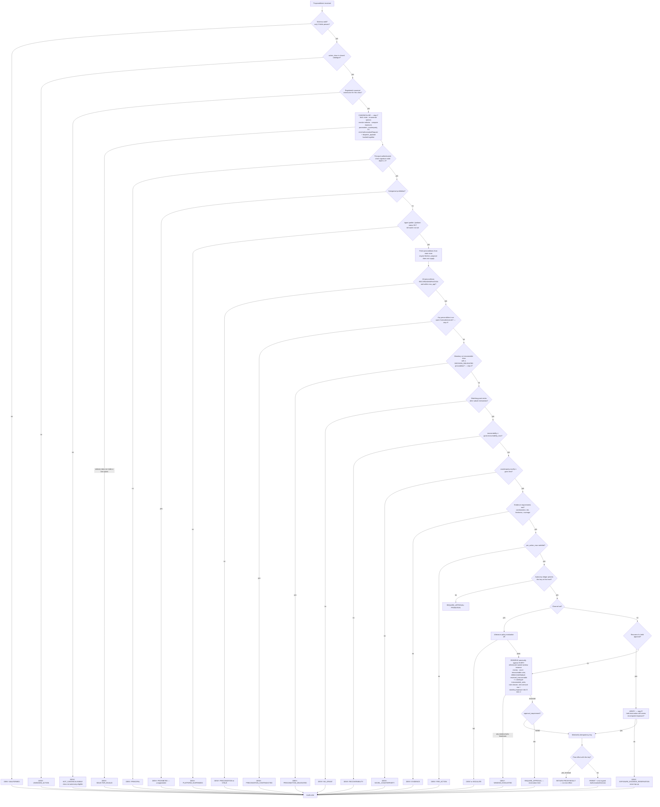

# 26 — Authority and Policy Model

**ACOS Operating Spine v1.3. Version 1.3. Issued 2026-09-03. Supersedes v1.1 (2026-09-02).**
Covers Phase 2 brief Parts 6 and 7. Depends on `22`, `23`, `24`, `25`.

## v1.3 change record

New §2.1.3 declares the rate-class zero-monetary-reservation handoff and traces the first `campaign.budget.set` to PERMIT (TB-03). §10.1's `Standing` is instance-scoped (TB-02); §10.5 completes the commercial statement (TB-02, TB-10 partial); §8 discloses TB-13. Full disposition in `phase2-v1.3-remediation-ledger.md`.

## v1.2 change record

Applied per `57-second-redteam-remediation.md`. Dispositions in `phase2-v1.2-remediation-ledger.md`.

| Change | Remediation | Section |
|---|---|---|
| **`exposure` splits into `vendor_amount` and `total_exposure`.** `I18` retired and replaced by `I18a`–`I18d`. The refund policy tests `total_exposure` against the cap, so a retained fee consumes the per-action cap. | SR-C1 | §2.1, §2.2, §8, §10.1 |
| **`enumerate_effects` is a first-class READ capability** with a `context_spec`, a journal row and a quota. §7's closing paragraph is corrected: enumeration scoping is a mechanism, not an assertion. | SR-C2 | §2.0, §7 |
| **`selector` becomes `{enumeration_id, option_id}`** with content-addressed options. C′ re-enumerates and denies rather than substituting. | SR-C3 | §2.0, §2.1, §2.2, §7 |
| **`constructor_version` recorded in every lineage position**, with declared semantic and non-semantic change classes. Constructors become control artifacts. | SR-C4 | §2.1, §7, §11, §12 |
| **Grants may only narrow a window; the window ceiling binds.** Windows declare `max_monetary`, `max_count` and `max_irrecoverable_units`. `standing.required` grants may reference DISCRETE windows only. | SR-L1, SR-L2, SR-S1 | §4, §10.1 |
| **§7 gains an explicit `KERNEL_SERVICE` branch** naming every step a kernel-originated request skips and every step it must not. | SR-S3 | §7.1 |
| **§10.1 rewritten.** `min()` typed over `Money | UNBOUNDED`; `Standing` uses the exposure-remainder form with declared overdelivery and month bases; `MIE_cost` becomes a p50/p95 band; `OrderDriven_cost` becomes a fifth displayed quantity; §10.4 gains a seventh exclusion. §10.5 states the standing-release commercial cost. | SR-S2, SR-S4, SR-L1, SR-L2, SR-L3, SR-L4 | §10 |
| **P4 restated over `value_direction`'s three outbound values**, covering goods as well as money. §11.2's hand proof completed over the whole authority-bearing catalogue with a P6 reachability column. §11.3 works the difficult cases; §11.4 adds the per-adapter destination-enforceability table. | SR-R2, SR-R3 | §11 |
| **Approval lifetimes reconciled with reservation lifetimes**; `RESERVATION_ABSENT`; `RemedyObligation`; semantic constructor comparison on resume; the anti-flooding arithmetic corrected. | SR-R1, LIM-09 | §12 |
| **`I51` replaces four drifted `I31` citations.** | SR-R4 | §7, §12 |

## v1.1 change record

| Change | Remediation | Section |
|---|---|---|
| **§2 rewritten.** The authority tuple is now *constructed by the kernel*. The model-facing input is `ProposedIntent{action_class, resource_ref, selector, reason_code, rationale}` and nothing else. `exposure` and `parameters` are no longer proposal fields. | R1 | §2, §2.1, §2.2 |
| `counterparty.novelty` is defined as a property of a **payee, supplier or settlement destination**; `customer_novelty` becomes a separate attribute with its own bounds. | R17 | §2, §11 |
| Recoverability reclassifications: entitlement issuance and fenced-asset disclosure become IRRECOVERABLE. Rate-based classes are flagged as requiring a `StandingAuthorization`. | R2, R17 | §5 |
| **The irrecoverable currency splits** into `MIE_discretionary` and order-driven fulfilment. | R8 | §5, §10 |
| **§7 gains steps C′ (canonicalisation), H′ (contradiction denial) and R′ (verify mode)**, and step R reserves against every referenced named window. | R1, R7, R9 | §7 |
| **§8's worked policies no longer read `context.parameters`.** Every operand is a kernel-computed field. The refund policy's daily count is reconciled with the grant's window limits. | R1, R8 | §8 |
| **§9: T-U0 gains per-slot staleness, normalisation, rendered-thread evaluation, a deterministic tier floor and the non-text rule. T-U1 is narrowed to twelve conditions and deferred out of the MVP.** | R12 | §9 |
| **§10 rewritten.** `MAL_monetary`, `MIE_cost`, `Standing`, `MAL_total`, named windows, and the demonstration that the sub-caps cannot imply a larger total silently. | R8, R2, R20 | §10 |
| **P4 rewritten and re-proved; P7 added.** | R17 | §11 |
| §12: approval waits are kernel state; verify mode; the owner-attention budget. | R9, R16 | §12 |
| §13: approval-quality demotion triggers; promotion thresholds tagged ESTIMATE; the ladder stated as inert at MVP. | R16, R20 | §13 |
| §14's residual restated in terms of the four exposure quantities. | R8 | §14 |


---

## 1. The rule the whole model implements

`07 §9`, and it is the governing sentence of this document:

> **The agent's authority ceiling equals the amount the owner would be willing to lose to an attacker who fully controls the agent.** Because under an adaptive attacker — per Nasr et al., at 71–100% ASR against every published defence — one effectively does.

Two corollaries follow, and they shape everything below.

**Corollary 1 — the boundary is not a risk score.** `07 §9`: it is **reversibility × counterparty novelty**. An agent may move money along an already-approved path; it may never create a path. **v1.1: "counterparty" means a payee, supplier or settlement destination** — not a customer. A first-time buyer receiving their own refund to their own original instrument is not a novel counterparty, and conflating the two produced a formal property (P4) that either forbade refunding a new customer or was misdescribed (`§11`).

**Corollary 2 — the ceiling must be computable.** If the owner is accepting a loss, the owner must be able to see its size. **v1.1: it is four computed figures, not one** — `MAL_monetary`, `MIE_cost`, `Standing` and `MAL_total` (`§10`). A single number named *Maximum Authorised Loss* that excluded by construction both the cost of every irrecoverable action and the forward integral of every rate-based authorisation was worse than no number, which is `§10`'s own argument turned on itself.

**Corollary 3 — the request must be built by the ceiling's enforcer, not by its subject.** New in v1.1, and it is the reason `§2` was rewritten. A limit evaluated against a figure the model supplied is not a limit.

---

## 2. The authority tuple, and who builds it

Every authorisation question is the same question, asked over a fixed tuple. **v1.1: the kernel builds that tuple. The model does not.**

### 2.0 What the model may say

```
ProposedIntent {
  action_class      // from the closed catalogue (SR7)
  resource_ref      // must resolve to a RECORD-grade entity inside the task's context_spec scope
  selector {                         // v1.2: content-addressed, never positional
    enumeration_id                   // names one EnumeratedOptionSet the kernel computed
    option_id                        // = H(action_class ‖ resource_id ‖ semantic_option_digest)
  }
  reason_code       // from a closed enum
  rationale         // free text; journaled for the audit record; NEVER parsed, NEVER interpreted as authority
}
```

That is the whole model-facing write surface (SR1, `propose_intent`). `selector` remains **one** field for `I21`'s purposes; it is a pair rather than an integer.

**v1.2: why the index became a content address (SR-C3, CAN-03).** v1.1's `selector` was an index into a kernel-enumerated option set, and `DENY: SELECTOR_INVALID` fired when the selector did not index a live option. That guard catches the option set *shrinking past* the index, which is the benign case. **The dangerous case is reordering, and reordering is undetectable by an ordinal.** `53 §1` constructed it: order 123 carries refundable lines `[A: $10.00, B: $20.00]`; the model reads the enumeration and submits index 0 for line A; a concurrent partial refund exhausts line A; step C′ re-enumerates to `[B: $20.00]`; index 0 is valid and denotes B; the kernel computes $20.00, every policy check passes, and **a refund of line B dispatches with `I18`, `I21`, `I2`, `I3`, `I29` and `I31` all holding.** The executed effect was economically different from the selected one and no invariant fired. Content-addressing the options makes the identity of the selected effect part of the selector, so substitution is impossible by construction and the failure mode is a denial.

### 2.0.1 `enumerate_effects` — the read the model needs (v1.2, SR-C2)

**The defect this closes.** Enumerate-then-select requires the model to *see* the enumeration. v1.1 specified no capability that returns one (CAN-02), leaving two readings and both defective: either `selector` is uninformed, in which case the refund engine's classification cannot reach the money path and the class stops doing its job; or an unspecified read exists at the highest-value surface in the architecture — the one that tells a compromised model exactly what is currently permitted against which resource — with no `context_spec`, no `max_age`, no journal row, no quota and no invariant. `§7`'s v1.1 closing paragraph bounded the channel by *"scoping enumerations to the resource the task's `context_spec` admits"*, which was a statement about a mechanism the package did not define.

```
enumerate_effects(action_class, resource_ref)
  → EnumeratedOptionSet {
        enumeration_id            // opaque, journaled
        computed_at               // for the class's max_age check at C′
        constructor_version       // the constructor that produced this set
        options [ {
            option_id             // = H(action_class ‖ resource_id ‖ semantic_option_digest)
            description           // projected through the task's context_spec — see I52
        } ]
    }
```

| Property | Rule |
|---|---|
| Capability kind | **READ.** It creates no effect, reserves nothing and dispatches nothing. |
| Scope | Inside the task's `tool_scope`. A task without the capability cannot call it. |
| Field visibility | Governed by the task's `context_spec`. **No field appears in any option `description` that the `context_spec` does not admit** (`I52`), enforced by a projection filter at runtime and by spec review in CI. |
| Resource scope | `resource_ref` must resolve to a RECORD-grade entity inside the task's `context_spec` scope, the same rule `propose_intent` applies. An out-of-scope reference denies. |
| Journaling | Journaled with `journal_row_kind = READ`. **It is a journal row, not an effect** — it takes a `journal_seq`, it chains, it mirrors, and it is not in the effect ledger. |
| Quota | Rate-limited per principal per window. Exhaustion suspends the requesting capability, consistent with `I39`'s direction of travel. |
| Denial detail | A single `DENY: SELECTOR` category covers out-of-range, stale and downstream denial, so cardinality is not recoverable by binary search (CAN-05). |

**What this does not close.** The enumeration remains an information channel: an in-scope enumeration tells the model the shape of the permitted option set for a resource it is already entitled to see. The bound is the `context_spec` plus the quota, not the absence of the channel, and `29 §9` continues to treat denial-rate and enumeration-rate spikes as compromise signals.

> **Model output may propose intent and select among kernel-enumerated options. It may never supply an authoritative precondition, an exposure figure, or any field of the dispatched request.**

**Why this changed.** v1.0's tuple carried `parameters` and an `exposure { monetary_amount, currency, irrecoverable_units }` block as **proposal fields**. `§7` step M evaluated `per_action_max` against them, step R reserved against them, and `§8`'s worked policies read `context.parameters.amount` and `context.parameters.delta_pct`. So the figure that the entire governance model bounds was supplied by the component the architecture assumes is compromised. B3's v1.0 wording — *"No model output is an input to the policy engine"* — was false as written, and `36 §2`'s test that preconditions are *"structurally unavailable"* to the engine was a tautology over the fields that do not bound money and impossible for the ones that do. This was `47 §1`'s single most consequential finding, because every other monetary control in the package sat downstream of it.

### 2.1 What the kernel builds

The Effect Canonicaliser (`23 §5.2`) holds a **versioned constructor per action class** and produces the complete request:

```
AuthorizationRequest {                  // every field below is kernel-computed
  principal            // resolved, signed, chain-verified — stamped by the kernel, never a parameter
  case_ref             // v1.3.4 (CSB-01): the statutory/customer case this effect belongs to, or NULL.
                       //   INHERITED from the authoritative task (24 §3 K7), never from ProposedIntent,
                       //   rationale, a reason string, a model classification, a caller argument or an
                       //   inference from a resource or customer id. Kernel-owned and immutable; it is
                       //   30 §5.1 row 3's clock lookup key. Specified in 30 §9.2.
  action_class         // from ProposedIntent
  resource             // resolved from resource_ref, under the entity advisory lock
  selected_option      // the enumerated option whose option_id the selector names, with its
                       //   full description; re-enumerated under the C′ lock (I53)
  enumeration_ref      // v1.2: the enumeration_id and its computed_at, for lineage
  constructor_version  // v1.2: the ConstructorVersionRecord that produced every computed field (I61)
  reason_code          // from ProposedIntent
  parameters           // COMPUTED from selected_option — not supplied
  exposure {                            // v1.2: split per SR-C1
    vendor_amount,                      // the money in the dispatched request; NULL where the
                                        //   request carries no monetary field (e.g. fulfilment.reship)
    total_exposure,                     // vendor_amount + Σ cost_components + class-specific
                                        //   economically bounded loss. THIS is the reserved quantity.
    currency,                           // the single ledger currency
    fx_rate_ref,                        // RECORD-grade, staleness_policy = BLOCK
    original_amount, original_currency, // journaled for audit
    cost_components[],                  // retained processing fee · freight · COGS · compensator cost
    forward_integral,                   // rate classes: forward_exposure(s, w_instance, t), §10.1.
                                        //   v1.3 (TB-03): for rate classes this is the ENTIRE
                                        //   economic exposure and it is carried by I3 term 2,
                                        //   never by the reservation. See §2.1.3.
    irrecoverable_units,                // COMPUTED from the class, not supplied
    irrecoverable_class                 // DISCRETIONARY | ORDER_DRIVEN
  }
  recoverability       // from the action catalogue — never from the intent
  value_direction      // v1.2: NONE | INBOUND_ORIGINAL_INSTRUMENT | OUTBOUND_TO_COUNTERPARTY |
                       //   INTERNAL_LIABILITY | OUTBOUND_TO_THIRD_PARTY_BENEFICIARY |
                       //   OUTBOUND_GOODS_TO_ADDRESS.  From the catalogue, never null (I59).
  counterparty {
    id, novelty        // EXISTING | ALLOWLISTED | NOVEL  — a payee/supplier/settlement destination
  }
  customer_novelty     // NEW | RETURNING | null — the payer of the original transaction, NOT a counterparty
  channel              // null | EMAIL | SMS | SOCIAL_PUBLIC | SOCIAL_DM | PLATFORM_MSG | WEB_PUBLIC
  communication_exposure  // §9, when channel != null
  window_refs[]        // every named window the matching grants reference
  evidence_refs[]      // frozen evidence set, when the action derives from research
  context_digest       // hash of the assembled context the proposer saw
  intent_hash          // hash of the ProposedIntent, for lineage
  dispatch_payload_hash   // binds this request to exactly one dispatch payload
}

DispatchPayload {                       // built by the kernel, consumed verbatim by the adapter
  adapter, method, vendor_parameters, idempotency_key,
  monetary_effect,                      // == exposure.vendor_amount (I18a); NULL where the vendor
                                        //   request carries no monetary field
  precondition_token,                   // v1.2 (CAN-10): the vendor's optimistic-concurrency token
                                        //   where the vendor supports conditional writes; NULL and
                                        //   recorded as unsupported per class where it does not
  authorisation_ref
}
```

`AuthorizationRequest` and `DispatchPayload` are emitted **together and hashed together**. The adapter receives the payload verbatim and **constructs nothing** — it does not reinterpret intent into vendor parameters, which is where the unit-price-versus-line-total class of error lives.

**`case_ref` is on the request and NOT on the payload (v1.3.4, CSB-01).** It is authority provenance: it decides which statutory clock `30 §5.1` row 3 reads, and it changes no refund amount, no recipient, no payment instrument and no vendor field. Placing a support-case identifier in a vendor request would leak it outside the perimeter for no vendor-semantic reason. A future action class whose vendor semantics independently require a case identifier would carry it as an ordinary constructor-computed `vendor_parameter`, which is a different field with a different provenance.

### 2.1.1 Why `exposure` split (v1.2, SR-C1, CAN-01)

v1.1's `I18` asserted `dispatch_payload.monetary_effect == authorisation.exposure == reservation.amount` while this section defined exposure to **include** `cost_components[]`. For a $25.00 refund carrying a $1.03 retained processing fee the equality is unsatisfiable in both readings:

| Reading | Consequence |
|---|---|
| `monetary_effect = $26.03` | Not the dispatched amount — the vendor request says $25.00. The equality compares a kernel figure to a copy of itself. **Vacuous, in exactly the way `36 §0` forbids.** |
| `monetary_effect = $25.00` | `≠ exposure`. **`I18` is violated by every correctly constructed refund**, every reship, and every COMPENSABLE class carrying a registered compensator cost. |

`fulfilment.reship` makes it starker: the vendor request contains no money field at all, so the first term has no referent. And a developer resolving the contradiction by driving `cost_components` to zero **silently restores the v1.0 defect R1 exists to close** — `42 §8.2` row 12, compensator cost unreserved.

**The repair is a type correction, not a relaxation.** Two fields, four assertions:

| Invariant | Assertion |
|---|---|
| **I18a** | Where the vendor request carries a monetary field, `dispatch_payload.monetary_effect == exposure.vendor_amount`. Where it does not, both are NULL. |
| **I18b** | `reservation.amount == exposure.total_exposure`, **exactly, always, no tolerance.** |
| **I18c** | Where `vendor_amount` is non-null, `total_exposure ≥ vendor_amount`, with equality only for classes the catalogue declares cost-component-free. |
| **I18d** | At settlement, `settled_cost` is within the class's declared `settlement_tolerance` **of `total_exposure`**, per `51 §5.1`. |

**And the consequence that matters most: no policy cap intended to bound economic loss may compare only against `vendor_amount`.** `§8`'s refund policy therefore tests `context.exposure.total_exposure <= 25.00`, so a $25.00 line refund carrying a $1.03 retained fee **denies** `PER_ACTION`. The refundable amount the constructor may enumerate is bounded by `per_action_max − Σ cost_components`. That is a real behavioural change and it is the point of the split: the cap bounds loss, and loss includes the fee that does not come back.

**Three invariants make this checkable.**

- **I21** — no `AuthorizationRequest` field is populated from `ProposedIntent` other than `action_class`, `resource_ref`, `selector`, `reason_code`. Type-level, and unlike v1.0's version not vacuous, because the fields that bound money are on the other side of the boundary.
- **I18a–I18d** — above. **Divergence is a critical incident, not a discrepancy.**
- **I53** — no effect is dispatched whose `option_id` was absent from the enumeration computed under the C′ lock. This is what makes the selector's identity load-bearing rather than advisory.
- **I61** — every request, decision, journal row and approval binding records a `constructor_version` resolving to a signed `ConstructorVersionRecord`.

### 2.1.3 Rate classes: `total_exposure`, and the reservation/standing handoff (v1.3, TB-03)

v1.2 left the handoff between a rate class's own reservation (`I3` term 1, `I18b`-bound to `total_exposure`) and the `StandingAuthorization`'s forward exposure (`I3` term 2) undeclared, with `total_exposure` and `forward_integral` both present on the exposure block and no statement of their relationship. **Every literal reading double-counted, and the arithmetic denied the first `campaign.budget.set` the company ever attempts** — `W_MONTH_ADSPEND.max_monetary` equals `standing_cap` exactly, so counting the same money in two of `I3`'s four terms exhausts the window before anything is authorised.

**The declared model: a rate-setting action class is a documented zero-monetary-reservation class.** Not a zero-*exposure* exemption — the row exists, so `I2` is satisfied without a carve-out, exactly as `26 §7.1`'s `StandingRevocationAuthority` path already does.

| Field | Value for a rate class | Consequence |
|---|---|---|
| `exposure.vendor_amount` | **NULL** | The dispatched request carries a **rate**, not a monetary effect. `dispatch_payload.monetary_effect IS NULL`, so `I18a`'s null branch applies and `I18c` is vacuous — the same type-correct treatment `fulfilment.reship` already receives |
| `exposure.total_exposure` | **`0.00`** | This is the reserved quantity. `I18b` holds exactly: `reservation.amount == total_exposure == 0.00` |
| `exposure.forward_integral` | `forward_exposure(s, w_instance, t)` | The whole economic exposure, entering `I3` **term 2** through the `standing_window_exposure` row the authorising transaction creates |
| `I18d` settlement leg | Compares settled spend against **`standing_cap(s, w_instance)`**, not against `total_exposure` | `51 §5.1` already declares `BAND(standing_cap)` for `campaign.budget.set`; v1.3 states the reason rather than leaving it inferable |

**The alternative was rejected and it is worth saying why.** Converting the ordinary reservation into standing exposure inside the authorising transaction also satisfies the arithmetic, but it introduces a **third reservation-terminal state** alongside release and `PRESUMED_SETTLED`, and `26 §10.3`'s Path A remediation is emphatic that releasing a reservation must not release exposure. Adding a conversion path adjacent to that rule is the kind of adjacency that produces the next AUDA-01. The zero-amount row has a precedent in this document and needs no new state.

**No instant double counting and no transient free headroom.** The zero-amount reservation row and the `standing_window_exposure` row are written in **one transaction**, under the `window_balance` `FOR UPDATE` lock taken first in the declared order, and the commitment guard evaluates the four-term sum once, after both. There is no interval in which the standing term is absent and the reservation is zero.

**The first authorisation permits, and it is asserted rather than assumed.** January, 31 days, an empty window, `$6.00/day`:

```
standing_cap(s, W_MONTH_ADSPEND:2026-01) = $6.00 × max(31, 30.4) = $186.00
term 1 reserved  = $0.00      term 2 standing  = $186.00
term 3 presumed  = $0.00      term 4 realised  = $0.00
        Σ = $186.00  ≤  W_MONTH_ADSPEND.max_monetary = $186.00     → PERMIT

standing_cap(s, W_DAY_ADSPEND:2026-01-01) = $6.00 × 2.0 = $12.00
        Σ = $12.00   ≤  W_DAY_ADSPEND.max_monetary  = $12.00       → PERMIT
```

`36 §2` **VC-S7** asserts this directly. No pre-existing verification case did, and under every literal v1.2 reading it denied `WINDOW_EXHAUSTED`.

**Normative consistency condition (v1.3.1, E1).** For every rate class, **no normative passage may describe `forward_integral` as the ordinary reservation amount.** Every normative passage must agree that `reservation.amount == exposure.total_exposure == 0.00`, and that the economic exposure is carried by `I3`'s **standing** term through `standing_window_exposure`. Step R (`§7`) states both branches explicitly for this reason. `analysis/consistency-v1.3.py` condition **E1** enforces the rule mechanically over the operational corpus; historical passages describing the superseded reading are permitted only where they are explicitly marked historical.

### 2.1.2 Constructor versioning (v1.2, SR-C4, CAN-04)

`§11`'s v1.1 reproducibility claim — *"same inputs, same version, same verdict, forever"* — was false across any constructor deploy, because the *inputs* are constructed by a versioned constructor whose version was recorded nowhere. `I18`'s settlement-side investigation could not determine which constructor computed the exposure it was disputing, and `35`'s walkthroughs were auditable after the fact only for the policy half.

```
ConstructorVersionRecord {
  constructor_id, action_class,
  semantic_major, non_semantic_minor,
  changed_fields[], semantic_change: bool,
  signed_at, signature
}
```

**The semantic/non-semantic line is declared, not asserted per deploy.** A bump is **semantic by definition** — and cannot be declared otherwise — if it changes any of: exposure computation, `cost_components` membership, enumeration membership, the `semantic_option_digest`, counterparty derivation, `value_direction`, recoverability, or the dispatch payload's field set. Anything else — logging, refactoring, a `description` string — may be declared non-semantic.

`constructor_version` is recorded on the `AuthorizationRequest`, the `AuthorizationDecision`, the journal row, the approval binding alongside `dispatch_payload_hash`, and the replay context. **A pending approval must not silently execute under changed construction semantics**: on resume, a differing `semantic_major` denies `CONSTRUCTOR_SEMANTIC_CHANGE` and re-proposes with a `RemedyObligation` (`§12`); a differing `non_semantic_minor` resumes. Replay of a recorded decision under a differing `semantic_major` is **refused**, not silently recomputed. Constructors join the control-artifact manifest as class 19 (`50 §2`) — **they compute money and in v1.1 they were not owner-signed.**

### 2.2 The semantic error catalogue this closes

`38 §7.2` named request-construction error as the most likely money-path bug in the system, and v1.0 contained no component that addressed it. `42 §8.2`'s catalogue, adopted:

| Error | How the canonicaliser closes it |
|---|---|
| Unit price instead of line total | Exposure computed from the enumerated line-item set, not supplied |
| Quantity mismatch | Quantity is part of the enumerated option, not a free parameter |
| Wrong currency | Single ledger currency; RECORD-grade FX with `staleness_policy=BLOCK`; both amounts journaled |
| Refund to the wrong line item | Line items enumerated from the order; `selector` **content-addresses** one option (v1.2, SR-C3) |
| Refund after a prior refund | Enumeration reads remaining refundable per line at fetch time under the entity advisory lock (`25 §14`) |
| **Refund to a different line after concurrent mutation** (v1.2) | C′ re-enumerates under the lock and denies `SELECTOR_STALE` if the `option_id` is absent. **The kernel never substitutes another option** (I53) |
| **Authoritative state mutates during the asynchronous outbox gap, after authorisation and before dispatch** (v1.3.5, SER-01) | **The dispatch boundary revalidates the originally authorised effect under Epoch B's dispatch lease BEFORE the claim** (`25 §14.1`) and **refuses the claim** if the original option or effect is no longer valid. **No new payload is constructed and no other option is substituted** (I53 at the dispatch boundary). The economic reservation stays held; the model-facing denial is coarse |
| **Refund apportioned across the wrong tender** (v1.2) | The refund enumeration is two-dimensional over `(line, parent_transaction)`, so `instrument` is an enumerated property rather than a constructor assertion. Split-tender orders are **expressible and non-autonomous at MVP** (`58 §11`) |
| **Exposure computed by a different constructor than the one recorded** (v1.2) | `constructor_version` in every lineage position; semantic bumps refuse replay (I61) |
| Budget delta versus resulting total | Both computed; exposure is the forward integral; the dispatched absolute value is the kernel's |
| Percentage against the wrong baseline | Baseline fetched; a percentage is never accepted as an input |
| Gross versus net | Per-class cost model adds retained fees and tax treatment |
| Address scope | Address sources enumerated from RECORD state **as at order creation** (`24 §8`) |
| Stale resource identifier | Resolution is part of enumeration; `max_age` applies |
| Contradicted precondition | Step H′ denies on an open `ContradictionLink` (I29) |
| Compensator cost unreserved | Registered compensator cost is a computed exposure component of **`total_exposure`**, and `I18b` is an exact equality against it (v1.2) |
| **Retained fee escaping the per-action cap** (v1.2) | The cap is compared against `total_exposure`, never `vendor_amount` (§8) |

**And where the canonicaliser cannot construct, the class cannot be autonomous.** That is the same disqualifier logic `25 §7` applies to idempotency, and it is the honest answer for any future action class whose exposure is not deterministically computable from state.

**v1.2: `semantic_option_digest`, per class.** `option_id = H(action_class ‖ resource_id ‖ semantic_option_digest)`, and the digest must cover every field whose change would make the option a *different effect*. Declared per class in the action catalogue, and a change to any digest definition is a **semantic** constructor bump:

| Class | `semantic_option_digest` covers |
|---|---|
| `refund.create` | `line_id` · `parent_transaction_id` · `amount` · `instrument` · `reason_code_scope` |
| `campaign.budget.set` | `campaign_id` · the resulting **absolute** daily budget · `currency` |
| `order.address.edit` | `order_id` · the destination address's canonical form · `address_source_record_ref` |
| `fulfilment.reship` | `order_id` · `line_id` · `quantity` · `destination_address_ref` |
| `goodwill.credit.issue` | `customer_id` · `amount` · `expiry` |
| `entitlement.issue` / `.revoke` | `customer_id` · `entitlement_id` · `scope` |

An option whose digest omits a money-bounding field is a catalogue defect, and `36 §2.3`'s negative control exists to detect exactly that: the reordering test must fail under positional selection, or it is not testing anything.

### 2.3 What is deliberately absent from the tuple

**Any free text with authority.** The engine reads no prose. `rationale` exists for the audit record and the engine never parses it. This is B3, and it is the property that makes injection unable to argue with the gate.

---
## 3. Principals

A principal is not "an agent." It is a resolved, attributable identity with a verified chain.

```
Principal {
  id, kind,            // OWNER | KERNEL_SERVICE | AI_ROLE | ADAPTER | AUDIT_REVIEWER
  role,                // e.g. ceo, support_reasoner, market_researcher
  model_binding,       // model id + version + prompt version — null for non-AI
  session_id, task_id,
  objective_id,
  delegation_chain[],  // signed; each hop names the delegating principal and the granted subset
  delegation_depth
}
```

**Chain rules**, following the pattern in AWS's Cedar reference architecture (`07 §5`), which addresses exactly the failure mode of *authorization scope silently expanding through delegation chains*:

1. Each hop is signed by the delegating principal's key, held by the kernel, not by the model.
2. **Capability-subset validation:** a delegate's effective grants are the intersection of its own role grants and the delegator's held grants. A delegation can only narrow.
3. `delegation_depth ≤ 3`. Beyond that, deny. Cedar's reference uses a hop count of 5; ACOS uses 3 because its organisational depth is Owner → CEO → worker and a fourth hop indicates a bug.
4. **The principal on the request is the agent, not the owner.** Cedar's stated insight: *"The principal remains the agent, not a user entity."* An owner approval is an *attribute of the request*, not a substitution of principal — otherwise an approved action inherits owner authority, which is exactly the confused-deputy escalation.

---

## 4. Grants

The owner's authority statements. Grants are data, versioned, owner-only (B9).

```
Grant {
  id, version, status, created_by, created_at, expires_at,   // expiry is mandatory
  principal_selector      { kind?, role?, model_binding? },
  action_class_selector   [ ... ],
  resource_selector       { type, predicate },
  counterparty_selector   { novelty_max: EXISTING | ALLOWLISTED },   // payee/supplier/settlement destination
  customer_novelty_bounds { allow: [NEW, RETURNING], per_action_max_if_new? },  // v1.1, separate from counterparty
  recoverability_max      REVERSIBLE | COMPENSABLE | IRRECOVERABLE,
  per_action_max          { monetary?, irrecoverable_units? },
  window_refs             [ named_window_id, ... ],   // v1.1: REFERENCES named windows; MONTH is mandatory
  standing                { required: bool, max_rate?, max_period? },  // v1.1: rate-based classes
  conditions              [ predicate over RECORD/OBSERVATION/DECISION_OWNER-grade state ],
  evidence_requirements   { min_independent_sources, max_tier, max_age_days },
  approval_requirement    NONE | TIER_1 | TIER_2 | OWNER,
  autonomy_key_binding    // ties the grant to an autonomy-ledger entry (§13)
  gate_class_on_permit    GATED | UNGATED_LOGGED
}
```

**Mandatory expiry** is not bureaucracy. It forces periodic re-consent and it caps the blast radius of a grant the owner forgot about. An expired grant is not renewed automatically.

**Conditions read only RECORD, OBSERVATION and `DECISION_OWNER` grade** (`24 §5`). A condition that depended on a CLAIM would let a supplier or a webpage move the boundary; a condition that depended on `DECISION_DELEGATED` would let a model's own accepted recommendation unlock money (I28). **And an OBSERVATION used as a precondition must not derive solely from a single adapter's writes** (I27) — `28 §8`'s `SpendAuthorityCondition` requires order counts corroborated against processor settlement rather than the commerce projection, which is what closes the cross-adapter escalation in `24 §10` case 6.

**v1.1: grants reference named windows rather than declaring private ones (R8).** v1.0 summed MAL over grants while reservations were taken against windows and nothing bound the two, so two grants permitting the same action class either doubled the headroom or conflicted with no precedence rule. Windows are company-scoped named objects (`24 §3` K5); an effect reserves against **every** window its matching grants reference and fails if any lacks headroom; and **every grant carries a MONTH window** so `MAL_total(month)` is defined. A grant with only a DAY window made `min(g.window_limit(MONTH).max_monetary, …)` undefined, which is exactly why v1.0's `37 §5` did not reconcile with `§10`'s formula.

**v1.1: rate-based classes declare `standing`.** A grant permitting `campaign.budget.set`, a subscription change, a dunning schedule or a saved mandate must set `standing.required = true`, and the authorising effect creates a `StandingAuthorization` whose forward exposure is carried as **standing exposure — `I3` term 2 — to the end of every referenced window instance**, never as the class's own reservation amount, which is `0.00` (`§2.1.3`). A rate-based class **without** a standing declaration is a catalogue defect and is denied (SR7's fail-closed applied to the new dimension).

**v1.2: grants narrow; windows bind (SR-L2, LIM-02).** v1.1 said grants *reference* named windows and left the window's own ceiling undeclared, so `I3` read an attribute of an object that had none. Two repairs were possible with opposite consequences — ceiling-as-sum-over-grants makes `I3` vacuous and named windows pointless; an independently declared ceiling makes `MAL_monetary` over-count when grants share a window. **v1.2 selects the second and states the rule precisely, because the imprecision is what made the choice ambiguous:**

> Every named window declares `max_monetary : Money | UNBOUNDED` (not nullable), `max_count` and `max_irrecoverable_units` (`51 §2`). **Each individual grant's derived term must be ≤ the window's ceiling — a grant may only narrow.** The **sum** over grants referencing a window **may exceed** the ceiling, and the ceiling binds. `MAL_monetary(w) = min(w.max_monetary, Σ_g min(w.max_monetary, g.per_action_max.monetary × g.window(w).max_count))`, so the window is the binding object and the grant sum cannot exceed it.

`I3` therefore has a declared operand and is not vacuous, and `51 §7`'s fixture F2 exercises the composition — two grants of one class on one window, two classes on one window, a cap binding below `per_action × count`, and two live standing authorisations — every one of which v1.1's fixture could not represent.

**v1.2: `standing.required` grants may reference DISCRETE windows only (SR-S1, STD-01).** `51 §2` declares `boundary_kind ∈ {DISCRETE, ROLLING}` on every window. A rolling window has no end to integrate to and no boundary at which to re-reserve, so `forward_exposure_to_window_end` is undefined against one and R2's pause mechanism has no trigger point. **A `standing.required` grant referencing a ROLLING window is a catalogue defect and denies at validation** — SR7's fail-closed applied to the new dimension. All nine production windows are redeclared DISCRETE (`51 §2.1`), so no rolling interval remains and no calendar-boundary algorithm is being reused for one.

---

## 5. Recoverability, as a first-class attribute

EM3. Assigned per action class in the catalogue, not per request, and never by a model.

| Class | Definition | Compensator | Governance |
|---|---|---|---|
| **REVERSIBLE** | A compensating action fully restores the prior external state, and its success is verifiable. | Registered, `guarantee=FULL` | Monetary limits only. |
| **COMPENSABLE** | A remedy exists that limits but does not undo the effect. A shipped order can be returned; the shipping cost is spent. | Registered, `guarantee=PARTIAL` | Monetary limits plus a rate limit. |
| **IRRECOVERABLE** | No compensator exists. The effect reached a third party or the physical world. | None | **Count-gated, cost-disclosed** (v1.1). No batching. Approval tier raised. |

**v1.1: the irrecoverable currency splits (R8, from `43 §4.4`).** The two-currency model carried an unexamined assumption — that irrecoverable actions are *rare*. They are rare only for the agent-**discretionary** class. `33 §9` puts POD's dominant recoverability class at IRRECOVERABLE for every fulfilled order, and for high-value digital, delivering the fenced asset is a disclosure that cannot be recalled. So in at least two of the four tested business models, a correctly calibrated single MIE would have to exceed order volume, at which point it gates nothing — and at v1.0's proposed MIE of 5/month with `email.send` at one unit, the sixth customer message of the month required an owner approval and the company's normal operating mode became an approval queue (`44 §6.3`).

| Class | Governed by | Consumes |
|---|---|---|
| **`MIE_discretionary`** — reship, goodwill send, address edit, public post, campaign send, entitlement revocation | A small owner-signed integer per window, gating | `MIE_discretionary` headroom, and contributes `MIE_cost` to the disclosed ceiling |
| **Order-driven irrecoverable fulfilment** — the shipment or entitlement a paid order requires, and transactional order-state sends | A per-order rate limit, a template whitelist, and an anomaly threshold on the **ratio of fulfilments to settled orders** | Nothing from `MIE_discretionary` (I30) |

**And an irrecoverable action still costs money.** A reship costs COGS plus freight; a campaign send costs ESP volume and, on a bad day, the sending domain's bulk-sender classification. Count remains the **gating** control; `MIE_cost` — an `[ESTIMATE]`-graded sum of class unit costs — enters the **disclosed** ceiling (`§10`). v1.0 built a second currency for exactly these actions and then omitted their cost from the figure shown to the owner.

**Worked assignments.**

| Action class | Recoverability | Note |
|---|---|---|
| `catalog.update` | REVERSIBLE | Versioned; restore is exact. |
| `price.change` | REVERSIBLE for the record; **COMPENSABLE in effect** | A customer who bought at the wrong price is a real event. Classified COMPENSABLE. |
| `refund.create` | COMPENSABLE | Money left; the goods relationship persists. |
| `campaign.budget.set` | COMPENSABLE, **and rate-based** | Spend already delivered is not recoverable; the rate can be reversed forward. **v1.1: requires a `StandingAuthorization`** and dispatches an absolute value computed by the kernel, not a delta supplied by a model. v1.0's `campaign.budget.increase` reserved a *delta* against a window measuring *spend* — a unit error in the package's own worked policy. |
| `subscription.*`, `dunning.retry`, `payment_mandate.*`, `plan.change` (metered) | COMPENSABLE, **and rate-based** | Same shape. One authorisation, recurring external effect. `StandingAuthorization` required. |
| `campaign.pause` | REVERSIBLE | |
| `supplier.order.place` | COMPENSABLE at best, IRRECOVERABLE once produced | POD production starts fast; the class is IRRECOVERABLE unless the adapter exposes a verifiable pre-production cancel window. |
| `email.send`, `sms.send`, `social.post`, `social.reply`, `platform.message.send` | **IRRECOVERABLE** | `20 §5 I4`: *"A gate can refuse a send; it cannot unsend."* |
| `order.address.edit` | COMPENSABLE, and specifically flagged | `07 §4.1` names address edit and free reshipment as the two highest-risk support actions precisely because they move goods without tripping a monetary cap. |
| `fulfilment.reship` | IRRECOVERABLE, **discretionary** | Same reason. Count-limited from `MIE_discretionary`, with COGS plus freight in `MIE_cost`. |
| `fulfilment.order.create` (the shipment a paid order requires) | IRRECOVERABLE, **order-driven** | Governed by per-order rate limit, template whitelist and the fulfilment-to-settled-order ratio. Does **not** consume `MIE_discretionary` (I30). |
| `entitlement.issue` | **IRRECOVERABLE** (v1.1, R17) | `33 §9` v1.0 put the digital column's dominant class at COMPENSABLE while its own "hardest governance problem" cell said asset leakage is irrecoverable. Issuing an entitlement discloses a fenced asset; revocation removes future access and does not un-disclose it. Order-driven when a paid order requires it; discretionary otherwise. |
| `entitlement.revoke` | IRRECOVERABLE, **discretionary** | A customer-facing removal of something already paid for. |
| `payee.create`, `payment_method.modify`, `credential.*`, `payment_page_code.*`, `authority.*`, `audit.write` | **PROHIBITED** | §6. |

---

## 6. Categorical prohibitions

Not "requires approval." **Architecturally unreachable**, enforced twice: a deny rule that no grant can override, and the absence of any credential the broker can issue to an AI-originated principal that could perform it.

| Prohibited class | Evidence |
|---|---|
| `payee.create`, `payee.bank_details.modify`, `payment_method.add` | EM17. IC3 2025: BEC 24,768 complaints, $3.05B, ~$123k average. `07 §4.3` — the one place the evidence supports a flat prohibition. |
| `credential.create/rotate/export`, `oauth.scope.modify` | `07 §10`, `06 §2.7`. |
| `payment_page_code.write`, `theme.checkout.write` | PCI DSS SAQ A eligibility criterion effective 2025-03-31 (`07 §8`). An agent with write access to payment-adjacent code changes the compliance regime, not merely the risk. |
| `authority.*` — grants, policies, action catalogue, model bindings, autonomy ledger | B9. `06 §2.7`: authority expansion is the one action class with no safe failure mode. |
| `audit.write`, `audit.close`, `audit.delete` | EM16. |
| `platform.spend_cap.raise` (Meta), `platform.budget_limit.raise` (Google) | SR10. The platform-enforced outer ring is only a control if ACOS cannot move it. |
| `review.create`, `testimonial.create` | FTC 16 CFR Part 465 §465.2(a)(1) reaches AI-generated reviews by misrepresenting *"That the reviewer or testimonialist exists"* (`17 §5.5`). A technical prohibition, not a prompt instruction (`06 §2.4`). |
| `tax.filing.*`, `entity.*`, `contract.execute`, `legal.response.send` | `06 §2.6`. Personal legal exposure and entity signatures. |
| `dispute.representment.submit` | `06 §2.5`, `10 §2.2`. An adversarial legal document adjudicated by a third party, with Visa VAMP's non-compliant threshold at a 0.5% ratio and a **count of 5**. |

---

## 7. Policy evaluation sequence

Deterministic, ordered, fail-closed. Every step can deny; only completion permits.




**v1.1: three steps added and one changed (R1, R7, R9).**

| Step | Change |
|---|---|
| **C′ — Canonicalise** | Inserted between the catalogue check (C) and the principal check (D). The Effect Canonicaliser fetches authoritative state under the entity advisory lock — **Epoch A's authority lease, `25 §14.1` (v1.3.5, SER-01), held continuously from here through step W's COMMIT** — **re-enumerates** the permissible effects for `(action_class, resource)`, resolves `selector.option_id` against the **live** set, computes exposure (`vendor_amount` and `total_exposure`), parameters, counterparty, `customer_novelty`, `value_direction`, recoverability and FX, and emits the `AuthorizationRequest` and `dispatch_payload` bound by one hash, both stamped with `constructor_version`. **v1.2 denials:** `SELECTOR_STALE` if the `option_id` is absent from the live set; `SELECTOR_ENUMERATION_STALE` if `enumeration_id.computed_at` exceeds the class's `max_age`; `SELECTOR_MALFORMED` if the pair does not parse; `NOT_CANONICALISABLE` if no constructor is registered for the class. **The kernel never substitutes another option** (I53). Everything downstream of C′ evaluates kernel-computed operands only. |
| **H′ — Contradiction check** | Immediately after H (precondition grade and freshness). Any precondition participating in an open `ContradictionLink` denies with `DENY: PRECONDITION_CONTRADICTED` (I29). v1.0 blocked contradicted evidence at the Decision Registry only, which left the effect path open. |
| **H″ — Delegated-grade check** | Any precondition at `DECISION_DELEGATED` grade denies for a monetary or irrecoverable class with `DENY: PRECONDITION_DELEGATED` (I28). This closes the path by which a model-authored recommendation, accepted within delegated authority, reached gating grade without a promoter and without a corroborating RECORD. |
| **R — Reserve** (changed; rate semantics restated v1.3.1, E1/TB-03) | **Ordinary, non-rate class.** Reserves `exposure.total_exposure` into the **ordinary reservation term — `I3` term 1** — against **every named window instance** the matching grants reference, taking each `window_balance` row `SELECT … FOR UPDATE` in **ascending `window_id`** and then the journal counter (`30 §5.2`'s declared lock order), and fails if **any** lacks headroom. **Irrecoverable units (v1.3.5, MIE-01, `25 §10.1`, `24 §3` K5).** Where the action class is IRRECOVERABLE, the same transaction additionally reserves the class's catalogue-declared `irrecoverable_units` into the **third ledger's reserved term** — `reserved_irrecoverable += irrecoverable_units` — against **every applicable MIE window instance the effect's authority and grants reference**, not the first, not a primary and not the most permissive, under the same lock order and the same commitment guard. **`irrecoverable_units` is read from the closed catalogue's execution metadata and is never a caller or model parameter**; it is `1` for every current IRRECOVERABLE class and `0` otherwise, so a REVERSIBLE or COMPENSABLE class moves this ledger not at all. **Irrecoverable standing remains definitionally zero** — the ledger has no standing term — and the reservation, the authorisation, the effect row, the local decision and the journal row commit or fail together exactly as this step already requires. **Rate class.** `exposure.total_exposure` is `0.00` (`§2.1.3`), so step R creates a **real zero-amount reservation row** — `reservation.amount == exposure.total_exposure == 0.00`, satisfying `I2` without a carve-out and `I18b` exactly — and **in the same transaction** creates the `StandingAuthorization`, its `StandingRevocationAuthority` (I55) and the `standing_window_exposure` rows whose `forward_monetary` enters **`I3` term 2**. **`forward_integral` is never the ordinary reservation amount.** The transaction still locks and re-checks **every** referenced window instance in the declared order before committing, and denies `WINDOW_EXHAUSTED` if any lacks headroom under the four-term guard. |
| **R′ — Verify mode** (new path) | On approval resume, the sequence re-runs with step R replaced by an assertion: the held `reservation_id` must still cover the recomputed `total_exposure`. It does not reserve, top up, or release-and-retake. **v1.2 (SR-R4):** a recomputed exposure exceeding the held reservation **denies `EXPOSURE_EXCEEDS_RESERVATION`, attributed to `I51`** — not `I31`, which states only that no second reservation row is created. **v1.2 (SR-R1):** an **absent, released or expired** `reservation_id` denies **`RESERVATION_ABSENT`**; R′'s v1.1 wording covered *insufficient* and not *absent*, and absent was the guaranteed case for OWNER tier. **v1.2 (SR-C4):** a differing `constructor_version.semantic_major` denies `CONSTRUCTOR_SEMANTIC_CHANGE`; a differing `non_semantic_minor` resumes. **Every DR1 denial emits a `RemedyObligation` and auto-enqueues a fresh proposal at the same tier** (I58, `§12`). |

**Nine properties of this sequence are load-bearing.**

1. **Prohibitions are evaluated before grants** and are unappealable. No grant, no approval, no owner override at runtime can reach them. Changing a prohibition is a change to the policy artifact, deployed and reviewed like code.
2. **The kernel constructs the request** (step C′). It never accepts an amount, a percentage, a vendor parameter or a counterparty from the proposer. v1.0 stated the weaker property — that the engine fetches its own *preconditions* — and then reserved against a model-supplied `exposure`.
3. **The engine fetches its own preconditions** (step G). This remains true and remains valuable; it is simply no longer the whole story.
4. **Staleness denies** (step H). A precondition outside `max_age` with `staleness_policy=BLOCK` is not a warning.
5. **Contradiction and delegated grade deny** (steps H′, H″).
6. **Reservation precedes approval** (step R before S), SR5. The window is committed across the human latency gap and released on denial or expiry. This also **bounds the depth of the pending-approval queue in money terms**, which is a real anti-flooding property v1.0 had and did not claim (`44 §6.1`).
7. **Resume verifies, never re-reserves** (step R′).
8. **Idempotency check happens after reservation and before permit** (steps T–V), so a duplicate proposal returns the prior result and the reservation is released rather than double-counted.
9. **Every path writes an audit record, including every denial.** Denials are the highest-value security telemetry ACOS produces; a spike in `DENY: PROHIBITED` from one principal is a compromise signal (`29 §9`).

**Denial detail returned to the model is coarse.** The audit record holds the full reason; the worker receives a category and no near-miss information. A model that learns "denied: amount exceeded by $3" has been handed a probing oracle.

**v1.2: the enumeration channel is now a mechanism rather than an assertion (SR-C2, CAN-05).** v1.1 said the only remaining probing channel was the enumeration and bounded it by *"scoping enumerations to the resource the task's `context_spec` admits"* — a statement about a mechanism the package did not define. `§2.0.1` defines it: `enumerate_effects` is a READ capability inside `tool_scope`, its option descriptions are projected through the task's `context_spec` (I52), it takes a journal row, and it is rate-limited per principal per window. And the probing oracle `53 §1` CAN-05 constructed — binary-searching `selector = 2^k` against `SELECTOR_INVALID` to recover `|options|` in `O(log n)` — is closed twice over: content-addressed `option_id`s are not searchable by index, and **a single `DENY: SELECTOR` category no longer distinguishes out-of-range from downstream denial.**

### 7.1 The `KERNEL_SERVICE` branch (v1.2, SR-S3)

`24 §3` K4 has always accepted *"a fully specified action request from a kernel state machine"* as an input and `§7` had no branch for it, so a kernel-originated request either traversed step I and denied `NO_GRANT` — which is STD-03's deadlock, where a standing authorisation cannot pause because the grant that would authorise the pause has just expired — or skipped policy entirely, **which is an undocumented authority bypass in the money path.** Both readings were defective and the branch is load-bearing, so it is written down.

A request whose `principal.kind == KERNEL_SERVICE` and whose authority is a `StandingRevocationAuthority` (`24 §3` K5):

| Step | Behaviour | Why |
|---|---|---|
| B — schema | **Evaluated** | A malformed kernel request is a kernel bug and must fail loudly |
| C — closed catalogue | **Evaluated** | |
| C2 / C′ — constructor and canonicalisation | **Evaluated** | The kernel does not get to skip construction; the pause's payload is constructed like any other |
| D — principal, chain, depth | **Evaluated** | |
| E — categorical prohibitions | **Evaluated, unappealable** | A kernel origin never reaches a prohibited class |
| F — platform status, kill switch | **Evaluated** | |
| G / H / H′ / H″ — preconditions, grade, contradiction, delegation | **Evaluated** | |
| **I — matching grant** | **SKIPPED** | This is the deadlock. Authority comes from the `StandingRevocationAuthority`, not a grant |
| J — recoverability ≤ max | **Evaluated** against the authority's declared max | |
| **K — counterparty novelty** | **SKIPPED** | The resource is fixed at authority creation; there is no destination to choose |
| **L — evidence requirements** | **SKIPPED** | A kernel-initiated cessation is not an evidence-bearing decision |
| M — per-action max | **Evaluated** against the authority's own declared bound, which is **zero monetary** | |
| **N — autonomy ledger** | **SKIPPED** | The kernel has no autonomy level; the authority is its authorisation |
| R — reserve | **Evaluated.** A zero-amount reservation row is still a row (I2) | |
| S — approval requirement | **Evaluated**; `NONE` for this authority by construction | |
| T–V — idempotency | **Evaluated** | |
| W — signed decision · X — audit write | **Evaluated** | |

**The authority can authorise nothing else.** Its `action_class_selector` is a singleton, its `resource_selector` is an equality on one `resource_ref`, it names one `standing_authorization_id`, and its `per_action_max.monetary` is zero. `I55` requires one to exist for every non-`REVOKED` `StandingAuthorization`, with `expires_at ≥ grant.expires_at + cessation_grace`, so the pause is always authorisable **after** the grant lapses. `36 §2.7` asserts it cannot authorise another class, another resource, or any monetary amount.

---

## 8. Expressing the owner's example policies

The brief supplies five. All are expressible; the sketches below use Cedar-like syntax for concreteness, not as a commitment (DP3).

**v1.1: every operand below is a kernel-computed field.** v1.0's sketches read `context.parameters.amount` and `context.parameters.delta_pct` — proposal fields authored by a model — which is what made B3 false as written. The `context.exposure.*` and `context.selected_option.*` values here are produced by the Effect Canonicaliser (§2.1) from authoritative state, and I21 makes it a type-level property that they cannot come from anywhere else.

**"CEO may increase an already-approved campaign budget by no more than 15% if total daily exposure remains under $100."**

```
permit(principal in Role::"ceo",
       action == Action::"campaign.budget.set",
       resource in CampaignSet::"approved")
when {
  resource.status == "approved" &&
  resource.status_grade == "RECORD" &&
  context.selected_option.delta_pct <= 0.15 &&          // computed: option enumerated from current budget
  context.exposure.forward_integral <=
      exposure.window("W_DAY_ADSPEND").headroom &&      // v1.2: exposure-remainder form, §10.1
  context.exposure.forward_integral <=
      exposure.window("W_MONTH_ADSPEND").headroom &&    // v1.2: both referenced windows, explicitly
  context.exposure.total_exposure == 0.00 &&           // v1.3, TB-03: rate classes reserve zero;
                                                        //   the economic term is forward_integral
  context.window("W_DAY_ADSPEND").boundary_kind == "DISCRETE" &&   // v1.2, SR-S1
  context.window("W_MONTH_ADSPEND").boundary_kind == "DISCRETE" &&
  context.standing.required == true &&
  context.evidence.incrementality_age_days <= 30        // EM12, fetched by the engine
};
```

Three v1.1 differences, all consequential. The action class is `budget.set`, not `budget.increase`, because the kernel dispatches an **absolute value** it computed rather than a delta a model supplied. The **governed quantity** is the forward integral to the window-instance boundary, not the delta — v1.0 checked `committed + delta ≤ 100` against a window that measures *spend*, so the check passed while the platform spent the resulting daily total, which is a unit error in the package's own worked example. **The forward integral is carried by `I3` term 2 through the `StandingAuthorization`; it is not the ordinary reservation amount, which for this class is `0.00`** (`§2.1.3`, E1). And `standing.required` must hold, so the authorising effect creates a `StandingAuthorization` with mandatory expiry (I23) rather than a one-off permission with unbounded duration.

**A fourth difference, v1.3 (TB-03).** `total_exposure` is `0.00` for this class and `forward_integral` carries the whole economic quantity, so `I3`'s terms 1 and 2 no longer describe the same money. `§2.1.3` declares the handoff and shows the first authorisation permitting; without it the worked policy above **denies on the company's first advertising action**.

**And a disclosure, v1.3 (TB-13, scheduled).** This worked policy describes *increasing an already-approved campaign budget*. On the exposure model as specified there is no declared supersession for a second `campaign.budget.set` on a resource that already carries a non-`REVOKED` `StandingAuthorization`, so `Standing(w)` sums both and the change denies `WINDOW_EXHAUSTED` within the window. **Budget tuning of a running campaign is unavailable within a window at MVP.** TB-13 is scheduled in `phase2-v1.3-lower-severity-register.md` as `S1 BEFORE IMPLEMENTING RELATED COMPONENT`; until it lands, this example describes an operation the exposure model forbids and `§10.5` says so.

**"Support may refund an existing order up to $25 for an approved reason."**

```
permit(principal in Role::"support_reasoner",
       action == Action::"refund.create",
       resource is Order)
when {
  resource.exists && resource.grade == "RECORD" &&
  context.exposure.total_exposure <= 25.00 &&            // v1.2: TOTAL, incl. retained fee (I18b, SR-C1)
  context.selected_option.line_refundable_remaining >=
      context.selected_option.amount &&                  // enumerated from the order at fetch time
  context.selected_option.instrument == "original" &&    // v1.2: an ENUMERATED dimension, not an
                                                         //   assertion — see (line, parent_transaction)
  context.reason_code in ApprovedReasons &&
  context.customer_novelty in [NEW, RETURNING] &&        // v1.1: NOT a counterparty test
  exposure.window("W_DAY_REFUND").count_headroom > 0 &&
  exposure.window("W_MONTH_REFUND").count_headroom > 0 &&
  exposure.window("W_DAY_REFUND").monetary_headroom >=
      context.exposure.total_exposure &&                 // v1.2: windows declare max_monetary (SR-L2)
  exposure.window("W_MONTH_REFUND").monetary_headroom >=
      context.exposure.total_exposure
};
```

**v1.2: the cap operand changed, and the change has teeth (SR-C1).** v1.1 tested `context.exposure.monetary_amount`, a field that no longer exists. The test is now against **`total_exposure`**, so a $25.00 line refund carrying a $1.03 retained processing fee computes `total_exposure = $26.03` and **denies `PER_ACTION`**. The constructor's enumeration is bounded accordingly: the largest refundable amount it may offer is `per_action_max − Σ cost_components`. A cap that bounded only the amount visible in the vendor payload would not bound economic loss, which is the whole reason `I18` was ill-typed.

**v1.2: `instrument` is enumerated, not asserted (SR-R3, RES-10, CAN-07).** The refund enumeration is two-dimensional over `(line, parent_transaction)` with content-addressed `option_id`s, so this line tests an enumerated property. On Stripe-family APIs the destination is derived by the processor from the charge and **P4a is structurally true**; on Shopify's `refundCreate` the mutation admits transaction parents and gateways, so the destination is payload-selectable and P4a is **policy-only**. `§11.4` publishes that per adapter rather than stating it uniformly. **Split-tender orders are expressible under the two-dimensional enumeration and remain non-autonomous at MVP** (`58 §11`).

**The count limits are the grant's named windows, not a separate number.** v1.0's sketch carried `exposure.window("DAY","refund").count < 20` while the grant declared its own private window limits, and the two were different objects that never reconciled: 20/day at a $25 cap is $15,000/month against a stated MAL of $600 (`43 §4.3`). The policy now references the same named windows the grant references and the MAL computation consumes (`51-limits-fixture.md`), and I7's CI check asserts the displayed figure equals the recomputed sum.

**And `customer_novelty` appears here deliberately.** A first-time buyer refunded to their own original instrument is the ordinary case, not a novel-counterparty case. Conflating them is what made P4 unprovable (§11).

**"No AI system may create a new payee."**

```
forbid(principal in PrincipalKind::"AI_ROLE",
       action in [Action::"payee.create",
                  Action::"payee.bank_details.modify",
                  Action::"payment_method.add"],
       resource);
```
Plus: no adapter credential exists with a scope covering these operations, verified **empirically and continuously** by I15's probe rather than by comparing ACOS's own scope labels to ACOS's own prohibition list. Redundant by design (EM17), and `42 §5` records that this class is one of the eight where the credential-level half is genuinely real — the vendor exposes no endpoint at all.

**"Customer-facing AI may answer order-status questions but may not promise compensation outside stored policy."**

Two separate statements, because they are two separate gates.
Execution side: no compensation action class is granted to `support_reasoner` beyond the $25 refund above.
Utterance side (§9): `order_status` responses are **T-U0 template tier** — assembled from approved templates with slots filled from RECORD-grade state **within each slot's declared `max_age`** (I35). Compensation language is in the prohibited-commitment grammar and cannot appear in a template, **and v1.1 applies that grammar to templates at authoring time in CI** rather than only to generations at runtime (R11) — because v1.0's grammar policed T-U1 output and never policed the corpus, which made the entire T-U0 commitment surface an unversioned, uninvarianted template file.

**"Any new supplier relationship requires owner approval."**

```
permit(principal, action == Action::"supplier.relationship.create", resource)
when { context.approval.tier == "OWNER" };
```
Combined with the categorical prohibition on `payee.create`, a new supplier is a two-step human process: the owner approves the relationship, and the owner separately creates the payment path out-of-band. Splitting them is deliberate — `07 §4.3` is about the payment path specifically, and a supplier relationship approved on a plausible story should not carry a payment path with it. `44 §6.6` confirms this is one of the places approval is doing real work rather than substituting for a control.

**v1.2: and the out-of-band step no longer generates a security incident every time it is performed correctly** (RES-08). `I8` states that no external effect exists in any vendor system ACOS did not journal, and its violation routes to the security path with three interpretations, all incidents — so the workflow this section prescribes fired a high-severity detector on a routine, correct owner action. The fix is **not** an exclusion rule, which `24 §3` K5 refuses for renewals on the explicit grounds that *"an exclusion rule is a permanent hole in the sweep."* It is a **positive record**:

```
OutOfBandAction { vendor, operation, resource_ref, attested_at, owner_signature, expires_at, single_use }
```

written through the owner's own authenticated path, narrow, single-use and expiring, which `I8` matches exactly as `I22` matches renewals. **An unmatched vendor mutation remains an incident**, and an expired or already-consumed `OutOfBandAction` matches nothing.

---

## 9. Utterance authority

EM4. This is the control surface Phase 1 named and the vendor stack does not cover: `07 §7`, *"no fetched vendor documentation offers pre-send commitment validation as a feature."*

### 9.1 Why classification cannot be the gate

`07 §11.7`: **response validation before send has no measured false-negative rate, because no published benchmark exists for prohibited-commitment detection.** The only control that touches the Moffatt exposure is the one with no evidence behind it. Combined with the project's own rule that classifiers are telemetry and never gates (`07 §5`: BrowseSafe misses ~1 attack in 6 on a good day), a design that puts a classifier in front of the send button is a design that has not read its own evidence base.

**So the primary control is construction.** Three tiers, and the tier is assigned by a **deterministic floor** the model may only raise.

**v1.1: the reason the floor exists (R12, UTT-08).** v1.0 said the tier is *"a property of the message class, assigned in the catalogue"* — but message class came from the triage model's classification, and `23 §9.2`'s claim that *"the router, not the model, decides the action"* is a claim about a function whose input is model output. Determinism of a function over model output is not determinism. A compromised triage worker downgraded a negotiation to `order_status` (T-U0) or a goodwill request to T-U1. RED classes were protected because their detectors run before the model on raw content; **everything else was not.**

### 9.2 Tier assignment

**The deterministic tier floor** is computed by the kernel from message features and case state, before any model sees the content:

| Signal | Effect on the floor |
|---|---|
| Any non-text part (attachment, embedded image, audio, video) | **T-U2** unconditionally (§9.4) |
| Detected language outside the certified set, or mixed scripts beyond the allowlist | **T-U2** |
| Any monetary, entitlement, eligibility or policy term in the inbound text | ≥ T-U2 |
| Prior escalation on the case, or thread depth beyond the configured bound | ≥ T-U2 |
| Any prior model-authored turn in the thread | ≥ T-U2 |
| Order in a disputed, refunded or chargeback state | ≥ T-U2 |
| Customer tenure below the configured floor with an open remedy request | ≥ T-U2 |
| None of the above, and the message class resolves to an enumerated T-U0 template | T-U0 |

**The model's classification may only raise the tier, never lower it.** That is the whole property, and it is enforced in the kernel rather than requested of the router.

### 9.3 The three utterance tiers

| Tier | Mechanism | Autonomous? | MVP status |
|---|---|---|---|
| **T-U0 — Template** | Response assembled from an approved template. Slots filled from RECORD-grade state by deterministic code, **each slot within its own declared `max_age` with `staleness_policy=BLOCK`** (I35). The model selects a template id and supplies slot *references*, never slot *values* and never prose. | Yes, within rate limits | **Built. The only autonomous tier at MVP.** |
| **T-U1 — Grounded generation** | The model drafts; a deterministic validator checks grounding, grammar and jurisdiction. | Only under all twelve conditions in §9.6 | **Designed and deferred** (`45 §3`, ADR-015) |
| **T-U2 — Free generation** | Human approval before send. | No | Built. Everything not T-U0. |

**v1.1: T-U0's claim is narrowed.** v1.0 said a T-U0 response *"cannot say anything not already a record."* That is true about **provenance** and false about **meaning**, and `44 §1` demonstrated four ways:

1. **Staleness.** Grade is not freshness. v1.0's `staleness_policy=BLOCK` examples were supplier cost, inventory, incremental CAC and platform policy version — **order and fulfilment status were not among them.** A T-U0 "your order shipped on the 3rd, tracking XYZ" fills correctly from a RECORD four days after the parcel was returned to sender. Every slot resolves; the sentence is false; the customer relies on it. **Fix: per-slot `max_age` with BLOCK on every template slot (I35).**
2. **Composition.** *"Your refund of $40 was issued on 3 September"* (slot-filled) plus *"Refunds appear on your statement within 5–10 business days"* (an approved corpus template) jointly asserts a delivery date for money. Each sentence passes; the commitment is created by juxtaposition, and nothing evaluated juxtaposition. **Fix: the gate evaluates the rendered message and the rendered thread, not the sentence.**
3. **The grammar did not police the corpus.** The prohibited-commitment grammar constrained T-U1 generation and was never applied to approved templates — so the entire T-U0 commitment surface was the template corpus, and the corpus was not in B9's enumeration, not covered by any invariant, and not required to be versioned. A single corpus edit created an unbounded commitment surface with nothing noticing. **Fix: templates, corpus, grammar, detectors and rendering policy are control artifacts under B9 with a content-hash manifest (I19), and the grammar runs against templates at authoring time in CI (R11).**
4. **Promoter error.** `24 §10` case 3 admits `shipment_confirmed_v1` can promote a false fact on a mismatched tracking number, and T-U0 then states it with full confidence. Unfixable at the utterance layer; mitigated by promoters being few, versioned and property-tested, and by promoter rules being control artifacts.

### 9.4 Rendering, normalisation and language

**Slot filling is deterministic. Rendering is not**, and v1.0 specified no rendering policy (`44 §1.2`). The **locale rendering policy** is a control artifact under B9:

| Vector | Rule |
|---|---|
| Decimal separator | Canonical per-locale formatter; `1.000` must not render a $1,000 refund as one dollar |
| Currency | **Always with an ISO 4217 code.** `$40` for a CAD 40 refund read by a US customer is a misstatement |
| Dates | Unambiguous form only; never `03/04` |
| Bidi and format controls | **Rejected** in all rendered output — RTL overrides and direction marks reorder rendered numerals |
| Zero-width and confusable characters | Rejected in slot values; NFKC-normalised before matching |
| Empty optional slot | Template fails to render rather than emitting *"shipped via ."*; an omitted conditional disclaimer changes a sentence's legal character |
| Minor-unit-free currencies | Per-currency precision from a table, not a global format |

**Matching order for the grammar and the detectors:** normalise (NFKC) → strip format characters → confusable-fold → match, **against the rendered form**, not the source. A closed lexical specification matched against raw input is defeated by `gu\u200Barantee`, by Cyrillic `guаrantee` (U+0430), by full-width Latin and by combining marks. This is a well-understood pipeline and its absence from v1.0 was an implementation hazard with a five-line fix.

**Language.** A lexical grammar is language-specific, and v1.0's *"anything in a jurisdiction with no approved policy corpus"* is a **jurisdiction** test — a German-language message from a US customer passed it and met an English grammar. Detected language must be in a **certified set** with its own grammar and its own escalation-detector patterns. Anything else, and any message with mixed scripts beyond an allowlist, is T-U2.

**Non-text parts force T-U2** (§9.5).

### 9.5 Mandatory pre-generation escalation triggers

`07 §7`: these *"are none of them safe to decide after the sentence has been sent."* Detected deterministically on inbound content, before any drafting occurs:

legal threat · chargeback or dispute notice · DSAR / privacy request · suspected fraud · safety-of-person content · product-safety complaint · account-security request · regulator or media identification · minor-related content · anything in a jurisdiction or language with no approved corpus.

**v1.1: the detectors were 100% false-negative on non-text-borne triggers (R12, UTT-09).** They are lexical and pattern checks on inbound **text**. A DSAR delivered as a PDF, a legal threat photographed as a solicitor's letter, a chargeback notice forwarded as an image, a product-safety complaint in a voice note: none reached a detector, and `23 §7`'s Z3-cannot-hear-Z4 rule foreclosed the obvious fix. This was architectural, not a corpus gap, and `44 §3.1` calls it the strongest single finding in that document.

Two changes:

1. **Any inbound message with a non-text part is forced to T-U2** — no generation, human review — unconditionally.
2. **Z4 emits a typed `red_class_signal{class, confidence, span_ref}`** from deterministic OCR/transcription plus the same pattern set, consumed by **Ingress in Z1**, never by Z3. The zone rule survives: Z4 still never communicates with Z3, and the signal is a schema-validated structured claim carrying no free text.

**v1.1: detectors gain structured and behavioural triggers** alongside lexical ones (T2, `44 §3.2`): attachment present · any named third party or organisation · any reference to a bank, card issuer or payment provider · repeat contact on a closed case · any message following a denied refund · any message from a customer whose address changed within N days. These are enumerable, deterministic and **independent of phrasing**, which is the property v1.0 claimed for the lexical set and only partially delivered — `44 §3.2` supplies the adversarial paraphrases that defeat pure lexical matching, none of which contains a plausible trigger keyword.

**v1.1: the escalation claim is restated (R12, R20, UTT-10).** v1.0 and `36 §8.4` asserted 0% false negatives as achievable *"because the detectors are deterministic pattern-and-record checks over an enumerable trigger list."* The 0% figure is a property of an **author-written corpus**, and the corpus and the detectors share an author — circular in exactly the way `36 §9.4` refuses to be circular about competitor poisoning. The package drew the distinction for one and not the other. Operative wording:

> Escalation detection achieves 0% false negatives against the enumerated trigger patterns on an **independently authored held-out corpus**. The false-negative rate on natural adversarial phrasing is **unmeasured**. The false-negative rate on non-text-borne triggers was 100% and is bounded to T-U2 by construction until the `red_class_signal` path is built and tested. **Production recall** — adverse events that occurred with no prior escalation where the state contained a leading indicator — is the reported operating gate (`30 §11`).

### 9.6 The prohibited-commitment grammar, and T-U1's twelve conditions

**The grammar is a closed lexical and structural specification**, not a model: future-dated commitments, monetary promises, guarantees, warranty statements, delivery-date assertions not sourced from a carrier record, policy assertions absent from the approved corpus, refund/discount/exception language, comparative or superlative product claims, health/safety/efficacy claims. It is deterministic, it over-blocks, and over-blocking is the correct direction.

**And it is not sufficient for free generation.** `44 §2.1` constructed six commitments that pass it — *"I'll make sure this gets sorted for you today"*, *"if it hasn't arrived by Friday, we'd of course make it right"*, *"you won't need to worry about being charged again"* — because commitment in natural language is carried by implicature, conditionals, negation, litotes and commissive verbs whose surface forms are unbounded. `07 §11.7`'s missing false-negative rate is not a gap ACOS avoided by choosing construction over classification; **it reappears inside the construction approach the moment T-U1 permits free generation of any kind.**

**T-U1 is therefore narrowed to twelve conditions and deferred out of the MVP** (ADR-015, `44 §4`). Permitted only when **all** of:

1. text-only inbound, no attachments, no embedded images;
2. detected language in the certified set, single script family;
3. every factual slot resolves to a RECORD within `max_age`, `staleness_policy=BLOCK`;
4. grounding coverage **100%** — not "above threshold";
5. message class is one of exactly three: **empathetic acknowledgement**, **clarifying question**, **explanation of an already-completed action**;
6. **no future tense with ACOS or its agents as subject**;
7. **no conditional construction of any kind**;
8. **no first-person commissive verb** (promise, ensure, guarantee, make sure, see to, sort, handle, take care of — enumerated, normalised, confusable-folded);
9. zero monetary, entitlement, eligibility or policy terms;
10. the **first** model-authored turn in the thread; any subsequent model-authored turn requires human review;
11. length below a hard bound;
12. the **rendered thread**, including prior ACOS utterances, passes the grammar (I34).

Under those constraints T-U1 collapses toward T-U0 with variable phrasing, which is the honest conclusion: **the value T-U1 adds over T-U0 is fluency, and fluency is what carries implicature.** Conditions 6–8 are the ones that actually bound the Moffatt exposure and they were absent from v1.0. ADR-015's reconsideration trigger for widening — an independently measured false-negative rate on adversarial inputs — is unchanged.

### 9.7 Abstention

`07 §7` on the Cursor incident: the agent *"invented a plausible, internally coherent policy"* to explain an anomaly it did not understand. **Retrieval grounding does not prevent this — there was nothing to retrieve.** The required behaviour is abstention.

Mechanised as **grounding coverage**: the Context Assembler declares, per message class, the RECORD fields required to answer. If the assembled context does not contain them, the work item goes to `FAILED_PRECONDITION` and escalates *before generation*. The model is never asked a question the state store cannot support, which removes the gap it would otherwise fill.

**v1.1: abstention is a manufacturable approval-flood lever** (`44 §6.2`). A compromised model can ask questions the state store cannot support, and each abstention is a MANDATORY escalation exempt from `30 §11`'s discretionary budget. The bound is the owner-attention budget (§12) and per-cause escalation caps (`30 §11`), not the abstention mechanism itself.

### 9.8 Dispatch: the outbox

**An outbound message is irrecoverable, and v1.0's own capability disqualifier excluded autonomous sending** (`25 §7`, DUP-01). The mechanism that resolves it without relaxing the rule is in `25 §7` and `25 §10`: an ACOS-owned outbox with an **at-most-once claim** committed before the HTTP call, a provider-visible correlation tag, a **recoverability-keyed unknown-outcome policy** (irrecoverable assumes executed and never re-dispatches), delivery-event reconciliation, and **ESP selection as an EM6 criterion**. I36 and I20 are the invariants; `44 §5.2`'s six kill points are the tests, run against a real ESP sandbox rather than a mock.

### 9.9 Communication exposure as a budget

Irrecoverable-unit counting (EM3) applies per channel and per audience size. **v1.1: transactional order-state sends are order-driven and do not consume `MIE_discretionary`** (I30) — v1.0's MIE of 5/month with `email.send` at one unit per message meant the sixth customer message of the month required an owner approval, making the approval queue the company's operating mode (`44 §6.3`).

| Channel | Unit | Class | Why the limit is a count, not a dollar |
|---|---|---|---|
| `email.send` — transactional, order-state, from a whitelisted template | 1 | **Order-driven** | Per-order rate limit plus the fulfilment-to-settled-order ratio anomaly check |
| `email.send` — goodwill, explanatory, discretionary | 1 | **Discretionary** | Consumes `MIE_discretionary` |
| `email.campaign.send` | recipient count | **Discretionary** | `06 §2.4`: Gmail's 5,000/day bulk-sender threshold is per primary domain **including subdomains**, bulk-sender status has **no expiration**, and spam rate must stay under 0.1%. One agent-driven blast permanently reclassifies the domain. Irrecoverable in the strict sense. **And `42 §5` records that one ESP server token performs both classes, so the `email.send`/`email.campaign.send` distinction is policy-only at the credential level and the campaign class is therefore non-autonomous.** |
| `sms.send` | 1, and separately rate-limited | Discretionary | Regulatory exposure per message |
| `social.post` / `social.reply` | 1, hard daily cap | Discretionary | Public, instant, and per `20 §4.2` the combination adaptive injection defeats |
| `platform.message.send` | 1 | Depends on trigger | Meta's messaging policy contemplates bots with mandatory automation disclosure and a 30-second SLA (`06 §2.4`) |

### 9.10 Disclosure

EM11. The Agent Profile Registry holds jurisdictional disclosure requirements; the Utterance Gate applies them as a template constraint:

- **EU AI Act Art. 50(1)** — customer-facing AI must disclose it is AI. `17 §5.5` corrects Phase 1: Art. 50(4)'s human-editorial-review exemption attaches only to text *"published with the purpose of informing the public on matters of public interest"*, so it is **not** the shield for product copy; Art. 50(1) is what reaches an AI-operated storefront.
- **Meta** — mandatory automation disclosure on messaging (`06 §2.4`).
- **Amazon** — agents must *"clearly identify themselves as automated systems"* (BSA effective 2026-03-04).
- **Google Ads AI labelling, July 2026** — visible overlays on AI-generated creative for campaigns targeting the EU, India and New York (`17 §5.3`).
- **Etsy** — in-listing AI disclosure on the *product*, distinct from disclosure about the shop being AI-operated.

Disclosure text is a policy-controlled artifact. A model cannot write, omit or vary it. **v1.1: K14 is deferred out of the MVP** (`45 §3`) — with a development store and no public storefront there is nothing to declare; the disclosure obligations remain recorded and the registry is built at the first real platform identity.

---
## 10. Authorised loss: six displayed quantities

SR11. Computed continuously from the grant registry, the **window registry** and the standing-authorisation table, displayed in the control centre, and re-signed by the owner whenever a signed quantity increases. `51-limits-fixture.md` is the fixture; `analysis/recompute-v1.2-output.txt` is the independent recomputation.

**v1.2 displays six quantities and names seven exclusions.** v1.0 displayed one and named four; v1.1 displayed four and named six. The additions are not decoration: each one was a channel through which realisable loss exceeded the displayed ceiling.

### 10.1 The composition

```
MAL_monetary(w)   = min( w.max_monetary,
                         Σ over live non-rate grants g referencing w:
                             min( w.max_monetary,
                                  g.per_action_max.monetary × g.window(w).max_count ) )

MIE_cost(w, b)    = Σ over irrecoverable DISCRETIONARY classes c:
                        MIE_discretionary(c, w) × unit_cost(c, b)     b ∈ {p50, p95}   [ESTIMATE]

standing_cap(s,w) = s.rate.amount × periods_basis(w, s.adapter)
                      periods_basis(DAY_window,   a) = a.daily_overdelivery_multiplier
                      periods_basis(MONTH_window, a) = max( days_in_window(w),
                                                            a.monthly_basis_multiplier )
forward_exposure(s, i, t)                                    -- v1.3, TB-02: per window INSTANCE
                  = 0                                          if i ∉ in_scope_instances(s)
                  = max( 0, standing_cap(s, w(i)) − realised_spend(s, i, t) )   otherwise

                    in_scope_instances(s) = { i : period(i) ∩ [s.created_at,
                                                    s.expires_at + cessation_grace) ≠ ∅
                                                  AND a standing_window_exposure row exists for
                                                      (s, w(i), i) — created at authorisation
                                                      for the then-current instance, or by the
                                                      boundary job, which runs for status = LIVE
                                                      only }                    (24 §3.1)

Standing(i)       = Σ over StandingAuthorizations s with status ≠ REVOKED
                      AND i ∈ in_scope_instances(s):
                        standing_cap(s, w(i))

OrderDriven_cost(w, b)
                  = Σ order-driven fulfilments in w × unit_cost(class, b)   -- displayed, NOT folded in

MAL_total(w)      = MAL_monetary(w) + MIE_cost(w, p95) + Standing(w)

Realisable cash exposure(w)
                  = MAL_total(w) + cost ceilings(w)                        -- displayed, NOT folded in
```

**Typing, because v1.1 left the `min()`'s other operand undefined (SR-L1, LIM-01).**

> `window.max_monetary : Money | UNBOUNDED`, **not nullable.** `min(UNBOUNDED, x) = x`. `0.00` means the window admits no monetary exposure and every reservation against it denies. **`null` is a schema violation, rejected at catalogue validation.**

v1.1's `MAL_monetary` took a `min` against an operand no window declared. An independent implementation returned $300.00 under *absent = +∞*, $0.00 under *absent = 0*, and undefined under strict evaluation — and `54 §2.3` records that its author reproduced $300.00 **only by inferring the convention from the printed answer**, which is exactly the circularity `36 §0` exists to prevent. `I7` requires two implementations to agree; two implementations agree on an unstated convention only if both authors guess alike, which is the shared misconception the whole differential-oracle apparatus exists to exclude. There is now nothing to guess.

**`MAL_monetary`'s outer `min` is the window (SR-L2).** The window is the binding object. Grants narrow individually; their sum may exceed the ceiling; the ceiling binds. `51 §7`'s fixture F2 exercises both directions in one fixture: `min($300.00, $510.00) = $300.00` where the cap binds, `min(UNBOUNDED, $180.00) = $180.00` where the grant sum binds.

**`Standing` uses the exposure-remainder form (SR-S4, STD-04, STD-06).** v1.1 computed forward exposure as `rate × remaining_periods` against a 30-day rate period, which was wrong twice: it used the rate period rather than the calendar window's actual length, understating `Standing(month)` by up to $6.00 in seven months of twelve (STD-06); and it carried no slack, so **one day of documented platform overdelivery pauses a healthy campaign on day 2 of a 30-day consent** (STD-04). `57` specified `rate × remaining_periods × (1 + overdelivery_allowance)`. v1.2 uses the remainder form instead and `51 §4.3` shows why it is strictly better: the platform's own documented monthly cap **is** the total, so the correct forward quantity is the unrealised remainder. Front-loading then consumes the same total earlier rather than creating a shortfall, and the day-2 pause does not occur. The daily multiplier bounds the DAY window, where front-loading is the whole question.

**Adapter parameters carry declared provenance** (registry rule 8): `google_ads.daily_overdelivery_multiplier = 2.0` and `monthly_basis_multiplier = 30.4`, both `DOCUMENTED`; the per-adapter **cessation specification** **`UNDECLARED`** with a conservative default — the scalar `cessation_lag` is retired as the `I54` operand and its replacement's fields are scheduled under **TB-07** (`51 §3.2`); Meta `UNMEASURED` throughout and therefore not autonomy-eligible for rate classes. Values and citations in `51 §3.2`.

**`MIE_cost` is a band, not a point (SR-C1's tolerance requirement, LIM-06).** `MAL_total` is displayed against the **p95** basis, and p95 is the basis `I18d`'s tolerance admits. A boolean settlement equality against a figure the architecture itself grades `[ESTIMATE]` either fires continuously — a $95 international reship against a $35 estimate is a 170% divergence reported as a critical incident — or is widened until it detects nothing. Where no p95 has been measured, the interim value is `IMPLEMENTATION_VALIDATION_REQUIRED`, it is what the owner signs, and the class is autonomy-eligible only within it.

**`Standing` sums over every non-`REVOKED` authorisation (SR-S2), *within the instances that authorisation is in scope for* (v1.3, TB-02).** Not `LIVE` only: `PAUSE_PENDING`, `PAUSED` and `EXPIRED` all retain forward exposure **for the duration of every instance they already hold**, because none of them establishes that the platform stopped spending. What they do **not** do is acquire a *new* instance at a window boundary — the boundary re-reservation job runs for `LIVE` only. v1.2's formula had no instance referent and therefore recomputed the full `standing_cap` in every subsequent instance of a recurring window forever, which for an authorisation that can never reach `REVOKED` meant `W_MONTH_ADSPEND` was permanently exhausted and advertising could never restart (TB-02). `24 §3.1` declares the scoping rule; `§10.5` states what the retained-within-instance behaviour costs.

**`Standing` is a display quantity computed over the authorisation table; `I3` term 2 is an enforcement quantity materialised in `window_balance.standing_monetary` as the trigger-maintained sum of `standing_window_exposure.forward_monetary`** (v1.3, TB-01, TB-04). The two must agree and `I7` asserts it. v1.2 printed a `window_balance` `CHECK` with no standing column at all, so the enforcement quantity did not exist — `24 §3` K5 is the single authoritative schema and carries all four terms.

**`MAL_monetary` is the figure the owner signs. `MAL_total` at the p95 basis, in the longest month, is the declared signature basis and the figure the owner should look at.** Fixing the signature basis at the annual worst case means a February does not silently change what was signed.

### 10.2 What v1.0 and v1.1 got wrong, and why it mattered

`43 §4` found three v1.0 constructions that broke the name — irrecoverable cost excluded by construction, standing authorisations unrepresented, and stated limits that were not the output of the formula. v1.1 fixed all three and **its arithmetic was independently reproduced and found correct** (`54 §2.1`, all ten figures). What v1.1 got wrong was semantics, in four places, and the pattern is one thing:

> **A quantity or a threshold that the mechanism needs, that the artifact declaring quantities does not declare** (`52 §3`).

| v1.1 semantic defect | Consequence | v1.2 |
|---|---|---|
| `min()` over an absent window cap (LIM-01) | Displayed ceiling depends on an unstated convention; a blind second implementation had a one-in-three chance of showing $0.00 against $250.00 of realisable authority | Typed in `§10.1`; every window declares a value |
| `I3`'s `window ceiling` existed in no artifact (LIM-02) | The invariant said to bound the ledger was not evaluable | `51 §2` declares three ceilings per window |
| 30-day basis against a calendar-month window (STD-06) | `MAL_total(month)` understated by 1% in seven months of twelve; `I7` fails in CI in January or passes by reproducing the error | `periods_basis` uses the window's actual length or the platform's larger basis |
| Order-driven irrecoverable cost excluded **and** absent from both exclusion lists (LIM-03) | An order-of-magnitude-larger channel entering no displayed quantity and no disclosure | Fifth displayed quantity; seventh exclusion; three controls valued in `51 §3.4` |

**So MAL is not asserted in a document.** It is computed from the grant registry and the window registry, instantiated by `51-limits-fixture.md`, and `I7`'s CI check asserts the displayed figure equals what a **second independent implementation** recomputes — over a fixture that can now actually disagree (`51 §7`).

### 10.3 Named windows, re-signature, and the override path

Windows are company-scoped named objects and **a control artifact** (`50 §2` class 17). An effect reserves against every window its matching grants reference and fails if any lacks headroom.

- **Every grant carries a MONTH window**, so `MAL_total(month)` is always defined.
- **Daily caps do not compose into the monthly total**, and the MONTH window binds. `51 §4.2` displays the brute-force enumeration rather than leaving it as an inference.
- **Re-signature fires whenever a signed quantity increases** — `MAL_monetary`, or `MAL_total` at its signature basis. A window ceiling change, a grant addition, a standing-authorisation addition and an override-window activation all recompute both.

**v1.2: the override path, and the laundering it closes (SR-L4, LIM-04).** `52 §1` Path A: an adversary able to induce vendor timeouts — including the vendor — accumulates ten unresolved `refund.create` reservations; `I32` raises `HEADROOM_STARVATION`; the owner, facing denied refunds while the FTC 7-working-day clock runs, exercises the override that `25 §12` frames as an **availability** remedy; `I3`'s terms lose the exposure because a released reservation is not open and the spend of an unresolved effect is not yet realised; the window refills; **`MAL_monetary` never changes, so this section's re-signature requirement never fires.** Realisable refund loss is `10 × $25 × k`. The owner answered a liquidity question and raised a loss ceiling.

Three changes close it:

1. **`I3` gains a `PRESUMED_SETTLED` term.** The override releases the reservation's **workflow hold** — the operational blockage the owner is actually resolving — and the `presumed_exposure` continues to occupy `I3` until the settlement reconciler resolves it. `MATCHED` converts it to realised; `FAILED` releases it; **unresolved keeps counting, indefinitely.** Releasing the reservation does not release the exposure.
2. **Additional headroom comes only from a separately named `W_*_OVERRIDE` window** which **enters `MAL_total`** and requires owner re-signature. `51 §2` declares `W_MONTH_REFUND_OVERRIDE` and `W_MONTH_CREDIT_OVERRIDE` at `$0.00`: the windows always exist, and raising one is an explicit change to an authority quantity.
3. **The override bundle displays the `MAL_total` delta**, which `30 §10` item 3 already requires of every approval bundle and which this path bypassed.

**No liquidity override may masquerade as a loss-limit override**, because the liquidity action changes no ceiling and the ceiling action is a signed window change with a displayed delta. And if the owner genuinely wants more exposure, that is a legitimate act — it just has to be the act it is.

### 10.4 What these quantities do not bound

Stated so they are not mistaken for completeness. Displayed adjacent to `MAL_total`, labelled as out of scope for it. **Six in v1.1; seven in v1.2.**

1. **Platform identity loss.** `06 §2.4`: Google's Misrepresentation and Circumventing-systems policies both carry *"suspended upon detection and without prior warning."* No spend cap touches this, and `42 §5` establishes ACOS cannot be made incapable of raising the platform cap that would otherwise contain the spend, because one `adwords` scope covers reads, campaign budgets and account budget proposals alike.
2. **Utterance liability.** Bounded structurally (§9), not numerically.
3. **IP asset freeze**, modelled as a working-capital event in the runway projection.
4. **Reputational and account-quality effects** of irrecoverable communications.
5. **The residual under a compromised member of the Trusted Computing Base** (`49`). MAL bounds a compromised **model**. A compromised adapter is bounded by its vendor credential's full scope plus every authority whose preconditions its RECORD-grade writes can satisfy. A compromised control plane is bounded by nothing inside ACOS. **This is the largest of the seven.**
6. **Model and infrastructure spend** is a **cost ceiling, not authorised loss**. Shown separately — and, v1.2, summed with `MAL_total` into the realisable-cash line, because the owner's question is *how much can I lose*, not *did value reach a counterparty* (LIM-10).
7. **Order-driven irrecoverable fulfilment cost** (v1.2, SR-L3). `33 §9` puts POD's dominant recoverability class at IRRECOVERABLE for **every fulfilled order**, so this is the larger population by construction, and v1.1 excluded it from `MAL_total` by `I30` and from **both** six-item exclusion lists. Its magnitude and its three now-valued controls are in `51 §3.4` and `51 §4.5`. Its integrity depends on `I27`'s processor-settlement corroboration, which is R6 and out of the second review's scope — **if R6 slips, this is a loss channel rather than a disclosure defect** (OOS-02), and that dependency is stated here rather than inherited silently.

**And one exposure that is not a ceiling at all**, recorded because P4a named it and no class governs it (LIM-08): **chargeback loss**. Provider-initiated, so no ACOS effect exists and nothing reserves or counts — and agent-influenceable through delayed fulfilment, a wrong T-U0 statement or a denied refund. Representment is categorically prohibited (`§6`), so ACOS cannot contest. **Visa VAMP's non-compliant threshold is a 0.5% ratio and a count of 5.** Chargeback acceptance is **removed from P4a's enumeration** in v1.2, because naming an ungoverned outcome inside a symbolic property is the defect `47` catalogued.

A number that silently excludes the largest tail risks is worse than no number.

### 10.5 The commercial cost of the standing release rule (v1.2, SR-S2)

Stated in this document rather than only in the fixture, because it is a governance consequence and not an implementation detail.

`24 §3.1`'s state machine retains standing forward exposure in every status except `REVOKED`, and `I54` makes `REVOKED` conditional on a verification read, from the audit plane's own vendor credential, showing zero incremental platform spend across the interval the adapter's declared **cessation specification** defines. **That specification is `UNDECLARED` for every adapter** — v1.3 retires the single scalar it replaced, because `61 §B7` shows a scalar cannot express *"zero across an interval"* whose endpoints are vendor-defined and whose figures are revisable (TB-07, scheduled). So the conservative default applies:

> **No `REVOKED` transition is available. Forward exposure is held to the close of the last window *instance* the authorisation is in scope for** (`24 §3.1`), **and it does not acquire a new instance at a boundary unless the authorisation is `LIVE`.** v1.2 said *held until the last referenced window closes*, which has no referent for a recurring window and is corrected per TB-02.

The consequence, stated plainly because `57 §2` requires it to be visible in V2 rather than discovered:

> **Pausing a campaign does not return headroom. Pause-and-reauthorise within one window is not possible.** At MVP, advertising is a whole-window commitment: a mid-month strategy change costs the remainder of the month's authorised exposure, and reauthorising a different campaign inside the same month requires headroom the paused authorisation is still holding.

**v1.3 completes the statement (TB-02, and TB-10 partially).** Three further consequences an owner would otherwise discover:

1. **Pausing is one-way. A paused campaign cannot be resumed, only replaced.** `24 §3.1` has no `PAUSED → LIVE` transition and v1.3 does not add one, because resuming would mean re-establishing spend authority on evidence of cessation that does not exist. Replacement requires headroom the paused authorisation holds until its instance closes.
2. **When the headroom returns is now a declared date, not an inference.** Forward exposure lapses at the close of the last window instance the authorisation is in scope for — `24 §3.1`'s rule — and V2 displays that date per authorisation. **The next month's headroom is full**, which under v1.2's literal formula it was not.
3. **A budget *change* on a running campaign is subject to the same arithmetic as a replacement** and is therefore also unavailable within a window (TB-13, scheduled). `§8`'s worked policy is the package's headline example of what the CEO may do, and it describes an operation the exposure model currently forbids. That is disclosed rather than quietly true.

**Plainly, using the fixture's own numbers.** A campaign paused on day 2 of a 31-day month, with the platform having genuinely stopped immediately: `$12.00` realised, `$174.00` of forward exposure retained against a `$186.00` monthly ceiling. **93.5% of the month's advertising authority is unavailable for 29 days and the campaign it was authorising is not running.** It becomes available again on the 1st of the following month. **ACOS advertising is committed in whole-window chunks and, at MVP, in one chunk per window per resource.**

**This is the correct trade and it is not free.** The alternative — releasing on pause dispatch — is unsound: `54 §4.2` walks the path where the pause times out, the platform keeps serving, spend reporting lags by hours, and a second authorisation's reconciler rule absorbs the first's charges so `I22` never fires. **That is the exact v1.0 defect R2 was created to close, reached through the pause path.** The third alternative, releasing on `expires_at`, is sound and holds exposure for the full window regardless, which is what the conservative default already does.

If the cessation specification proves undeclarable for the adapter, or its measured settlement latency is long, that is a **business-model finding about advertising under this architecture**, not an engineering defect, and `62 §11` condition 3 — carried into `phase2-v1.3-implementation-brief.md §7` — records it as pass-revoking for a reason.

---
## 11. Policies as versioned, provable artifacts

**Versioned.** Every `AuthorizationDecision` records `policy_version` **and `constructor_version`** (v1.2, SR-C4). A decision is reproducible: **same inputs, same `policy_version`, same `constructor_version`, same verdict, forever.** v1.1's claim omitted the second and was therefore false across every constructor deploy — the *inputs* are constructed by a versioned constructor, and `I18`'s settlement-side investigation could not identify which constructor computed the exposure it was disputing (CAN-04). Replay under a differing `semantic_major` is **refused**, not silently recomputed (I61).

**Change-controlled.** Policy changes are code changes: reviewed, tested against a regression corpus, deployed. No runtime editing, no admin UI that mutates rules, no model in the path. **v1.2: constructors join the manifest as class 19 and the journal canonicalisation specification as class 20** (`50 §2`).

**Provable.** DP3's justification. `cedar-policy-symcc` (v0.6.0, inside `cedar-policy/cedar`, Apache-2.0 — note `17 §1.2`'s correction that `cedar-policy/cedar-symcc` does not exist) supports *"verification of properties about your Cedar policies with concrete counterexamples."* The properties ACOS proves in CI, not samples:

| Property | Statement |
|---|---|
| P1 | No policy path permits `refund.create` whose **`exposure.total_exposure`** exceeds the configured per-action cap. *(v1.2: the operand is `total_exposure`, not the vendor amount — SR-C1.)* |
| P2 | No policy path permits any prohibited action class for any `AI_ROLE` principal. |
| P3 | No policy path permits an `IRRECOVERABLE` action without an approval requirement above the configured count threshold. |
| **P4** | **(restated, v1.2)** For every action class whose `value_direction` is **outbound** — `OUTBOUND_TO_COUNTERPARTY`, `OUTBOUND_TO_THIRD_PARTY_BENEFICIARY` or `OUTBOUND_GOODS_TO_ADDRESS` — no policy path permits a **NOVEL destination**. One property, both BEC shapes, money and goods. |
| **P4a** | For every monetary action class whose `value_direction` is `INBOUND_ORIGINAL_INSTRUMENT` — the original payment instrument of a RECORD-grade transaction — `customer_novelty` is not a novelty constraint and may take any permitted value. The governing bounds are the per-action cap on `total_exposure`, the count caps and window headroom. *(v1.2: **chargeback acceptance is removed from this enumeration**, because no governed class exists for it — LIM-08.)* |
| P5 | No policy path permits an action whose precondition set includes a `CLAIM`-grade fact. |
| P5a | No policy path permits a monetary or irrecoverable action whose precondition set includes a `DECISION_DELEGATED`-grade fact (I28), or a fact participating in an open `ContradictionLink` (I29). |
| P6 | For every action class in the catalogue, at least one path is reachable — a policy set that denies everything passes the safety properties trivially and is not a control, it is an outage. **v1.2: P6 is now a column in the hand proof, because a hand proof over safety properties without a reachability check can certify an outage** (`56 §3.3`). |
| P7 | No policy path permits any action class in the `payment_path_mutation` set — `payee.create`, `payee.bank_details.modify`, `payment_method.add` — for **any** principal, including the owner acting through the effect path. |
| **P8** | **(new, v1.2)** For every action class whose `value_direction` is `INTERNAL_LIABILITY`, no policy path permits an issuance that would take outstanding unredeemed liability above the declared redemption bound (`W_LIABILITY_OUTSTANDING`, `51 §2`). *Added because SR-R3's `INTERNAL_LIABILITY` carries no novelty test, so its only bound is caps plus a redemption limit, and a limit with no property is not enforced.* |

### 11.1 Why P4 was rewritten in v1.1, and extended in v1.2

**v1.1's rewrite** replaced *"no NOVEL counterparty for any monetary action class"* — which, read literally, **forbids refunding a first-time buyer** — with a definition:

- **`counterparty`** is a **payee, supplier or settlement destination**: a party ACOS pays that is not the payer of the original transaction. Novelty here is exactly the BEC surface `07 §4.3` and IC3 2025's $3.05B is about, and P4 forbids it absolutely.
- **`customer_novelty`** describes the payer of the original transaction. It governs refund and remedy policy with its own bounds and is never a prohibition.

**v1.2's extension** is `value_direction`, and it exists because the v1.1 cut was incomplete over the catalogue the fixture actually grants (RES-03, RES-07):

| Direction | Definition | Governing property |
|---|---|---|
| `NONE` | No value leaves and no liability is created | Out of P4/P4a scope |
| `INBOUND_ORIGINAL_INSTRUMENT` | Destination is the original instrument of a RECORD-grade transaction | **P4a** — bounds size, never prohibits |
| `OUTBOUND_TO_COUNTERPARTY` | A payee, supplier or settlement destination that is not the original payer | **P4** — NOVEL absolutely forbidden |
| **`INTERNAL_LIABILITY`** | Value becomes a liability of the company; no external destination | Per-action and window caps **plus a redemption bound** (**P8**). No novelty test, because there is no external destination |
| **`OUTBOUND_TO_THIRD_PARTY_BENEFICIARY`** | Destination is neither the payer nor a registered counterparty — a gift recipient, the holder of a gift card used in a split tender | **P4** — NOVEL forbidden, conservatively |
| **`OUTBOUND_GOODS_TO_ADDRESS`** | **Non-monetary value** leaves to a resolved destination: a shipping address of record, or a customer account of record for a digital entitlement | **P4** — NOVEL forbidden. EXISTING = a destination of record on the customer **as at order creation** (`24 §8`) |

**Three gaps this closes, each landing on a class the fixture grants.** `goodwill.credit.issue` — the second monetary grant, $12.50 × 4/month, entering `MAL_monetary` — creates a liability and is neither outbound to a counterparty nor the original instrument, so in v1.1 **it landed in neither P4 nor P4a.** `order.address.edit` redirects **goods** to an arbitrary destination, moves no money, and so was outside both — and `07 §4.1` names address edit and free reshipment as the two highest-risk support actions *precisely because they move goods without tripping a monetary cap*, which the v1.1 property formalised as a blind spot. And the gift-card portion of a split-tender refund re-credits an instrument that may be held by a third party.

**Two rules make the taxonomy total rather than merely wider.**

1. **`value_direction` is single-valued and not nullable** (I59). A class whose value moves in more than one direction **must be split in the catalogue** — `fulfilment.order.create` carries goods to the customer while `supplier.order.place` carries money to the supplier. **Where an adapter's single call does both and cannot be split, the class is not autonomy-eligible**, which is `25 §7`'s disqualifier logic applied to settlement direction.
2. **A class whose direction is not expressible is a finding, not a blank cell** — and the five such classes are listed in `§11.2` as explicit exclusions rather than squeezed in.

### 11.2 Hand proof over the complete authority-bearing catalogue

`45 §3` defers symcc as an S1 gate on the grounds that a small catalogue is hand-checkable, and `37 §7` records the hand proof as the weaker interim substitute. **`56 §3.3` is right that the deferral's justification is the *completeness* of the substitute, and v1.1's covered eleven of nineteen classes — omitting two the fixture actively grants.** This is the completed table.

**CI enforces one row per catalogue class** (I59, using `I14`'s generate-and-diff discipline). A new action class cannot be added without a `value_direction` and a proof row.

| # | Action class | `value_direction` | Reachable `counterparty.novelty` | Reachable `customer_novelty` | P4 / P4a / P7 / P8 | **P6 reachability** |
|---|---|---|---|---|---|---|
| 1 | `catalog.update` | `NONE` | n/a | n/a | Out of scope — no value leaves | REACHABLE (S1) |
| 2 | `price.change` | `NONE` | n/a | n/a | Out of scope at the moment of change; a customer who bought at a wrong price is a downstream COMPENSABLE event | Not granted at S2 — reachable under its worked grant |
| 3 | `refund.create` | `INBOUND_ORIGINAL_INSTRUMENT` | n/a — destination derived by the canonicaliser from the RECORD-grade transaction, never from the intent | `NEW`, `RETURNING` | **P4a holds.** Bounded by `total_exposure ≤ $25.00`, counts and window headroom | REACHABLE (`51 §3.1`) |
| 4 | `goodwill.credit.issue` | **`INTERNAL_LIABILITY`** | n/a — no external destination | `NEW`, `RETURNING` | **P8 holds.** Per-action $12.50, 4/month, and outstanding liability ≤ $200.00 (`W_LIABILITY_OUTSTANDING`). No novelty test | REACHABLE (`51 §3.1`) |
| 5 | `campaign.budget.set` | `OUTBOUND_TO_COUNTERPARTY` — the advertising platform | **`EXISTING` only.** The platform account is established at owner-performed onboarding; no policy path admits `ALLOWLISTED` or `NOVEL` because the counterparty is not selectable | n/a | **P4 holds** | REACHABLE (`51 §3.2`) |
| 6 | `campaign.pause` | `NONE` | n/a | n/a | Out of scope — zero exposure, REVERSIBLE | REACHABLE — **and reachable through the `StandingRevocationAuthority` after grant expiry** (`§7.1`, I55) |
| 7 | `order.address.edit` | **`OUTBOUND_GOODS_TO_ADDRESS`** | n/a | `NEW`, `RETURNING` | **P4 holds.** EXISTING = an address of record on the customer **as at order creation** (`24 §8`); anything else is NOVEL and forbidden. Residual controls: `IMMUTABLE_AFTER_ORDER`, 1/day, 1/month | REACHABLE (`51 §3.3`) |
| 8 | `fulfilment.order.create` | **`OUTBOUND_GOODS_TO_ADDRESS`** | n/a — the supplier commitment travels on class 10 | `NEW`, `RETURNING` | **P4 holds** on the destination. **Where an adapter's fulfilment call also commits supplier spend and cannot be split, the class is not autonomy-eligible** (§11.1 rule 1) | REACHABLE (order-driven, `51 §3.4`) |
| 9 | `fulfilment.reship` | **`OUTBOUND_GOODS_TO_ADDRESS`** | n/a | `NEW`, `RETURNING` | **P4 holds.** Same destination test as row 7 | REACHABLE (discretionary, `51 §3.3`) |
| 10 | `supplier.order.place` | `OUTBOUND_TO_COUNTERPARTY` — the supplier | **`EXISTING` only**, and `supplier.relationship.create` is OWNER-tier (§8) | n/a | **P4 holds.** The two-step split is what makes it hold: a relationship approved on a plausible story carries no payment path | Not granted at S2 — reachable under its worked grant. **Canonicalisation is hard** (CAN-12): quantity-dependent pricing is quoted at order time |
| 11 | `supplier.relationship.create` | `NONE` — creates a relationship record; no value moves | n/a | n/a | Out of P4's scope. **P7 governs the payment path separately and prohibits it for every principal**, so the relationship cannot carry one | Not granted at S2 — reachable at OWNER tier only |
| 12 | `email.send` — transactional / order-driven | `NONE` | n/a | `NEW`, `RETURNING` | Out of scope — no value leaves. Governed by `26 §9` and `51 §3.4` | REACHABLE |
| 13 | `email.send` — goodwill / discretionary | `NONE` | n/a | `NEW`, `RETURNING` | Out of scope | REACHABLE (`51 §3.3`) |
| 14 | `sms.send` | `NONE` | n/a | `NEW`, `RETURNING` | Out of scope | Not granted at S2 |
| 15 | `social.post` / `social.reply` | `NONE` | n/a | n/a | Out of scope | Not granted at S2 |
| 16 | `platform.message.send` | `NONE` | n/a | `NEW`, `RETURNING` | Out of scope | Not granted at S2 |
| 17 | `entitlement.issue` | **`OUTBOUND_GOODS_TO_ADDRESS`** — a fenced asset to a customer account of record | n/a | `NEW`, `RETURNING` | **P4 holds.** EXISTING = the customer account of record on the order; disclosure to any other account is NOVEL and forbidden. IRRECOVERABLE (R17) — revocation removes future access and does not un-disclose | Not granted at S2 — reachable under its worked grant |
| 18 | `entitlement.revoke` | `NONE` — removes access; no value leaves | n/a | `NEW`, `RETURNING` | Out of scope. Count-gated from `MIE_discretionary` | Not granted at S2 |
| 19 | `webhook.subscription.assert` | `NONE` | n/a | n/a | Out of scope — REVERSIBLE, zero exposure | REACHABLE (R4) |
| 20 | `webhook.subscription.delete` | `NONE` | n/a | n/a | Out of scope — REVERSIBLE, zero exposure | REACHABLE (R4) |
| 21 | Reconciler resolution | **Inherits.** Not a distinct class: it re-dispatches the original effect under the original authorisation and idempotency key (`25 §8.3`), so it carries the original class's direction and is refused if the reservation was released | inherits | inherits | Inherits the original class's status | REACHABLE (R4) |
| 22 | `payee.create` · `payee.bank_details.modify` · `payment_method.add` | `OUTBOUND_TO_COUNTERPARTY` | **Unreachable** — categorical prohibition (§6), and no issuable credential covers the operation | n/a | **P4 holds vacuously; P7 makes it non-vacuous for every principal including the owner** | **UNREACHABLE BY DESIGN.** This is the one case where P6's reachability requirement must **not** be satisfied, and it is stated so a reader does not mistake it for a gap |

**Five classes are excluded from autonomous MVP execution rather than squeezed into the taxonomy.** `56 §2.1` and `58 §11` are right that a class that cannot be soundly classified should be excluded, and this is the honest place to record it:

| Excluded class | Disqualifier | Basis |
|---|---|---|
| **Split-tender refunds** | Not canonicalisable under a one-dimensional enumeration. The two-dimensional `(line, parent_transaction)` enumeration makes them **expressible**; the apportionment rule and the third-party gift-card holder are not soundly governed at MVP | CAN-07, `58 §11` |
| **Cross-currency monetary classes** | Settled cost is not computable pre-dispatch; the processor's conversion applies a spread at settlement and a per-corridor spread allowance does not exist | CAN-06, `58 §11` |
| **`email.campaign.send`** | One ESP server token performs both send classes, so the `email.send`/`email.campaign.send` distinction is **policy-only at the credential level** | `26 §9.9`, `29 §3.3`, `42 §5` |
| **Chargeback acceptance** | **No governed action class exists.** It is provider-initiated inaction and representment is categorically prohibited. Removed from P4a's enumeration; the exposure is disclosed in `§10.4` with the VAMP count of 5 | LIM-08 |
| **Any class with no registered constructor** | `DENY: NOT_CANONICALISABLE` at step C2 | `§7` |

**The proof obligation the canonicaliser carries.** P4 is a property of the policy set *given a request*, and it is meaningful only because `counterparty.id`, `counterparty.novelty` and `value_direction` are **computed by the kernel** (§2.1) rather than supplied. Under v1.0's tuple a model could assert `novelty == EXISTING` and P4 would have been satisfied by a lie. **v1.2 adds the test `56 §3.2` says is named nowhere:** for each class, a construction test asserting the computed `counterparty.id` and `novelty` against a hand-authored fixture, **including the case where the allowlist is stale** (`36 §3.2`). CAN-01, CAN-02 and CAN-03 were findings against P4's *premise*, not only against R1, and v1.2 closes all three.

### 11.3 The difficult cases, worked

`57`'s Part 14 requires these specifically, because a taxonomy is only as good as the cases it refuses to duck.

| Case | Direction | Governed by | Note |
|---|---|---|---|
| **Goodwill / store credit** | `INTERNAL_LIABILITY` | Per-action $12.50 · 4/month · **outstanding ≤ $200.00** (P8) | Enters `MAL_monetary`. No novelty test because no external destination exists |
| **Gift-card value issued as a remedy** | `INTERNAL_LIABILITY` **if** the card is bound to the payer's account; **`OUTBOUND_TO_THIRD_PARTY_BENEFICIARY`** if it is redeemable by a bearer or bound to another account | P8, or P4 with NOVEL forbidden | The distinction is a **RECORD-grade property of the card**, not a model judgement. Where the adapter cannot establish binding, the class denies |
| **Split tender** | Two directions on one refund — `INBOUND_ORIGINAL_INSTRUMENT` for the card leg, `INTERNAL_LIABILITY` or `OUTBOUND_TO_THIRD_PARTY_BENEFICIARY` for the gift-card leg | **Excluded from autonomous MVP execution** | Rule 1: a class with more than one direction must be split, and the apportionment is not soundly governed |
| **Marketplace settlement** | `OUTBOUND_TO_COUNTERPARTY` | **Not in the MVP catalogue** | Structurally NOVEL on first use, so P4 forbids it absolutely. **That forecloses marketplace business models rather than governing them, and it is a design position stated as one** (RES-03) |
| **Third-party beneficiary** — a remedy to a gift recipient | `OUTBOUND_TO_THIRD_PARTY_BENEFICIARY` | P4 — NOVEL forbidden | The payer and the beneficiary differ, so *"the payer of the original transaction"* does not identify the destination. Conservative default: forbidden |
| **Subscription credit** | `INTERNAL_LIABILITY` | P8 plus the standing-authorisation machinery, since a subscription is a rate | Not in the MVP catalogue |
| **Affiliate payout** | `OUTBOUND_TO_COUNTERPARTY` | **Not in the MVP catalogue** | Structurally NOVEL on first use. Same foreclosure as marketplace settlement, stated |
| **Chargeback acceptance** | — | **No governed class.** Excluded | Removed from P4a. Exposure disclosed in `§10.4` |

### 11.4 Per-adapter destination enforceability (v1.2, RES-10)

`56 §2.2` found that **P4a's strength varies by adapter and the package stated it uniformly.** The remediation is the per-class, per-adapter table `29 §3.3` already publishes for credentials, applied to settlement destinations.

| Class | Adapter | Destination is… | P4a / P4 enforcement | Consequence |
|---|---|---|---|---|
| `refund.create` | Stripe-family | **Processor-derived from the charge.** ACOS cannot supply it | **Structural** | Attack F-08 defeated. A genuine strength, recorded as one |
| `refund.create` | Shopify `refundCreate` | **Payload-selectable** — the mutation admits transaction parents and gateways | **Policy-only**, resting on the two-dimensional enumeration and `I53` | The tested field must be an **enumerated property**, which v1.2 makes it. Under a compromised commerce adapter the RECORD from which "original instrument" resolves is adapter-derived, and `I27` corroborates OBSERVATIONS used as preconditions, **not the RECORD the canonicaliser reads** — `35 §12.2` labels this contained, not closed, and the label is accurate |
| `campaign.budget.set` | Google Ads | Not selectable — the account is the counterparty | **Structural** | |
| `fulfilment.*` | Supplier / POD adapter | Address is payload-selectable | **Policy-only** | Bounded by the address-of-record novelty test and the per-order limit |
| `goodwill.credit.issue` | Commerce adapter | No external destination | n/a | Bounded by P8's redemption limit |

**Operating rule: a policy-only destination on an IRRECOVERABLE or high-value class is a non-autonomy candidate**, and the table is reviewed whenever an adapter is added.

**Deferred to the symcc gate:** the mechanical re-run of P1–P8 with counterexample generation, before the catalogue exceeds ten classes and before any real money. `36 §3` carries it. A counterexample fails the build. `11 E6` pre-registers the acceptance criterion as **zero** policy-violating writes and **no symcc counterexample**, with the note that *"99.9% is not a passing grade for financial authority."*

**Honest limit.** Symbolic verification proves properties of the *policy set*, **given a request**. It does not prove the engine implements Cedar correctly, that the canonicaliser constructs the request correctly, that the preconditions are fetched correctly, that the catalogue's recoverability assignments are right, or that an adapter does what its action class claims. Those are tested, not proved (`36 §4`). `45 §7`: without the canonicaliser, *"symcc establishes that no policy path permits a refund above the cap, given a request, while the request's amount arrives from the model"* — property 3 proved about the wrong object.

---
## 12. Approval semantics

| Tier | Who | Typical trigger | SLA |
|---|---|---|---|
| **NONE** | — | Within a grant, autonomy level permits | — |
| **TIER_1** | Any designated approver | Exposure above the autonomous floor but below material | 24h |
| **TIER_2** | Owner or designated deputy | Material exposure; first use of a capability; irrecoverable above count threshold | 48h |
| **OWNER** | Owner only, non-delegable | New supplier relationship; policy change; grant change; anything touching a categorical prohibition's boundary; new advertising identity; brand/IP publication; physical sample sign-off | No auto-expiry — it waits. **v1.2: the reservation is exempt from reaping and is attributed to `I32`** |

**Semantics, restated from `25 §12` because they are authority semantics as much as workflow semantics:**

- An approval binds to a **proposal hash**, to the `dispatch_payload_hash`, and in v1.2 to the **`constructor_version`** — so an approval authorises exactly one constructed effect, built by one identified constructor.
- **A pending approval is kernel state, not a suspended workflow** (v1.1, R9). The proposing workflow terminates. Approval starts a new workflow keyed on `(approval_id, original_idempotency_key)`.
- On resume, the **full policy evaluation re-runs in verify mode**. Approval is an input to the gate, not a bypass of it. Step R′ *asserts* that the held reservation still covers the recomputed `total_exposure`; it does not reserve. **A recomputed exposure exceeding the held reservation denies rather than topping up (`I51`)** — v1.1 cited `I31` here and in three other places, and `I31` states only that no second reservation row is created, which is a different property (SR-R4, RES-04).
- The exposure reservation is **held across the wait** and released on denial or expiry.
- **Never auto-approve on timeout.** Expiry denies.
- Approval is recorded in the audit store with approver identity, timestamp and hash.

### 12.1 Reservation lifetime and approval lifetime, reconciled (v1.2, SR-R1, RES-01)

The v1.1 package stated three things that could not all be true:

| Source | Statement |
|---|---|
| `§12` tier table | OWNER — *"No auto-expiry — it waits."* |
| `§12` semantics | *"The exposure reservation is held across the wait and released on denial or expiry."* |
| `24 §3` K5 | *"Reservations expire; a reaper releases them."* |

**For the tier whose approvals wait days, the reservation was guaranteed to be reaped first**, and step R′'s central assertion then had no subject — R′ covered *insufficient*, not *absent*. Three changes:

1. **Reservation TTL derives from the approval tier's SLA.** `reservation_ttl = tier.sla + reaper_grace`: TIER_1 `24h + 6h`, TIER_2 `48h + 6h`. **OWNER-tier reservations are exempt from reaping** and their held exposure is attributed to `I32`'s starvation metric, so the cost of an unattended approval is **visible rather than silent** — which is the correct place for it, because an unattended OWNER approval is a governance fact, not a ledger accident.
2. **R′ gains `RESERVATION_ABSENT`.** An absent, released or expired `reservation_id` denies explicitly. No top-up, no silent re-reserve, no release-and-retake — release-and-retake loses the slot to a concurrent proposal, which is the exact race SR5 exists to close.
3. **Every verify-mode denial has a bounded next state** (§12.3).

**And the resume comparison is semantic, not byte-wise** (SR-C4, RES-06). An approval binds `dispatch_payload_hash`, so in v1.1 **every constructor deploy voided the pending queue silently** — OWNER approvals wait days across deploys by design, so at MVP cadence the queue was regularly emptied and each denial inherited the orphaning. v1.2: on resume under a newer constructor, compare against the `ConstructorVersionRecord`. **Unchanged `total_exposure` plus a payload differing only in fields the version bump declares non-semantic → resume. Anything else → deny `CONSTRUCTOR_SEMANTIC_CHANGE` and re-propose.**

### 12.2 The Approval state machine (v1.2, SR-R1, RES-09)

`24 §3` K9 held approvals as kernel state and listed no states; `§12` gave approve, reject and expire. Deny-then-approve, approve-then-revoke-before-resume, and **approve-while-a-resume-is-already-running** were all unspecified — and the last is the one that matters, because two concurrent resumes on one `(approval_id, original_idempotency_key)` were prevented only by `I42`'s effect-key uniqueness at step T, which is **after** R′ and **after** the state transition.

```
PENDING ──approve──▶ APPROVED ──resume starts──▶ RESUMING ──effect terminal──▶ CONSUMED
   │                     │                           │
   │                     │                           └──denied at R′──▶ DENIED  (+ RemedyObligation)
   │                     └──superseded by a newer proposal──▶ SUPERSEDED
   ├──reject──▶ DENIED
   ├──tier SLA elapses (TIER_1/TIER_2 only)──▶ EXPIRED
   └──superseded──▶ SUPERSEDED
```

| From | To | Permitted? |
|---|---|---|
| `PENDING` | `APPROVED`, `DENIED`, `EXPIRED`, `SUPERSEDED` | Yes |
| `APPROVED` | `RESUMING`, `SUPERSEDED` | Yes |
| `RESUMING` | `CONSUMED`, `DENIED` | Yes |
| `APPROVED` | `PENDING`, `EXPIRED` | **No** — an approval does not un-approve, and an approved item does not time out |
| `DENIED` | anything | **No** — terminal. A later approval on a denied item is a **new proposal**, not a transition |
| `CONSUMED`, `EXPIRED`, `SUPERSEDED` | anything | **No** — terminal |

**`RESUMING` carries a unique partial index on `(approval_id)`** (I60), so a second resume cannot start. This moves the mutual exclusion from step T to **before** R′, which is where RES-09 said it had to be. `I60` also asserts every transition is in the declared set.

### 12.3 Obligations after a safe denial (v1.2, SR-R1, RES-05)

**A safe denial can still leave the company with an unresolved obligation, and v1.1's specified behaviour ended at the denial record.** `56 §1.3` constructs it: a $30 refund approved at 09:00; a fee-schedule change or a partial settlement makes the recomputed exposure $31.50 against a $30.00 held reservation; R′ denies, **correctly**. Then: the customer is still owed a refund, inside the FTC 7-working-day clock; no mechanism creates a new proposal; no typed obligation object exists; and the only backstop is `I13`, which fires at a warning threshold and produces an item **unlinked to the denial that caused it**, in the queue the owner is already failing to clear.

```
RemedyObligation {
  id, case_ref, clock_ref,
  denied_authorisation_ref, original_approval_ref,
  intent_hash, original_idempotency_key, constructor_version,   // lineage preserved
  reason, created_at, resolved_at
}
```

`§7`'s DR1 branch emits one **in the same transaction as the denial** and **auto-enqueues a fresh proposal at the same approval tier**, pre-populated and linked to the original approval so the owner sees **one thread rather than two unrelated items**. Emitted when:

- the recomputed exposure exceeded the reservation (`I51`);
- the reservation was absent, released or expired (`RESERVATION_ABSENT`);
- the constructor's semantic version changed (`CONSTRUCTOR_SEMANTIC_CHANGE`) — **the volume case**, since a deploy denies a whole class at once;
- any other verify-mode condition correctly blocks execution while a statutory or customer obligation remains open.

`I58` makes it checkable: no denied verify-mode resume for a class carrying an unmet obligation exists without a linked `RemedyObligation`. **A valid customer or legal obligation is never stranded because the safety mechanism correctly refused the old effect.**

**v1.1: an owner-attention budget bounds the classes reservations cannot** (R16, T2 — designed now, built later). `44 §6.1` established that reserve-before-wait **already** bounds the monetary approval queue structurally, because each pending item consumes headroom and exhaustion denies further proposals outright. That is a real anti-flooding property and v1.0 did not claim it.

**v1.2: the arithmetic supporting it was wrong in the loose direction** (LIM-09). v1.1 said *"at `MAL_monetary(month)` of $600 and a $25 per-action cap the queue cannot exceed roughly 24 items"* — two errors against its own fixture: `MAL_monetary(month)` is **$300**, not $600 ($600 was `MAL_total`), and the refund class's binding constraint is `W_MONTH_REFUND`'s **count of 10**, not a monetary quotient. The correct statement:

> The pending-approval bound is `min(count_headroom, floor(monetary_headroom / per_action_max))` **per class and per window**, not a single global figure. For `refund.create` under `51 §3.1` that is `min(10, floor($250.00 / $25.00)) = 10` pending refund approvals.

The property is real; it is per-class, it is smaller than v1.1 claimed, and it is now derived from the fixture rather than asserted beside it.

The equivalent property does not exist off the monetary path, and `06 §4` puts the human residual *"largely in approvals"* — so the dominant approval class is the unbounded one. Four model-reachable levers manufacture volume at zero exposure: inducing abstention (§9.7), proposing against stale preconditions, proposing against contradicted facts, and near-identical-but-distinct proposals that evade `30 §11`'s aggregation-by-recurring-cause. A fifth was removed in v1.1: filling the audit store to trigger v1.0's blanket degradation to `REQUIRE_APPROVAL` (AUDA-05, APP-08).

**Mechanism.** Every approval request consumes an `attention` reservation from a per-window ceiling. **Exhaustion suspends the requesting capability, not the owner's inbox** (I39). This is MIE applied to the scarcest resource in the company, and it is the only control that bounds the non-monetary classes.

**Approval quality is measured, and in v1.1 it acts** (R16, APP-04). v1.0 measured approval dwell time and approval-without-inspection rate, called a rubber-stamping owner *"a governance finding"*, and connected it to no state change — `26 §13`'s demotion triggers did not include it. So the architecture detected the failure of its own human control and did nothing. §13 now carries two new triggers.

**And the bundle order changes** (`30 §10`, APP-07). The AI-drafted recommendation sat in the most-read position in the owner's decision path, governed by nothing — the utterance gate covers external communication only, so the one channel where a compromised model addresses the human with root authority had no grammar, no grounding requirement and no tier. It is now either constrained to a closed template with slots or placed **below** the audit-plane-computed adverse section (I40), so the last thing read is the case against.

**Approval quality is a measured thing.** `07 §5`, on Trail of Bits: human review fails when users *"are generally poorly equipped to identify subtle malicious modifications."* An approval request that presents an opaque payload is theatre. Every approval carries: the plain-language action, the exposure, the recoverability, the preconditions the engine verified, the evidence set (with tiers and corroboration state), the MAL delta, and the specific reason approval was required. The control centre measures **approval dwell time and approval-without-inspection rate** as an audit metric — a rubber-stamping owner is a governance finding.

---

## 13. Autonomy levels

Phase 2 brief Part 20. Autonomy is **not** a company setting.

```
AutonomyLedgerEntry {
  key: (task_type, action_class, model_binding, resource_class),
  level: L0_ADVISORY | L1_ASSISTED | L2_SUPERVISED | L3_OPERATIONAL | L4_STRATEGIC,
  granted_at, evidence_ref,
  observations, policy_violations, escalation_misses,
  exception_rate, human_correction_rate,
  measured_pass_k { k, value, suite_version },
  realised_loss,
  probation_until
}
```

**Promotion requires all of:**

| Criterion | Threshold source |
|---|---|
| Minimum observation count at the current level | Owner-set; **`[ESTIMATE]`** — nothing in the literature calibrates it |
| Minimum observation window (calendar, not count) | Catches low-volume capabilities that would otherwise promote on three events |
| **Zero** policy violations | `11 E6`: anything short of zero fails |
| **Zero** escalation misses on RED classes | `11 E7`: *"One missed legal-threat escalation fails the experiment outright"* |
| Measured `pass^k` on the capability's own eval suite, k ≥ 4 | `11 E7` pre-registers **pass^4 ≥ 90%** on routine classes as the condition to move support answers to GREEN, taken from `06 §5`. Context: `SPINE` finding 3 — Claude Opus 5 on τ³-Banking, 48.71 pass^1 → **31.96 pass^4**; best retail pass^4 59.65. **No published model currently meets 90% at pass^4 on the nearest analogue.** The threshold is not a formality. |
| Exception rate and human-correction rate below thresholds | Measured by the audit plane, not self-reported |
| Realised loss within the expected band | |

**Demotion is automatic and immediate on any of:** a policy violation; a RED-class escalation miss; exception rate breach; realised loss above threshold; an unresolved discrepancy attributable to the capability; a platform policy change affecting the action class; **any change to `model_binding`**; and, new in v1.1 (R16, APP-04):

- **sustained approval-without-inspection above threshold** `[ESTIMATE]`, or **sustained approval dwell time below a floor** `[ESTIMATE]`, for approvals this capability requests — which demotes the capability and **raises** its approval tier.

The direction is counter-intuitive — more approvals in response to bad approvals — and it is correct, because the failing control is the *human* one and the right response is to reduce the volume reaching it. Demotion does that by suspending the capability rather than by asking the owner to try harder.

**v1.1: the promotion thresholds are `[ESTIMATE]`-graded and the ladder is inert at MVP** (R20, `45 §8`). v1.0 presented promotion criteria as an operating mechanism while conceding in the same section that no published model meets pass^4 ≥ 90% on the nearest analogue. Both statements were true and the combination was misleading. The honest position, which `37 §7` now carries as an expectation rather than a risk: **no capability is expected to promote during the MVP.** The ladder is correct, honest and currently inert, and `36 §8.2` states the sample size, interval and eval cost required to distinguish 90% from 80% at pass^4 — which v1.0 did not budget.

**Model change demotes.** SR6. The new binding starts at the level proven *for that binding* — by default `probation`, meaning `REQUIRE_APPROVAL` on every effect until the eval suite passes and the observation minimum is met. `08 §9` records that no source quantifies behaviour change across model versions on a fixed prompt suite; that is exactly why the earned level cannot transfer.

**The relationship to EM9.** The autonomy ledger determines `gate_class`. Effects permitted at L3/L4 without approval are `UNGATED_LOGGED` and count toward the governed monthly quantity. Raising a capability's autonomy level visibly raises that count, which is the intended feedback: the owner sees autonomy as an increase in a monitored number, not as a checkbox.

---

## 14. What an attacker who fully controls a model can still do

The honest answer, because `29` depends on it and quality gate 4 asks it directly.

| Attacker capability | Bounded by |
|---|---|
| Propose any effect in the catalogue | Policy, grants, prohibitions, preconditions |
| Exhaust every window it can reach | **`MAL_monetary(w)`, plus `Standing(w)` if it can reach a rate class, plus `MIE_cost(w)` at the p95 basis — i.e. `MAL_total(w)`, the pre-accepted loss.** v1.1 wrote `MAL(window)`, an identifier that no longer names one quantity |
| Emit the maximum irrecoverable actions it can reach | `MIE_discretionary(w)` in counts, priced into `MIE_cost(w)` |
| **Enumerate options it is not entitled to see** (v1.2) | `I52` — `enumerate_effects` is filtered by the task's `context_spec` and rate-limited |
| **Probe for a cap by binary-searching selectors** (v1.2) | **Cannot.** Content-addressed `option_id`s are not searchable by index, and a single `DENY: SELECTOR` category does not distinguish out-of-range from downstream denial |
| **Cause a different effect than the one it selected** (v1.2) | **Cannot.** `I53` — the kernel denies `SELECTOR_STALE` and never substitutes |
| **Declare degraded mode to dispatch unmirrored** (v1.2) | **Self-defeating.** `30 §5.6` makes the uncorroborated state *stricter*; the effect it wanted suspends |
| **Manufacture a statutory clock to buy the mirror exemption** (v1.2) | `I56` — clocks cite RECORD-grade facts only |
| **Launder headroom through an `I32` override** (v1.2) | `PRESUMED_SETTLED` keeps the exposure; extra headroom requires a named `W_*_OVERRIDE` window entering `MAL_total`; the bundle displays the delta unconditionally |
| **Move goods to an arbitrary destination without tripping a monetary cap** (v1.2) | **P4 over `OUTBOUND_GOODS_TO_ADDRESS`.** In v1.1 `order.address.edit` and `fulfilment.reship` were in neither P4 nor P4a |
| **Issue unbounded store credit** (v1.2) | **P8** against `W_LIABILITY_OUTSTANDING`. In v1.1 `INTERNAL_LIABILITY` had no property at all |
| Produce misleading interpretations, briefings and recommendations | Audit counter-metrics; the adverse-facts appendix (`30 §5`); owner approval on material decisions |
| Poison the evidence store with CLAIM-grade items | Corroboration gates; CLAIM cannot be a precondition |
| Consume the entire model budget | Queue-level budget ceiling below the provider cap |
| Waste owner attention with escalation spam | Escalation rate is a monitored metric; a spike is itself a finding |
| Refuse to escalate a RED class | **Not bounded by the model** — mandatory triggers are deterministic and run before generation (§9.4) |
| Reach a prohibited action | **Cannot.** Denied by policy and absent from every issuable credential |
| Modify its own authority | **Cannot.** B9 |
| Suppress the audit record | **Cannot.** B5, separate store, separate credentials |
| Persist across sessions | **Cannot.** EM14 — no conversational memory; context is assembled each time |
| Escalate through delegation | Capability-subset validation and depth cap (§3) |

**The residual is real and should be stated as numbers, not a posture:** a fully compromised CEO with all current grants live can lose up to **`MAL_total(month)`** — `MAL_monetary` plus `MIE_cost` plus `Standing` — and emit up to `MIE_discretionary(month)` irrecoverable discretionary actions before detection. Detection latency is therefore a governed quantity too, and the audit plane's anomaly checks on reservation velocity, denial-rate spikes and task-creation rate (`30 §7`) are what shorten it, together with the audit plane's own vendor reads (I8), which are the only mechanism that makes detection latency a property of anything other than the control plane's own telemetry.

**And three rows of this table need v1.1 corrections.**

| v1.0 row | Correction |
|---|---|
| "Exhaust every window it can reach — bounded by `MAL(window)`" | Bounded by `MAL_total(window)`, which is larger than the figure v1.0 displayed, because it now includes irrecoverable cost and standing forward exposure. |
| "Emit the maximum irrecoverable actions — bounded by `MIE(window)`" | Bounded by `MIE_discretionary(window)`. Order-driven fulfilment is bounded separately by the per-order rate limit and the fulfilment-to-settled-order ratio, and **exhausting the discretionary counter must not stop order fulfilment** (I30). |
| "Waste owner attention with escalation spam — escalation rate is a monitored metric" | Monitoring was not a bound. The bound is the owner-attention budget (I39) and per-cause escalation caps (`30 §11`), because the manufacturable escalation classes were the MANDATORY ones and they were exempt from the discretionary budget. |

**One row v1.0 was right about and did not claim:** *"Flood the approval queue"* — **cannot**, on the monetary path, because reserve-before-wait bounds the queue in money terms (§12).
